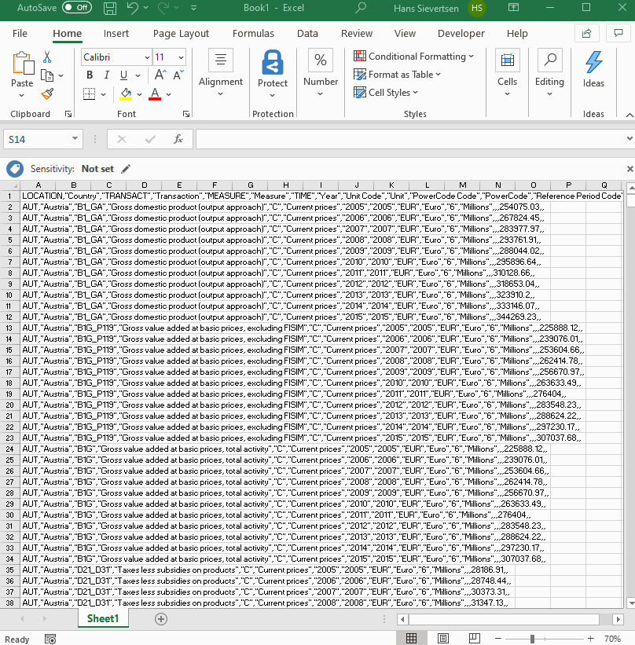

# Handling large datasets

## Filtering tables

We can use the filter function to filter the rows we are interested in. This is especially useful if our dataset contains many rows.

## Pivot tables

If our dataset follows the tidy data principles we can use the Pivot table function in Microsoft Excel to easily restructure the data and calculate aggregate statistics as shown below. 

## Text to columns

Sometimes Microsoft Excel will not recognize the data structure. This could for example happen if we imported a dataset stored in a different format like csv. In that case we explicitly tell Excel how to organize the data with the "Text to columns" function as shown below

