```{r, child="_setup.Rmd"}
```


# Introduction

Welcome to this introduction to Microsoft Excel written for Economics students at the University of Bristol. The goal of the guide is help you  get access to Microsoft Excel and get started working with Microsoft Excel. Most of the topics covered are also applicable for alternative software solutions such as [LibreOffice](https://www.libreoffice.org/), [OpenOffice](https://www.openoffice.org/), and [Google Sheets](https://docs.google.com/spreadsheets/). 


Please let me know if you find mistakes, find a section unclear, have suggestions for improvements, or if you have suggestions for  topics to include. You can contact me on h.h.sievertsen@bristol.ac.uk.

Best wishes,
Hans 
<br> 
<br><br> `r sf <- lubridate::stamp_date('Last updated on Tuesday, September 4, 2018'); sf(Sys.Date())`
<br>


<!--chapter:end:index.Rmd-->


# Getting Access to Excel

This section contains detailed descriptions on how to get access to Microsoft Excel. You can skip this section if you already have access to Microsoft Excel or if you already know how to access it. 


## Installing Microsoft Excel 

#### Video guide   {-}

Below is a video guide (without sound) on installing Microsoft Excel. You can skip this video if you prefer following the step-by-step guide below. 

Note: You can skip the section from  1:30 to 5:40 where Office is installed. 
<div align="center">
   <iframe width="560" height="315" src="https://www.youtube.com/embed/VtbghPs1O1s" frameborder="0" allowfullscreen>
   </iframe>
</div>


#### Step 1: Go to office.com  {-}
 
Go to [www.office.com](https://www.office.com) using a browser like Google Chrome, Safari, or Microsoft Edge.

```{r,  include=TRUE, fig.align="center", fig.cap=c(" "), out.width="90%", fig.show='hold',echo=FALSE}
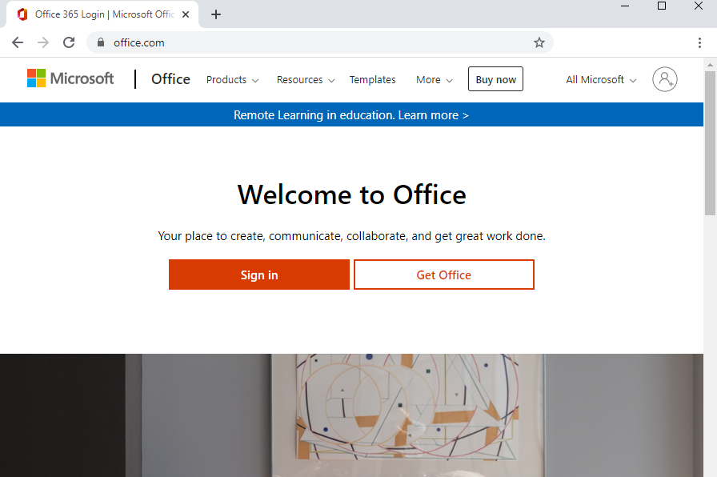
```

#### Step 2: Sign in  {-}

Click on "Sign in".

```{r,  include=TRUE, fig.align="center", fig.cap=c(" "), out.width="90%", fig.show='hold',echo=FALSE}
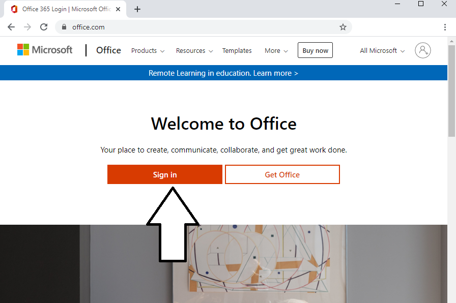
```

#### Step 3: Use your university e-mail to log in  {-}

Use your *University of Bristol e-mail* to sign in. 

```{r,  include=TRUE, fig.align="center", fig.cap=c(" "), out.width="90%", fig.show='hold',echo=FALSE}
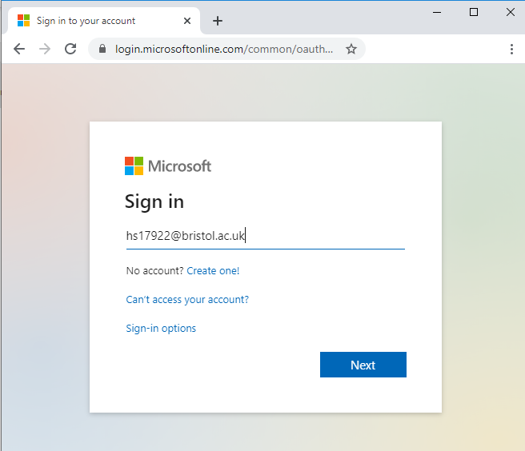
```

#### Step 4: Enter your password  {-}

You should now see the University of Bristol logo.  Use your *University of Bristol* password to complete the sign-in. 

```{r,  include=TRUE, fig.align="center", fig.cap=c(" "), out.width="90%", fig.show='hold',echo=FALSE}

```

#### Step 5: Respond to saving details  {-}

You will be asked whether you want the browser to remember your username and password. It is highly recommended that you **select No** if you are using a  shared computer. 

```{r,  include=TRUE, fig.align="center", fig.cap=c(" "), out.width="90%", fig.show='hold',echo=FALSE}
knitr::include_graphics("./graphics/ch1/fig5.png")
```

#### Step 6: Logged-in  {-}

You are now logged in to your University of Bristol office account. 

```{r,  include=TRUE, fig.align="center", fig.cap=c(" "), out.width="90%", fig.show='hold',echo=FALSE}
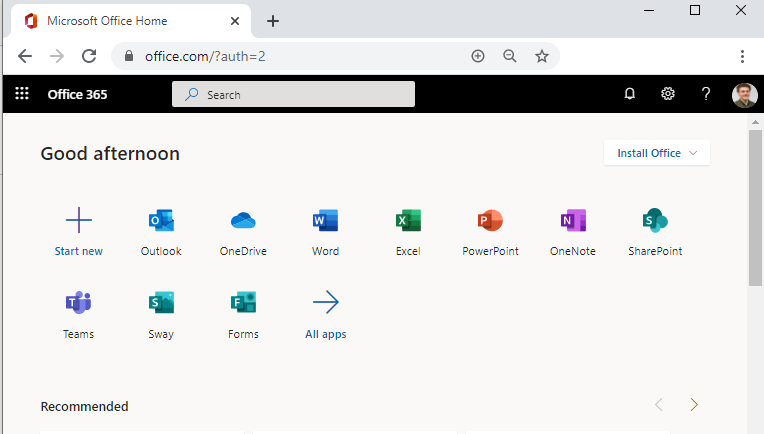
```

#### Step 7: Installing Microsoft Ofice   {-}

Click "Install Office"

```{r,  include=TRUE, fig.align="center", fig.cap=c(" "), out.width="90%", fig.show='hold',echo=FALSE}
knitr::include_graphics("./graphics/ch1/fig17.png")
```

#### Step 3: Installing Microsoft Ofice   {-}

Select Office 365

```{r,  include=TRUE, fig.align="center", fig.cap=c(" "), out.width="90%", fig.show='hold',echo=FALSE}
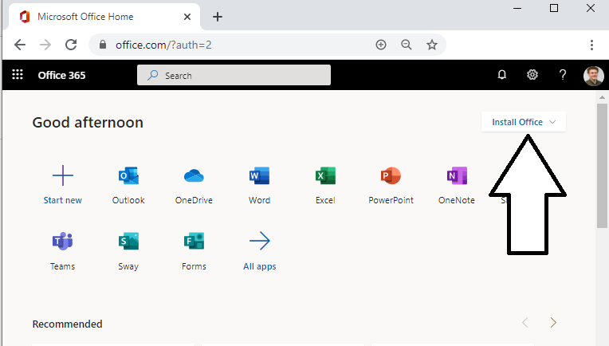
```

#### Step 4: Installing Microsoft Ofice   {-}

And follow the instructions to install Microsoft Office (including Excel, Word, and PowerPoint).

```{r,  include=TRUE, fig.align="center", fig.cap=c(" "), out.width="90%", fig.show='hold',echo=FALSE}
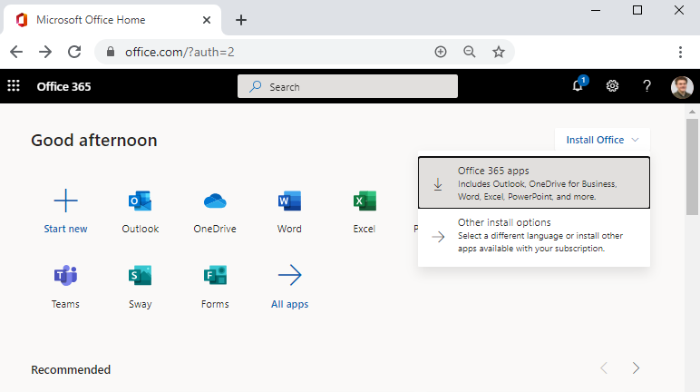
```


##  Student Remote Desktop

The University of Bristol offers you to access a university computer remotely. Follow the steps below to log on. 

#### Step 1: Go to UoB IT support {-}

Go to [www.bristol.ac.uk/students/support/it/](https://www.bristol.ac.uk/students/support/it/) using a browser like Google Chrome, Safari, or Microsoft Edge.

```{r,  include=TRUE, fig.align="center", fig.cap=c(" "), out.width="90%", fig.show='hold',echo=FALSE}
knitr::include_graphics("./graphics/remote_access/fig_r1.png")
```

#### Step 2: Locate the student remote desktop {-}

Scroll to the bottom of the page and find the two (identical) links to the student remote desktop. Click on one of these links (or the link  [here](https://uob.sharepoint.com/sites/itservices/SitePages/student-remote-desktop.aspx)).

```{r,  include=TRUE, fig.align="center", fig.cap=c(" "), out.width="90%", fig.show='hold',echo=FALSE}
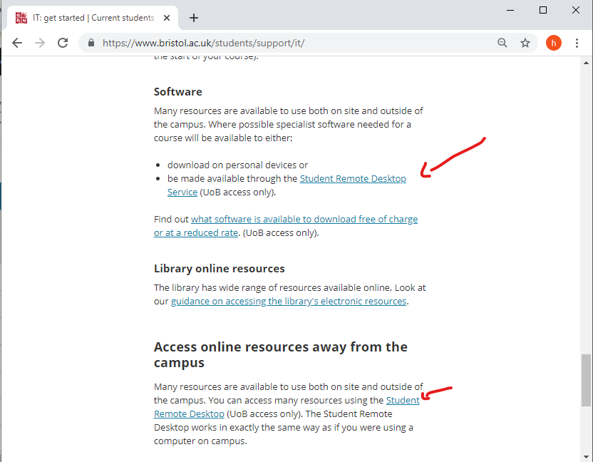
```

#### Step 3: Enter your university e-mail address and follow the steps to log in (this process is similar to the process for installing Office, explained above). {-}
```{r,  include=TRUE, fig.align="center", fig.cap=c(" "), out.width="90%", fig.show='hold',echo=FALSE}

```

#### Step 4: Student remote desktop website{-}

You should now be at the website for the student remote desktop. It should look like the below. You now have two options. A solution for fast internet connections and a solution for slow connections. Both should work fine. The site also includes details on using the student remote desktop for Mac users. 

Click on one of the two blue boxes to download the shortcut for the remote desktop. 

```{r,  include=TRUE, fig.align="center", fig.cap=c(" "), out.width="90%", fig.show='hold',echo=FALSE}
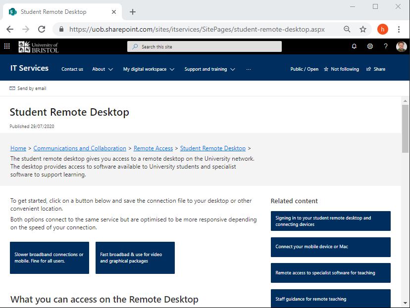
```

#### Step 5: Download the RDP file {-}

You will download a RDP file. An RDP file contains the information for a connection to a remote server. Click download if the file is not downloaded automatically. 

```{r,  include=TRUE, fig.align="center", fig.cap=c(" "), out.width="90%", fig.show='hold',echo=FALSE}
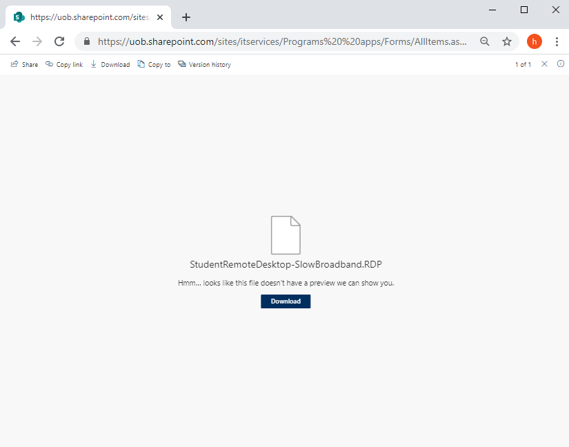
```

#### Step 6: Open the downloaded file {-}

Click on the downloaded file (or double click, depending on the system) with the mouse. Windows includes a program to handle the RDP files. This is not the case for Mac users (see step 4 above).

```{r,  include=TRUE, fig.align="center", fig.cap=c(" "), out.width="90%", fig.show='hold',echo=FALSE}
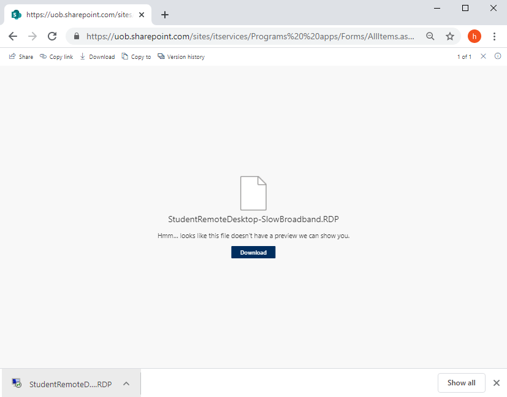
```

#### Step 7: Connect to the remote seriver {-}

You will likely see a message like the one below. Click on Connect.

```{r,  include=TRUE, fig.align="center", fig.cap=c(" "), out.width="90%", fig.show='hold',echo=FALSE}
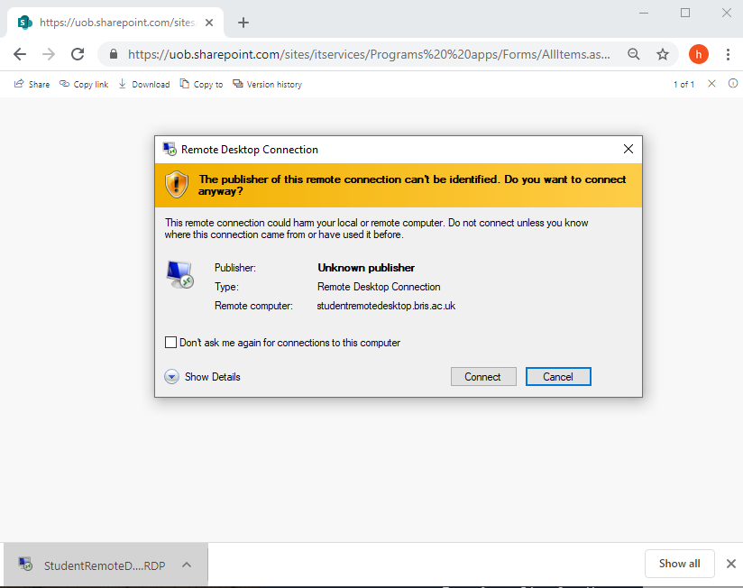
```

#### Step 8: Enter your university credentials {-}

Enter your credentials again. Note that the program already knows that it should connect to the University of Bristol (that is seen by the Domain pointing to UoB). You therefore only have to enter the first part of the e-mail address until (and not including) the "@" (like in the example below).

```{r,  include=TRUE, fig.align="center", fig.cap=c(" "), out.width="90%", fig.show='hold',echo=FALSE}
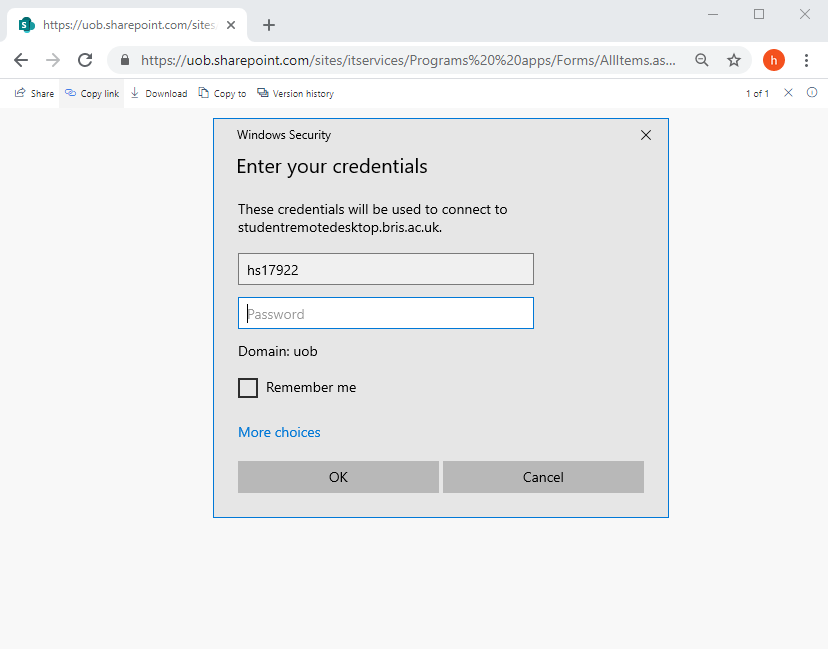
```

#### Step 9: Yet another box {-}

You will likely also see a box like the one below. Click Yes".


```{r,  include=TRUE, fig.align="center", fig.cap=c(" "), out.width="90%", fig.show='hold',echo=FALSE}
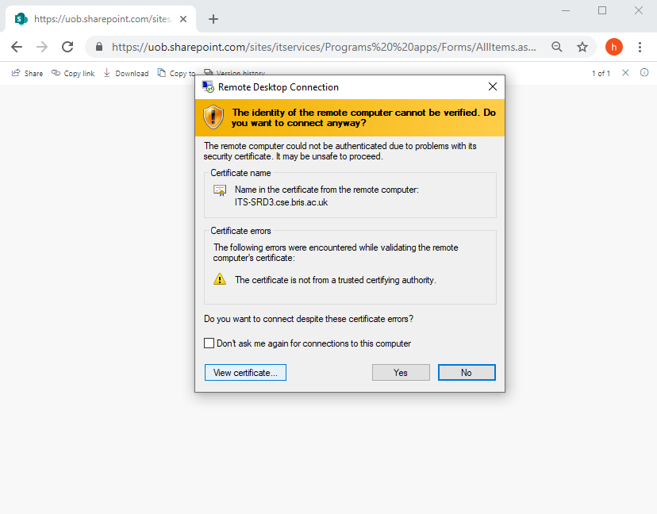
```

#### Step 10: Connecting {-}

You should now be connecting to the remote desktop.

```{r,  include=TRUE, fig.align="center", fig.cap=c(" "), out.width="90%", fig.show='hold',echo=FALSE}
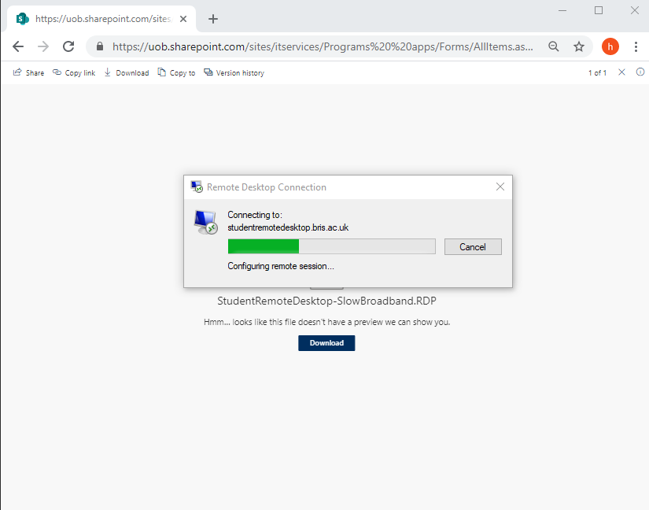
```

#### Step 11: You have  arrived  - almost {-}

You should now see a blue screen with some details about how the remote desktop work. Read the text and click "OK".

```{r,  include=TRUE, fig.align="center", fig.cap=c(" "), out.width="90%", fig.show='hold',echo=FALSE}
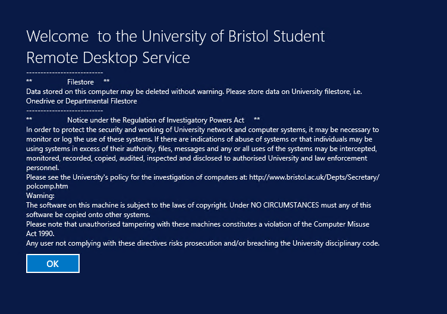
```

#### Step 12: You have arrived.  {-}

Congratulations. You have now arrived at a University of Bristol computer. Your screen should look like the below. You now basically opened another computer within your computer. You can use this computer just like any other computer.

```{r,  include=TRUE, fig.align="center", fig.cap=c(" "), out.width="90%", fig.show='hold',echo=FALSE}
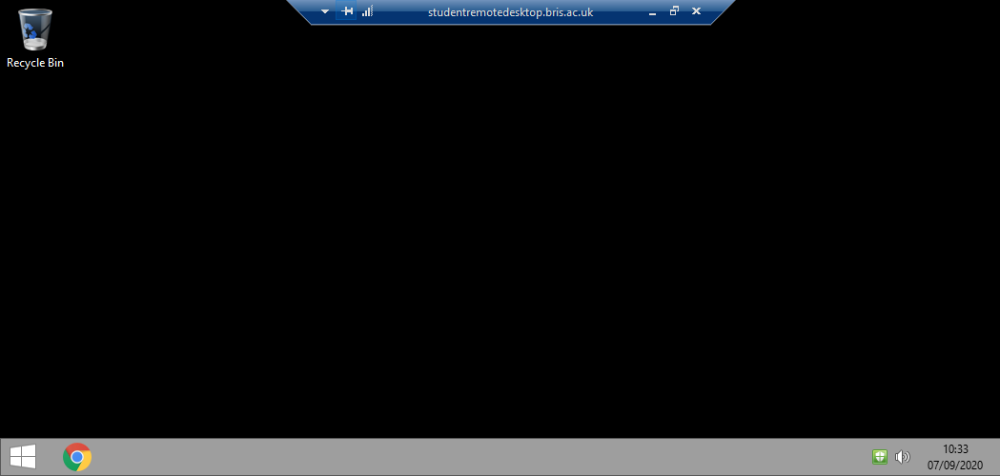
```

#### Step 13: The remote desktop bar {-}

You use the blue bar at the top (see picture below) navigate back and forth between your own computer and the remote your computer. You can minimize the remote desktop by clicking the third icon from the right (the white line). Click on the cross to close the remote desktop. 

```{r,  include=TRUE, fig.align="center", fig.cap=c(" "), out.width="90%", fig.show='hold',echo=FALSE}

```

#### Step 15: You can now use the remote computer {-}

Click on the Windows icon in the lower left corner to open the menu. Type "Excel" to find Excel 2016 and click on the icon to start using Microsoft Excel. 

```{r,  include=TRUE, fig.align="center", fig.cap=c(" "), out.width="90%", fig.show='hold',echo=FALSE}
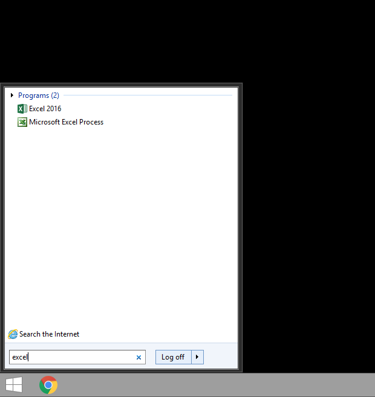
```

#### Step 16: Saving files remotely {-}

Note that since you are working on a UoB computer, you cannot save and create files everywhere. For example, you cannot save file sto the desktop. However, you can save files on the "O:" drive (see below) and you can also access your own local computer (see "C on IT..." under This PC on the left). However, saving and loading files on the local computer takes  a bit longer because you essentially have to download and upload the documents every time.

Note that you also can use the browser within the remote desktop. You van therefore also log on to your email account and send and receive files on the remote desktop.

```{r,  include=TRUE, fig.align="center", fig.cap=c(" "), out.width="90%", fig.show='hold',echo=FALSE}
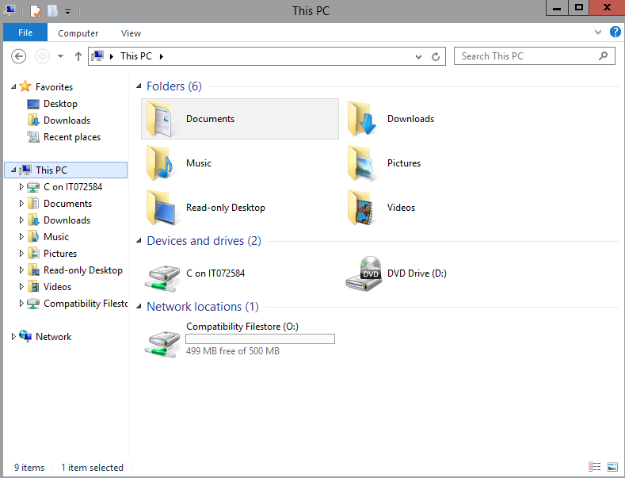
```


## Microsoft Excel in the cloud  

#### Video guide {-}

Below is a video guide (without sound) on accessing Microsoft Excel in the cloud. You can skip this video if you prefer following the step-by-step guide below. 

<div align="center">
   <iframe width="560" height="315" src="https://www.youtube.com/embed/DSKhvWIfchc" frameborder="0" allowfullscreen>
   </iframe>
</div>

#### Step 1: Go to office.com  {-}
 
Go to [www.office.com](https://www.office.com) using a browser like Google Chrome, Safari, or Microsoft Edge.

```{r,  include=TRUE, fig.align="center", fig.cap=c(" "), out.width="90%", fig.show='hold',echo=FALSE}

```

#### Step 2: Sign in  {-}

Click on "Sign in".

```{r,  include=TRUE, fig.align="center", fig.cap=c(" "), out.width="90%", fig.show='hold',echo=FALSE}

```

#### Step 3: Use your university e-mail to log in  {-}

Use your *University of Bristol e-mail* to sign in. 

```{r,  include=TRUE, fig.align="center", fig.cap=c(" "), out.width="90%", fig.show='hold',echo=FALSE}

```

#### Step 4: Enter your password  {-}

You should now see the University of Bristol logo.  Use your *University of Bristol* password to complete the sign-in. 

```{r,  include=TRUE, fig.align="center", fig.cap=c(" "), out.width="90%", fig.show='hold',echo=FALSE}

```

#### Step 5: Respond to saving details  {-}

You will be asked whether you want the browser to remember your username and password. It is highly recommended that you **select No** if you are using a  shared computer. 

```{r,  include=TRUE, fig.align="center", fig.cap=c(" "), out.width="90%", fig.show='hold',echo=FALSE}
knitr::include_graphics("./graphics/ch1/fig5.png")
```

#### Step 6: Logged-in  {-}

You are now logged in to your University of Bristol office account. 

```{r,  include=TRUE, fig.align="center", fig.cap=c(" "), out.width="90%", fig.show='hold',echo=FALSE}

```

#### Step 7:  Open Excel {-}

Click on the Microsoft Excel icon to start Microsoft Excel in the cloud. 

```{r,  include=TRUE, fig.align="center", fig.cap=c(" "), out.width="90%", fig.show='hold',echo=FALSE}
knitr::include_graphics("./graphics/ch1/fig7.png")
```

#### Step 8: Select document{-}

You can now either open a new blank document, open a template, or open an existing document. 

```{r,  include=TRUE, fig.align="center", fig.cap=c(" "), out.width="90%", fig.show='hold',echo=FALSE}
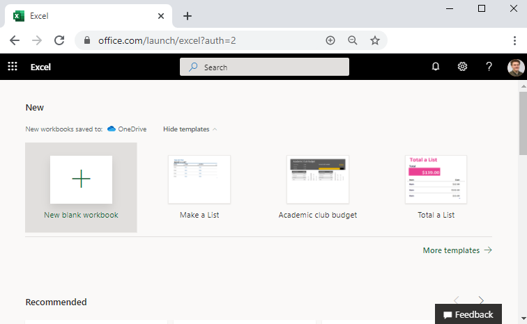
```


#### Step 9: Open a new workbook {-}

Select "New blank workbook" to create a new empty Excel document.

```{r,  include=TRUE, fig.align="center", fig.cap=c(" "), out.width="90%", fig.show='hold',echo=FALSE}
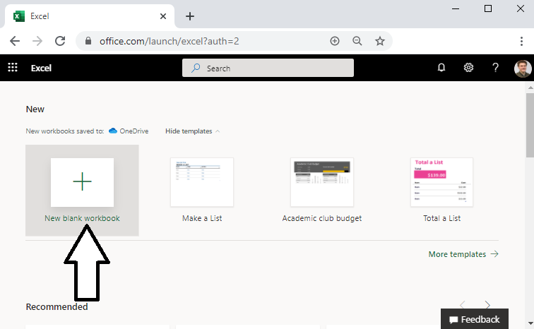
```


#### Step 10: You have arrived! {-}

Congratulations. You have now opened Microsoft Excel in the cloud and you can start working. 

```{r,  include=TRUE, fig.align="center", fig.cap=c(" "), out.width="90%", fig.show='hold',echo=FALSE}
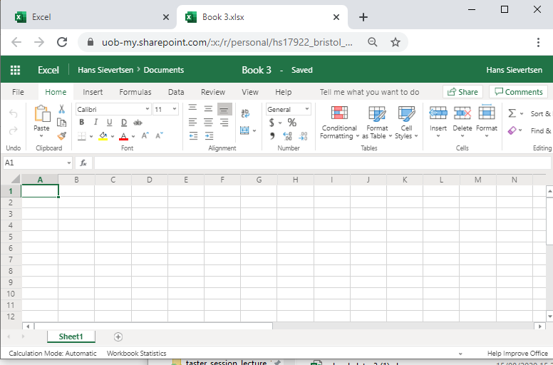
```

#### Step 11: Uploading a document.  {-}

You might have downloaded a document that you want to open in Microsoft Excel. Because you are working in the cloud, you first have to upload the document to the cloud. Click "File"

```{r,  include=TRUE, fig.align="center", fig.cap=c(" "), out.width="90%", fig.show='hold',echo=FALSE}
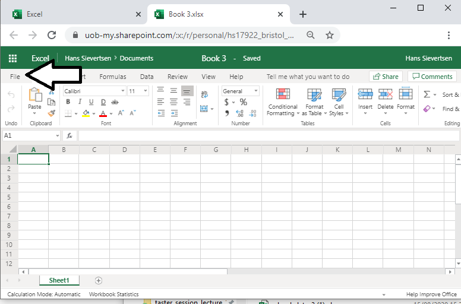
```

#### Step 12: Uploading a document continued {-}

Once you've opened the "File" menu, select "Open". 

```{r,  include=TRUE, fig.align="center", fig.cap=c(" "), out.width="90%", fig.show='hold',echo=FALSE}
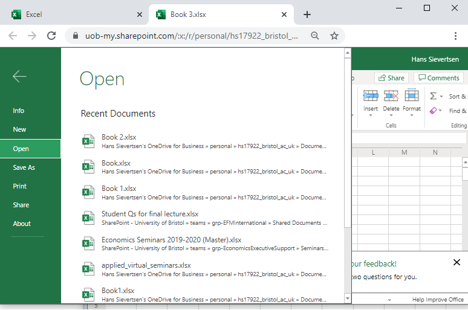
```

#### Step 13: Uploading a document continued {-}

Look for "More on OneDrive for Business" at the bottom of the list (you might have to scroll down).

```{r,  include=TRUE, fig.align="center", fig.cap=c(" "), out.width="90%", fig.show='hold',echo=FALSE}
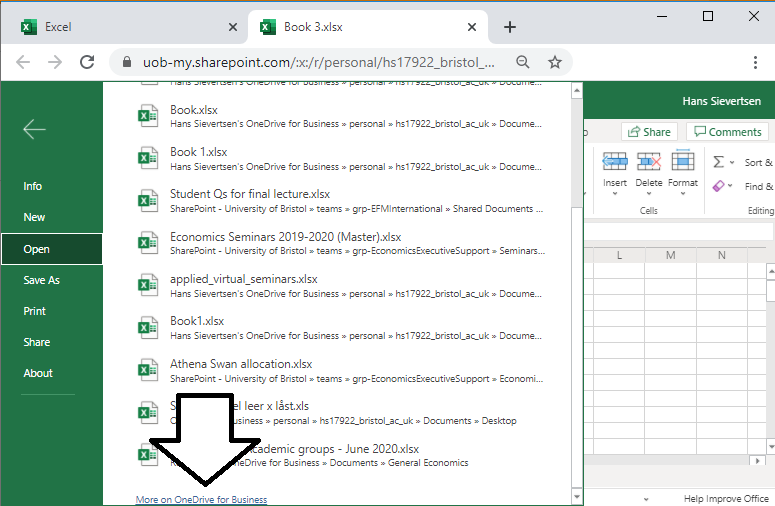
```

#### Step 14: Uploading a document continued {-}

You should now be viewing your University of Bristol OneDrive folder. This is a good place to store files that you want to work on. You can access these files from anywhere and share them with fellow students. 

```{r,  include=TRUE, fig.align="center", fig.cap=c(" "), out.width="90%", fig.show='hold',echo=FALSE}
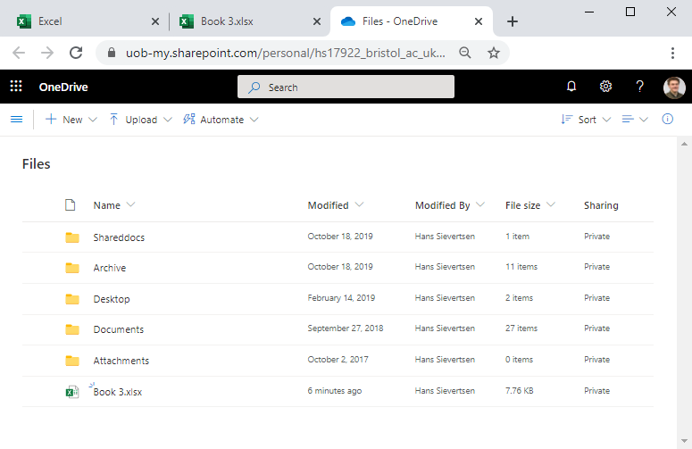
```

#### Step 15: Uploading a document continued {-}

Select "Upload" to upload a document from your local computer. After you've uploaded the document you should see it in your OneDriver folder. You can then open it by clicking on it. 


```{r,  include=TRUE, fig.align="center", fig.cap=c(" "), out.width="90%", fig.show='hold',echo=FALSE}
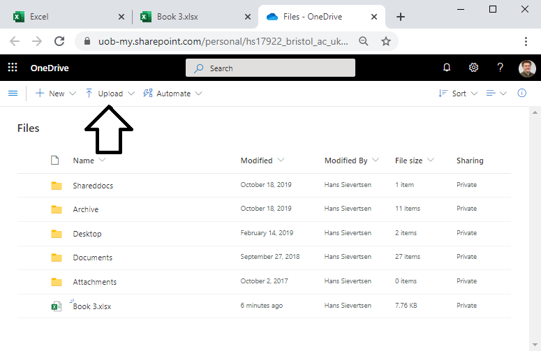
```

#### Step 16: Returning to our Excel document {-}

Note that we can return to our Microsoft Excel document by clicking on the tab. 

```{r,  include=TRUE, fig.align="center", fig.cap=c(" "), out.width="90%", fig.show='hold',echo=FALSE}
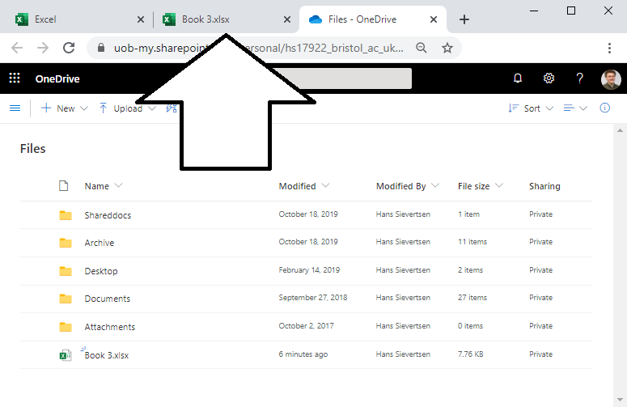
```

<!--chapter:end:01_ch1.Rmd-->

# Getting Started with Microsoft Excel 


## Finding our way in Excel

####   Workbooks & worksheets {-}


Okay let us open a new and empty Microsoft Excel document.  It should look like below. The full document is what we call a **workbook**.

```{r,  include=TRUE, fig.align="center", fig.cap=c(" "), out.width="90%", fig.show='hold',echo=FALSE}
knitr::include_graphics("./graphics/organisation/fig1.png")
```

A Microsoft Excel workbook consists of a number of **worksheets**. We can think of a Microsoft Excel workbook like an old-fashioned paper workbook that consists of several (work) sheets. When we are working on a specific worksheet in Microsoft Excel it is like when we are working on a specific page.  We can see the name of the worksheet (or page) we are currently working on in the bottom left corner as indicated with the arrow below. 

```{r,  include=TRUE, fig.align="center", fig.cap=c(" "), out.width="90%", fig.show='hold',echo=FALSE}
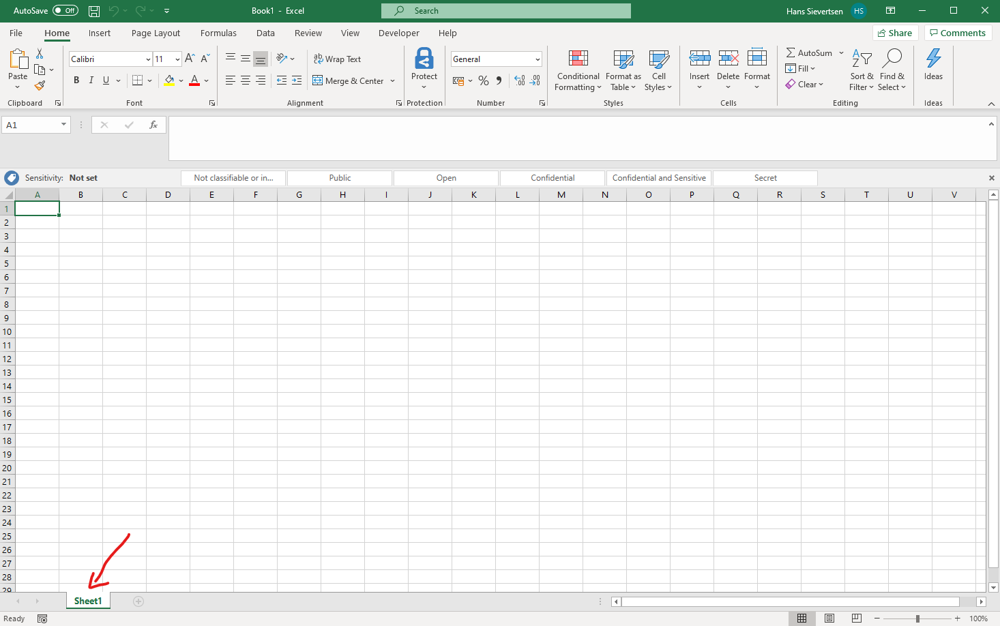
```


As a default recent versions of Microsoft Excel only have one sheet to start with. That one sheet is called *Sheet1*. However, we can easily add new sheets by clicking on the little plus indicated with an arrow below. 

```{r,  include=TRUE, fig.align="center", fig.cap=c(" "), out.width="90%", fig.show='hold',echo=FALSE}
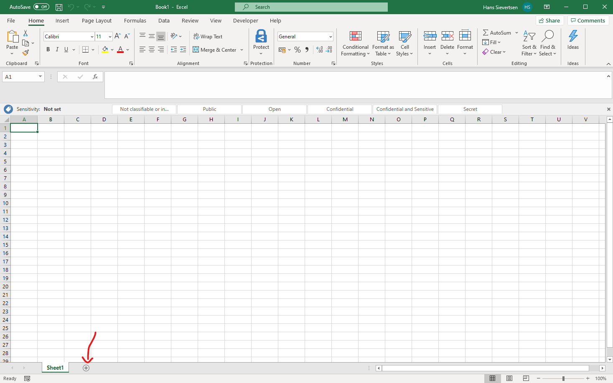
```


By default Microsoft Excel gives the new sheet the name *Sheet2* (very innovative!). And we can see in the image below that we are now working in *Sheet2* because it is highlighted with white.

```{r,  include=TRUE, fig.align="center", fig.cap=c(" "), out.width="90%", fig.show='hold',echo=FALSE}
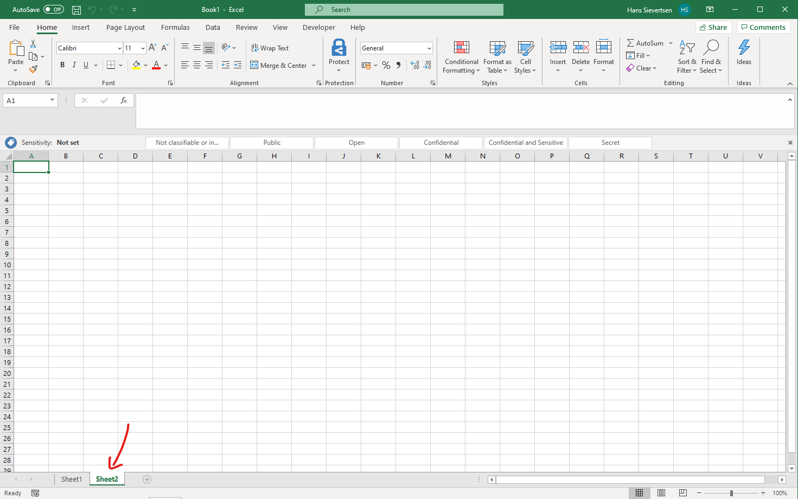
```

We can use the right mouse click on the name of a sheet to see a menu with options related to the sheet. We can rename a sheet, we can copy it, we can move it and we can delete it. 

```{r,  include=TRUE, fig.align="center", fig.cap=c(" "), out.width="90%", fig.show='hold',echo=FALSE}
knitr::include_graphics("./graphics/organisation/fig5.png")
```


Let's use the zoom bar to get a closer look at how worksheets are organised. The zoom bar is placed in the lower right corner as indicated with the arrow below.


```{r,  include=TRUE, fig.align="center", fig.cap=c(" "), out.width="90%", fig.show='hold',echo=FALSE}
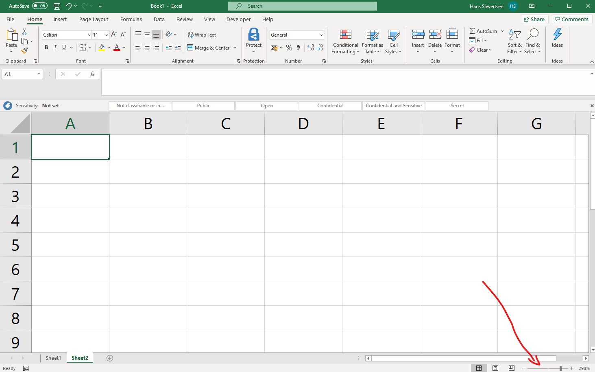
```


The worksheet consists of a lot of cells, just like a page in a squared notebook. In the image below we've selected the cell called *B2*. That is the cell that lies in the intersection between *column B* and row *2*. We can see that this cell is currently selected because it has a solid green border, while all other cells have a light grey thin border. 

```{r,  include=TRUE, fig.align="center", fig.cap=c(" "), out.width="90%", fig.show='hold',echo=FALSE}
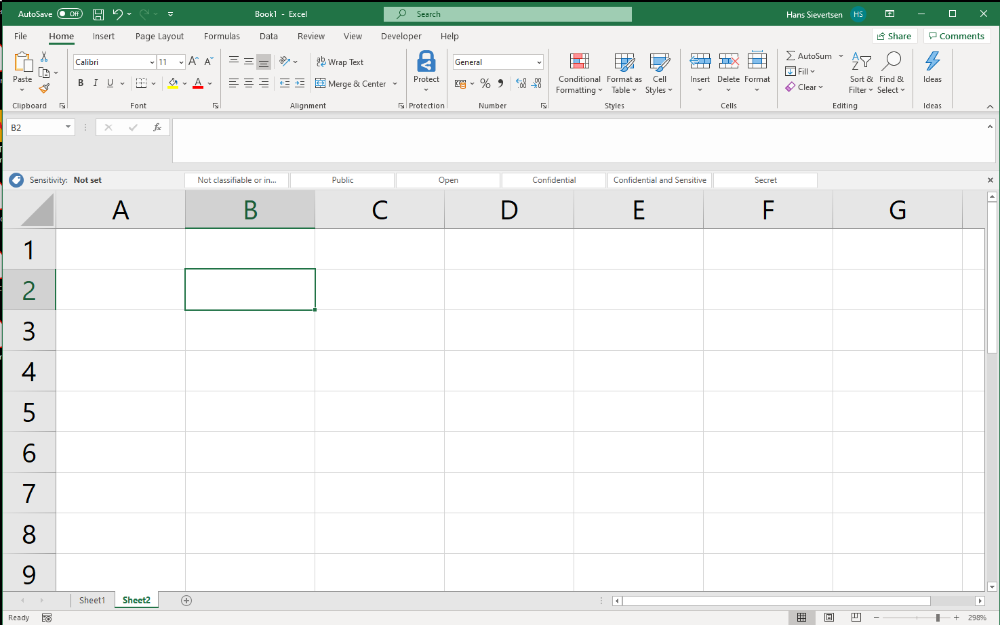
```

In general we identify the column by the letter in the header. We can select an entire column by clicking on the letter in the header. Once we've selected the entire column B it will look as below. 


```{r,  include=TRUE, fig.align="center", fig.cap=c(" "), out.width="90%", fig.show='hold',echo=FALSE}
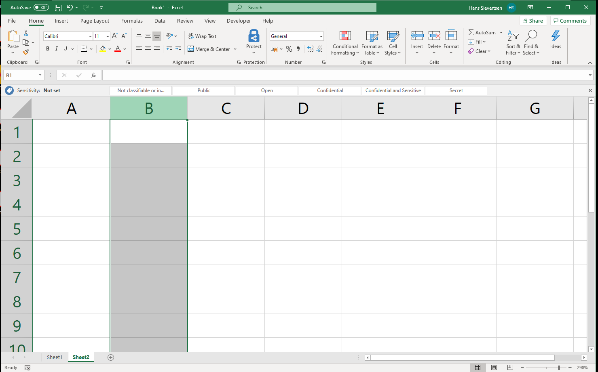
```


We identify the row by the number on left . We can select an entire row by clicking on the number. If we've selected the entire row 2 it will look as below. 

```{r,  include=TRUE, fig.align="center", fig.cap=c(" "), out.width="90%", fig.show='hold',echo=FALSE}
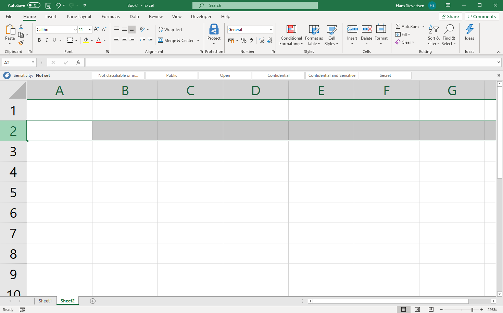
```

####   The ribbon {-}


The cells is where we enter the *data*, *formulas*, *labels*, and other content. Above the cells we have the *ribbon* (marked with yellow below) with various icons to modify and exploit the content in the cells. 


```{r,  include=TRUE, fig.align="center", fig.cap=c(" "), out.width="90%", fig.show='hold',echo=FALSE}
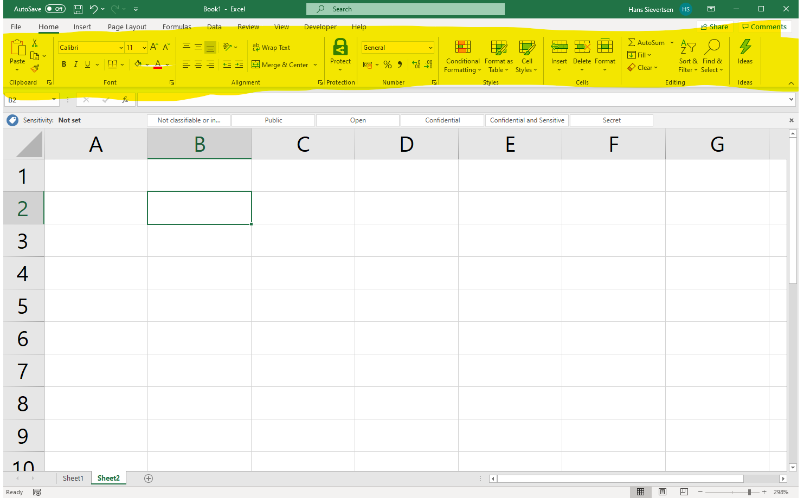
```

The functions shown in the ribbon depend on the tab selected above the ribbon (marked with yellow below). We will be working on the *Home* tab where we can change the font type and do other basic operations. However, the other tabs are also very useful as we will see later. To change the content of the ribbon, simply click on the tab header. For example on the *Data* tab indicated with an arrow in the image below.

```{r,  include=TRUE, fig.align="center", fig.cap=c(" "), out.width="90%", fig.show='hold',echo=FALSE}
knitr::include_graphics("./graphics/organisation/fig11.png")
```

Note that new tabs will appear when relevant. For example if we have selected a calc in our worksheet, tabs (and corresponding ribbons) related to calcs will appear. 

```{r,  include=TRUE, fig.align="center", fig.cap=c(" "), out.width="90%", fig.show='hold',echo=FALSE}
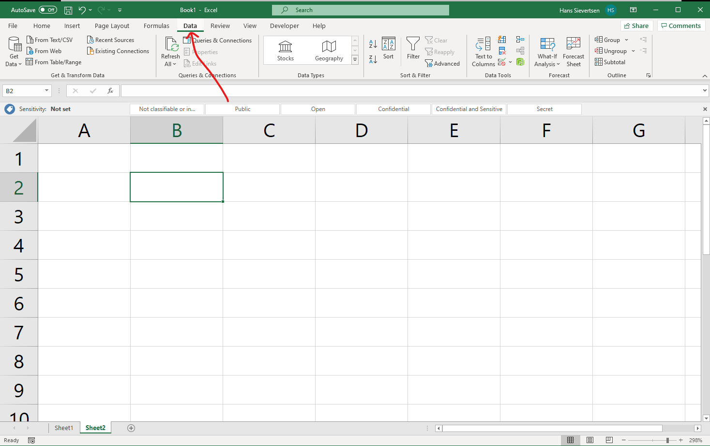
```


#### Entering values {-}

Once we've selected a column we can start typing numerical values or letters to add content to the column. We can also use the double-click with the mouse to get "into" the cell and add values. We can see the content of the cell in two places. First in the content itself. Looking at the example below, we clearly see - by looking at cell B2 - that it contains the numbers 12375. However, because the cell is also selected, we can also see the content of the cell in the **Formula Bar* above (the upper arrow in the image). 

  - Tip 1: While the cell itself will show the *evaluated content* of the cell, the formula bar will show the non-evaluated content. For example if the cell contains a formula, the formula bar will show the formula as we entered it, the cell instead will show the result of the formula.
  
  - Tip 2: To change content of a cell we can press F2 button, but can also just double left click on the cell i.e. chick once to select the cell and click again to edit it. 

```{r,  include=TRUE, fig.align="center", fig.cap=c(" "), out.width="90%", fig.show='hold',echo=FALSE}
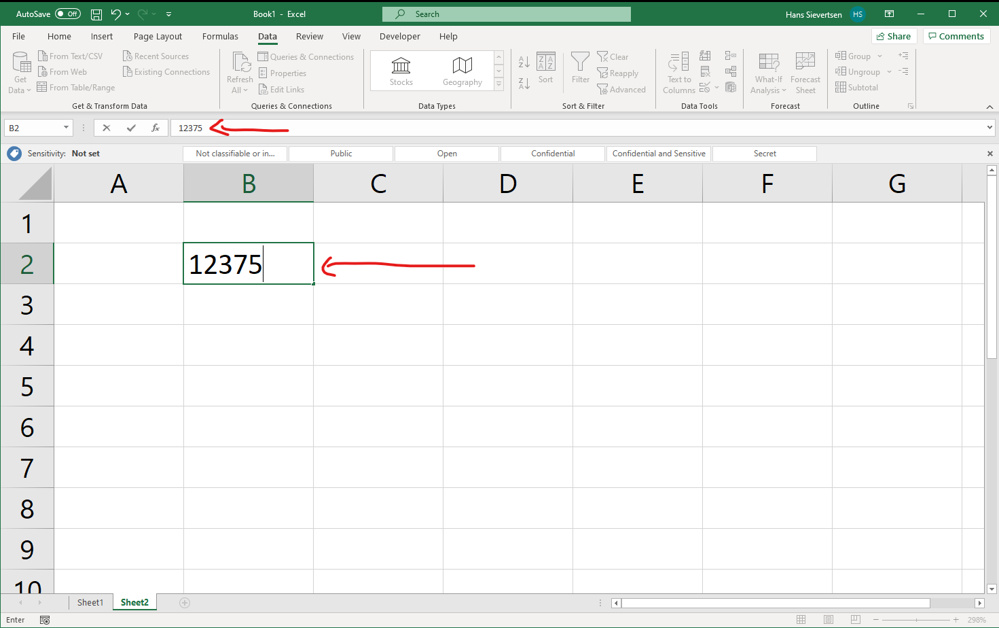
```

We can also right-click on the cell to see a menu of options related to this cell. The menu looks like below.

```{r,  include=TRUE, fig.align="center", fig.cap=c(" "), out.width="90%", fig.show='hold',echo=FALSE}
knitr::include_graphics("./graphics/organisation/fig14.png")
```

If we've copied or cut a cell (using the menu above or ctrl+c/ctrl+x or cmd+c/cmd+x) the cell that is copied (or cut) will be marked with a dashed green border. 

```{r,  include=TRUE, fig.align="center", fig.cap=c(" "), out.width="90%", fig.show='hold',echo=FALSE}
knitr::include_graphics("./graphics/organisation/fig15.png")
```

We can then paste the content by clicking using the keyboard shortcut ctrl+v or cmd+v or by right-clicking and clicking on the paste icon indicated below.  


```{r,  include=TRUE, fig.align="center", fig.cap=c(" "), out.width="90%", fig.show='hold',echo=FALSE}
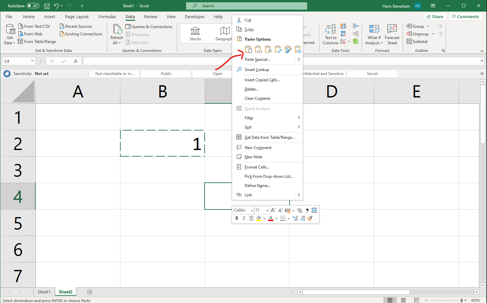
```

Note that Microsoft Excel has quite advanced copy-pasting options. We will cover these later. 


## Using Microsoft as a calculator


Worksheet cells can contain a wide range of content: Text, numerical values, dates, symbols and so on. Below is an example where cell B2 contains the words "Hellow World", cell B3 contains the number "1234", and the cell B4 the symbols "!!!". 

```{r,  include=TRUE, fig.align="center", fig.cap=c(" "), out.width="90%", fig.show='hold',echo=FALSE}
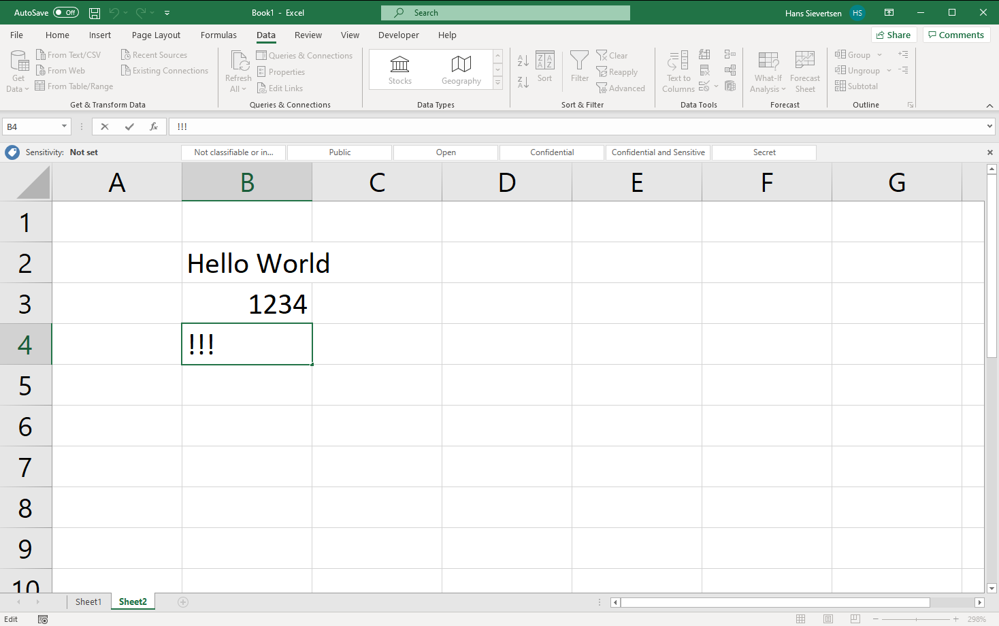
```

If we want Microsoft Excel not only to show the content of a cell, but also  to evaluate the content entered in the cell - like actually calculating the outcome of a  mathematical expression - we have to start the cell content with a "=" symbol as done in the example below.


```{r,  include=TRUE, fig.align="center", fig.cap=c(" "), out.width="90%", fig.show='hold',echo=FALSE}
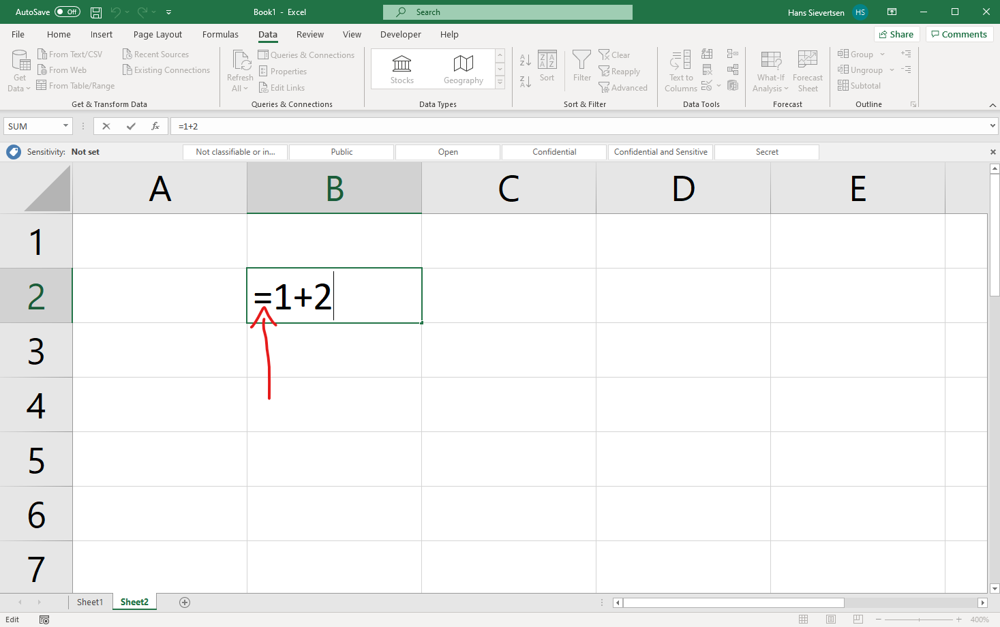
```

The example below is an example where what we see by just looking at cell content deviates from what we entered. We just observe the number "3" when looking at cell B2. However, when we look at the formula bar above, we can see that the cell contains the formula "=1+2". That is the advantage of the formula bar, we can see what actually goes on in the cell.

```{r,  include=TRUE, fig.align="center", fig.cap=c(" "), out.width="90%", fig.show='hold',echo=FALSE}
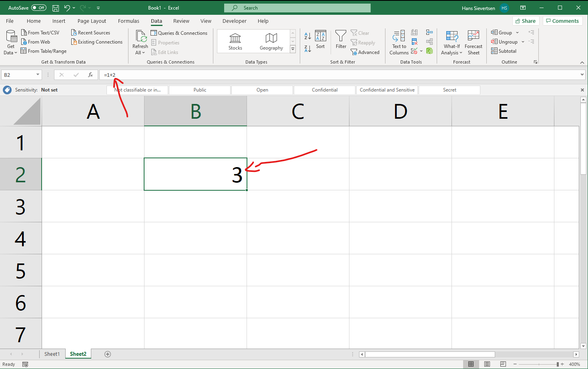
```


We can enter complicated formulas in the cells using common operators.

```{r,  include=TRUE, fig.align="center", fig.cap=c(" "), out.width="90%", fig.show='hold',echo=FALSE}
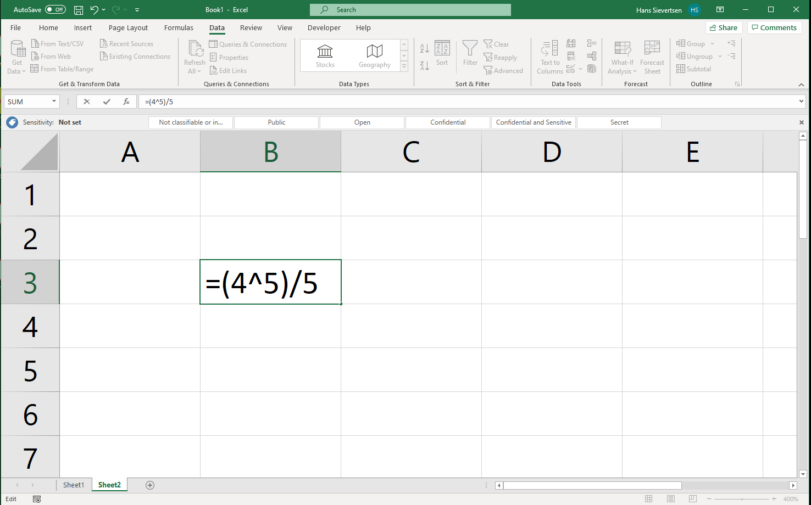
```

We can also use built-in functions in the formulas in the cell.  For example the in the image below we use the "sum" function to calculate the sum of the values 1 and 23. 


```{r,  include=TRUE, fig.align="center", fig.cap=c(" "), out.width="90%", fig.show='hold',echo=FALSE}
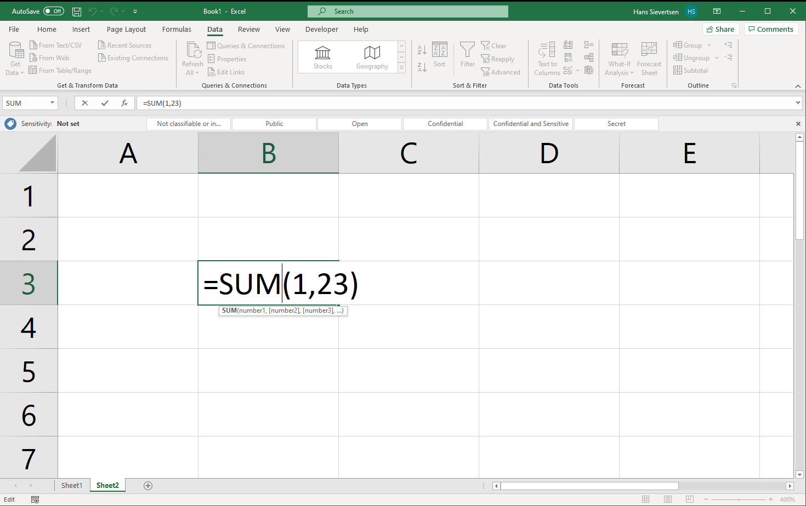
```

... which of course gives 24.


```{r,  include=TRUE, fig.align="center", fig.cap=c(" "), out.width="90%", fig.show='hold',echo=FALSE}
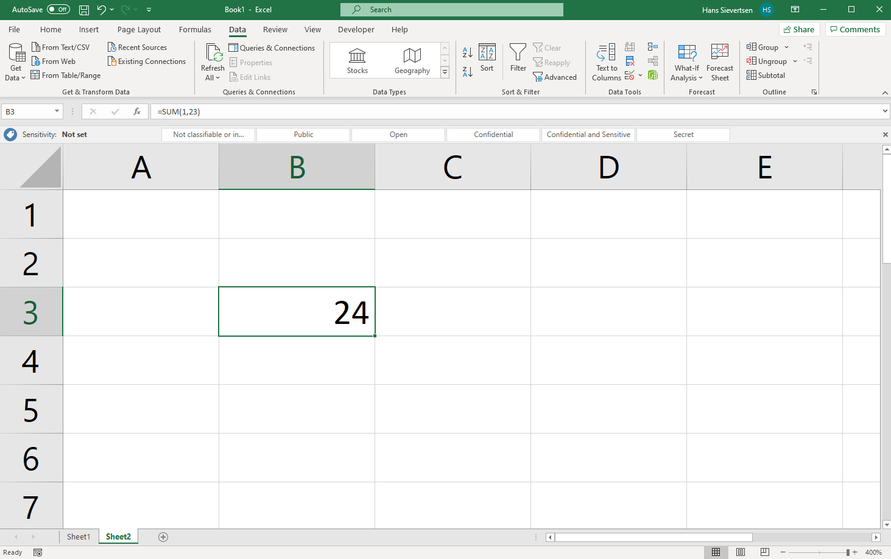
```


We can refer to cells within functions. For example we want to calculate the sum of cells B2, B3, and B4 we simply type: *=SUM(B2:B4)*. 


```{r,  include=TRUE, fig.align="center", fig.cap=c(" "), out.width="90%", fig.show='hold',echo=FALSE}
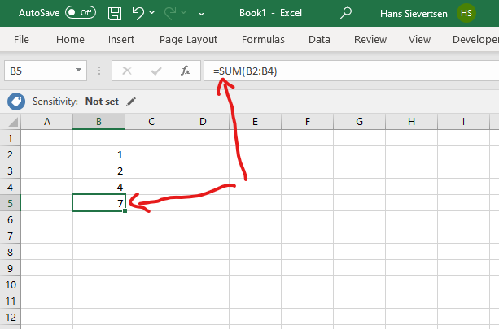
```


What if we don't know the name of the function? We can click on the symbol $f_x$ which opens a menu allowing us to search for functions. This menu also contains explanations on how to use the function.

```{r,  include=TRUE, fig.align="center", fig.cap=c(" "), out.width="90%", fig.show='hold',echo=FALSE}
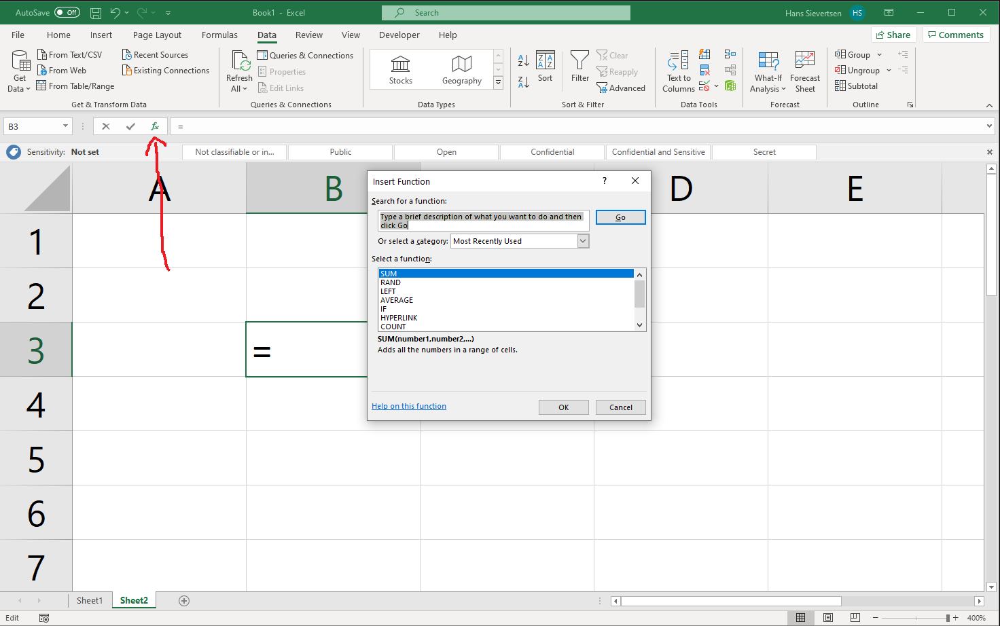
```


##   Sorting data

We can quickly rearrange the content of our worksheets using the **sort** function. The sort function can rearrange the content by specific columns and according to their numerical value or the alphabetical order.

Consider the example below where we have data in eight cells across two columns and eight rows.


```{r,  include=TRUE, fig.align="center", fig.cap=c(" "), out.width="90%", fig.show='hold',echo=FALSE}
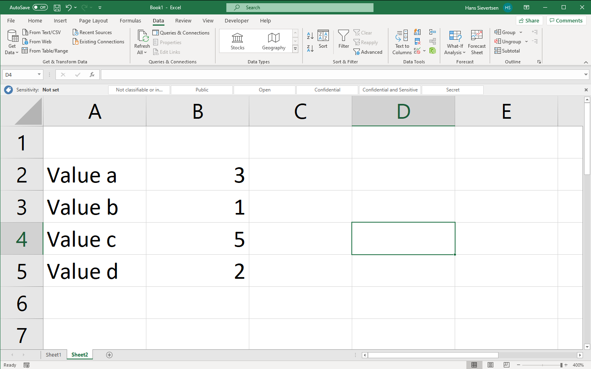
```


In this case we are interested in rearranging the data such that it is ordered by the number in the second column, from smallest to largest. Importantly, the content in the first column is related to the numerical value. The 3 in cell B2 is the value for the group "Value a". If we move the 3 we also want to move the "Value a".

To sort the data first select all the cells that should be sorted as in the example below.


```{r,  include=TRUE, fig.align="center", fig.cap=c(" "), out.width="90%", fig.show='hold',echo=FALSE}
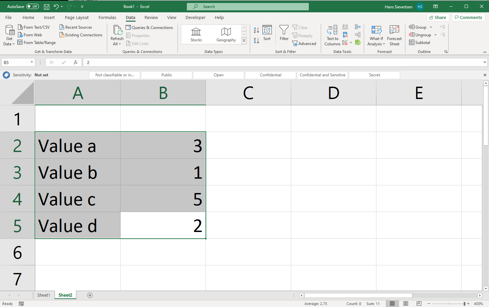
```


Now go to the *Data* tab  and in the data ribbon click on **sort**.

```{r,  include=TRUE, fig.align="center", fig.cap=c(" "), out.width="90%", fig.show='hold',echo=FALSE}
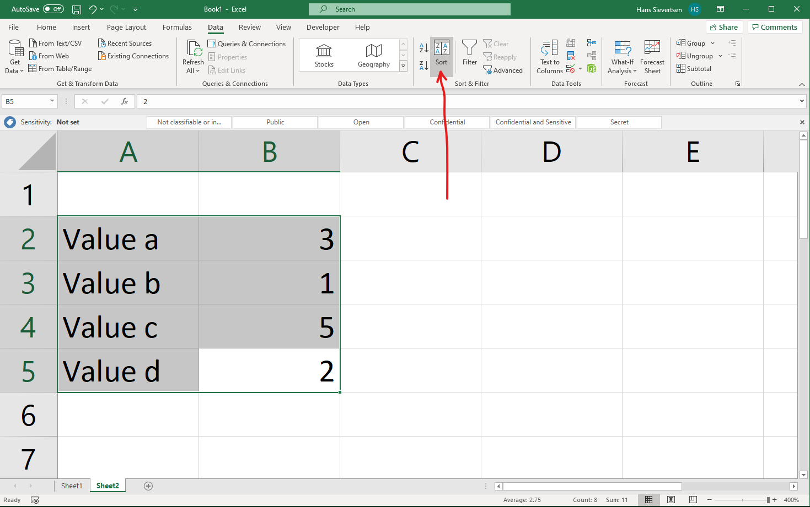
```


You will now see a menu about sorting like the one below. The menu asks you:

1. What column you want to use to determine the order of the values.

2. How to order the values (smallest to largest, largest to smallest, and so on).

3. Whether we want to more additional sorting columns. For example if we tell Microsoft Excel to sort by column B, what happens if two rows have exactly the same value in column B? What determines the order in that case? We can tell Microsoft Excel to look at the content of another column *after* it used the first column to sort the data. That means that if two rows have the same order in the first sorting column, their internal order will depend on the second sorting column.


```{r,  include=TRUE, fig.align="center", fig.cap=c(" "), out.width="90%", fig.show='hold',echo=FALSE}
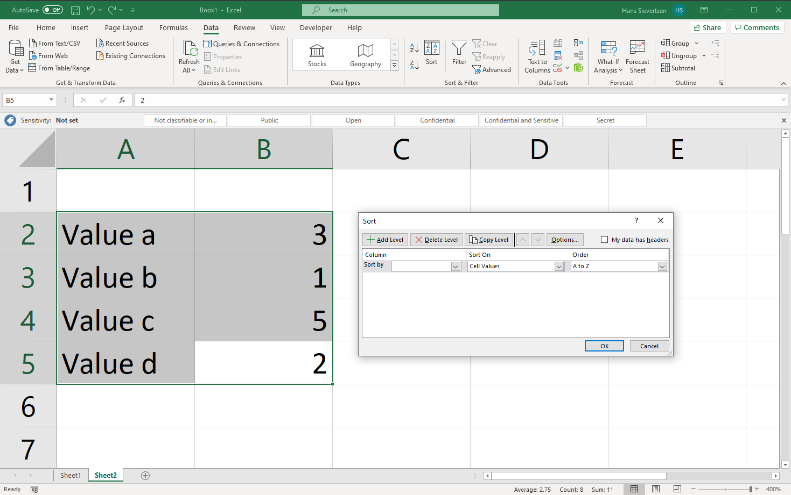
```


In this example we tell Microsoft Excel to sort the data by column B ...


```{r,  include=TRUE, fig.align="center", fig.cap=c(" "), out.width="90%", fig.show='hold',echo=FALSE}
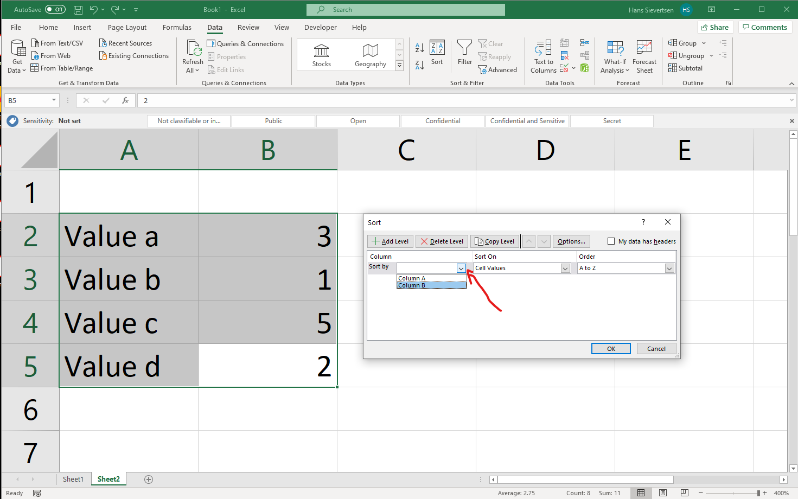
```


... from smallest to largest.


```{r,  include=TRUE, fig.align="center", fig.cap=c(" "), out.width="90%", fig.show='hold',echo=FALSE}
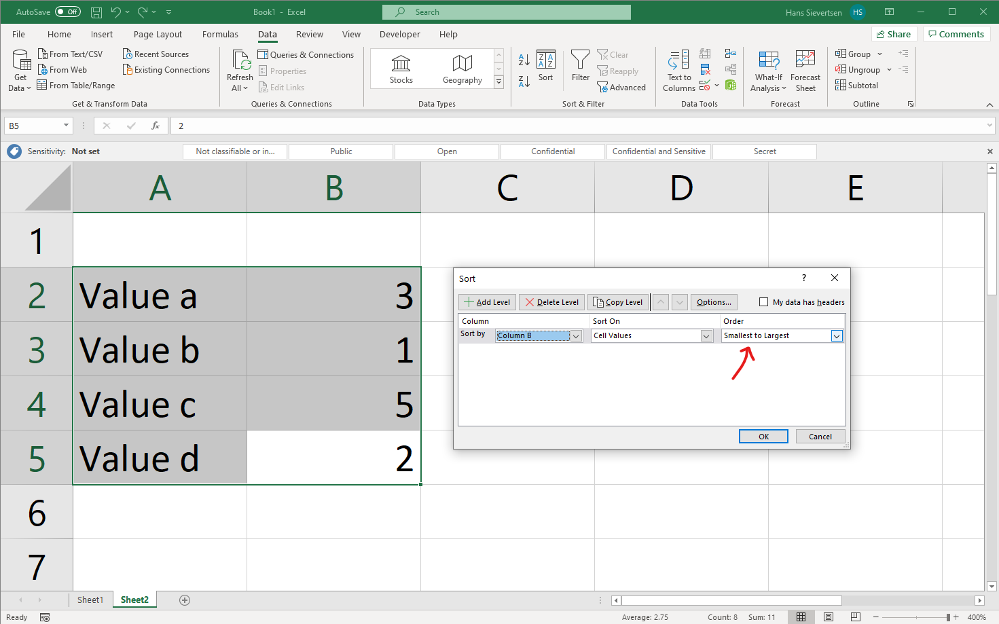
```


After we click "OK" the contents of the cells is rearranged. Note that the row numbers and column letters are constant. They don't move!


```{r,  include=TRUE, fig.align="center", fig.cap=c(" "), out.width="90%", fig.show='hold',echo=FALSE}
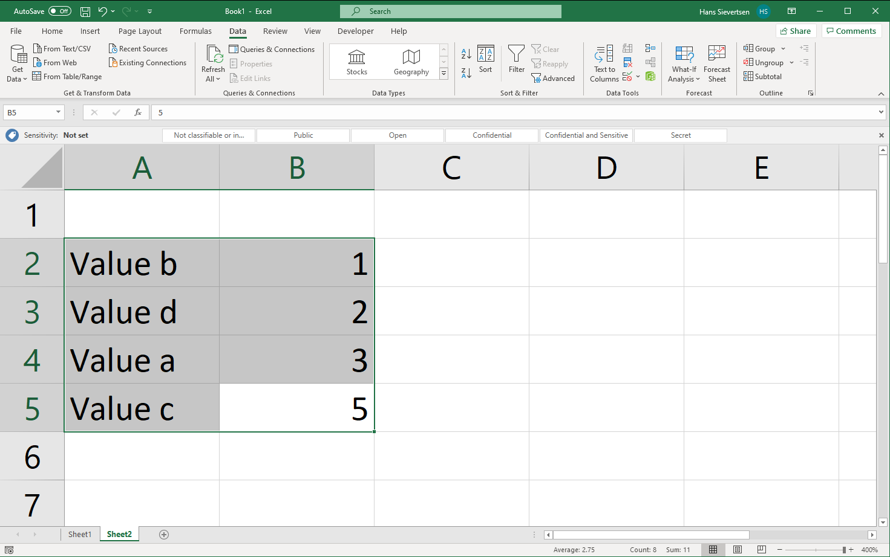
```


If our data have titles - like in the example below - we can include these titles when we select the data for sorting. 

```{r,  include=TRUE, fig.align="center", fig.cap=c(" "), out.width="90%", fig.show='hold',echo=FALSE}
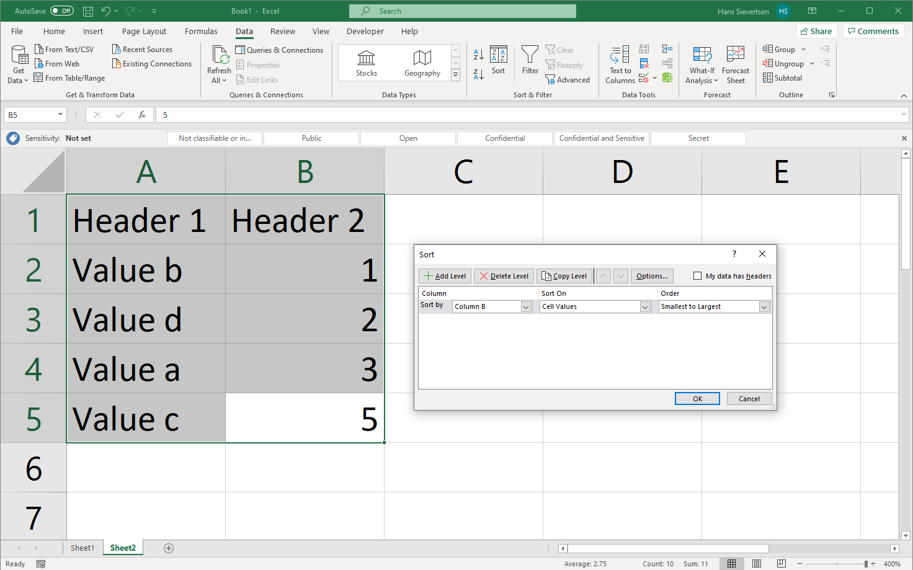
```


In the sorting menu, make sure that the "My data has headers" is selected if the data has headers. If not make sure it is not selected. Including the headers can be helpful in large datasets, because you might not remember the content of column AB, but the data header might be easier to remember.


```{r,  include=TRUE, fig.align="center", fig.cap=c(" "), out.width="90%", fig.show='hold',echo=FALSE}
knitr::include_graphics("./graphics/calc/fig17.png")
```


It is important to select all the data that should be rearranged. If you leave out adjacent columns when selecting the data and clicking sort, Microsoft Excel might give you a warning like the one below and ask you whether you want to include it. If you don't include it, you will lose the link between the column!

```{r,  include=TRUE, fig.align="center", fig.cap=c(" "), out.width="90%", fig.show='hold',echo=FALSE}
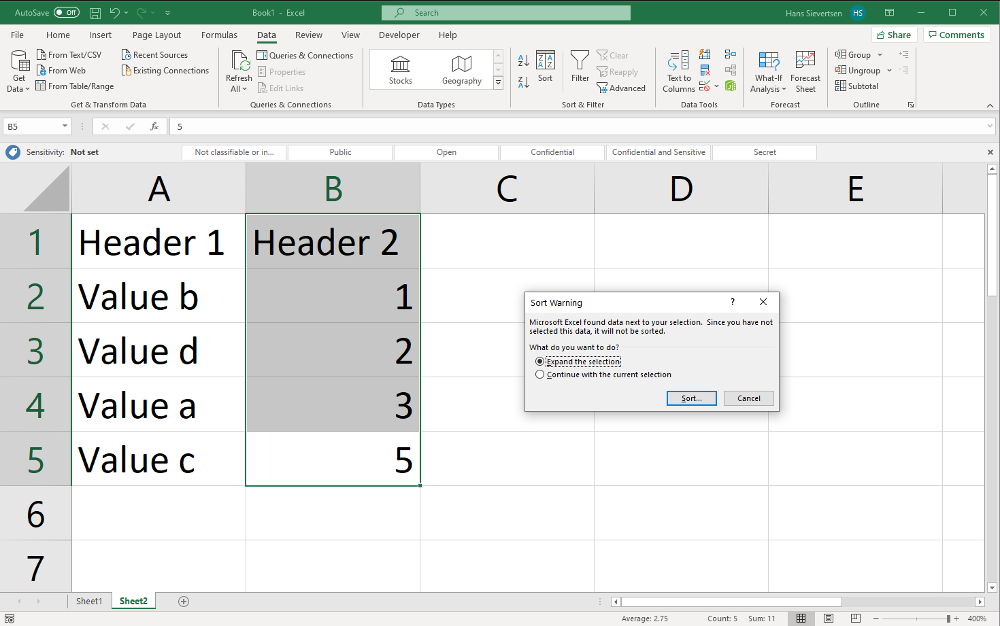
```


## Referencing across cells


A really useful feature of Microsoft Excel is that we can reference across cells. In other words, we can let the content of one cell depend on the content of another cell or several cells. For example in the example below we add a column that captures the average of *Value A* and *Value B*. Now, in cell D2 we could simply type *(0.57+0.72)/2* which would be the average of Value A and Value B. This approach is not very efficient because

1. It is very likely that we make typing mistakes. In general we should minimize manual entry of values. 

2. If we change the content of column B (Value A), we would have to manually update the content of column D.

3. It is slow!

What can we do instead? We can reference across cells. Instead of typing 0.57 we *refer* to cell B2. Instead of typing 0.72 we *refer* to cell C2 like in the example below:


```{r,  include=TRUE, fig.align="center", fig.cap=c(" "), out.width="90%", fig.show='hold',echo=FALSE}
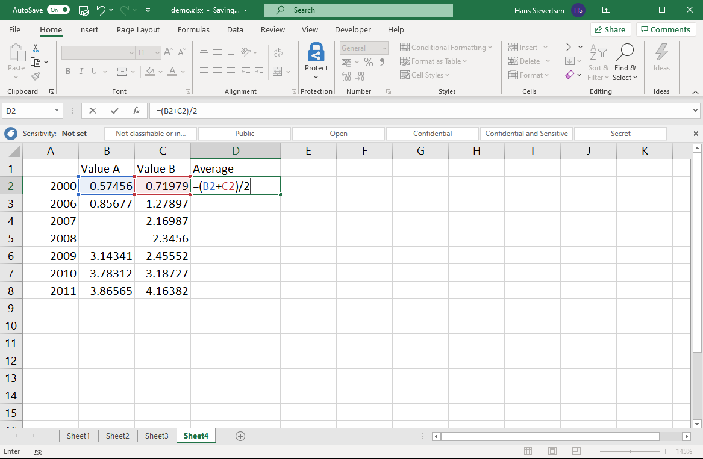
```


Now you might think that this certainly isn't faster than typing the values, but wait! Instead of retyping this formula for every row, we can **expand** the formula by clicking on the square in the lower right corner and dragging the selection all the way down. 

```{r,  include=TRUE, fig.align="center", fig.cap=c(" "), out.width="90%", fig.show='hold',echo=FALSE}
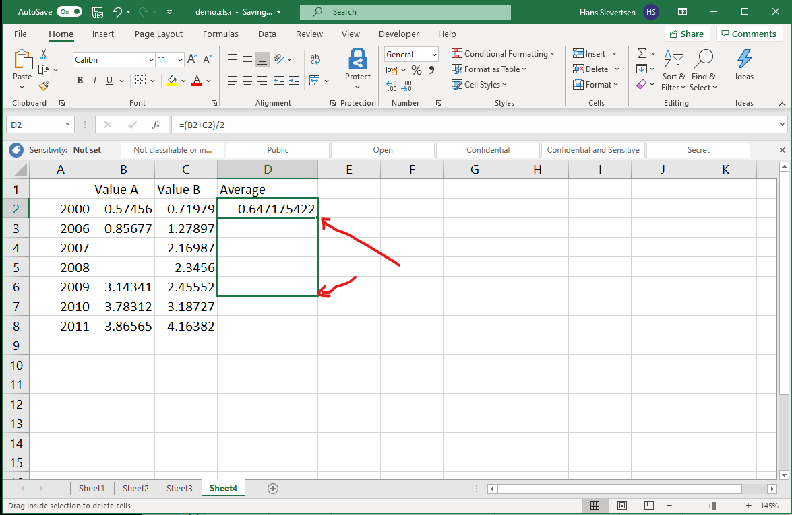
```


Voila! Microsoft Excel automatically entered the formula in all cells and updated the references, so that the formula in cell D8 refers to the content cells B8 and C8.

```{r,  include=TRUE, fig.align="center", fig.cap=c(" "), out.width="90%", fig.show='hold',echo=FALSE}
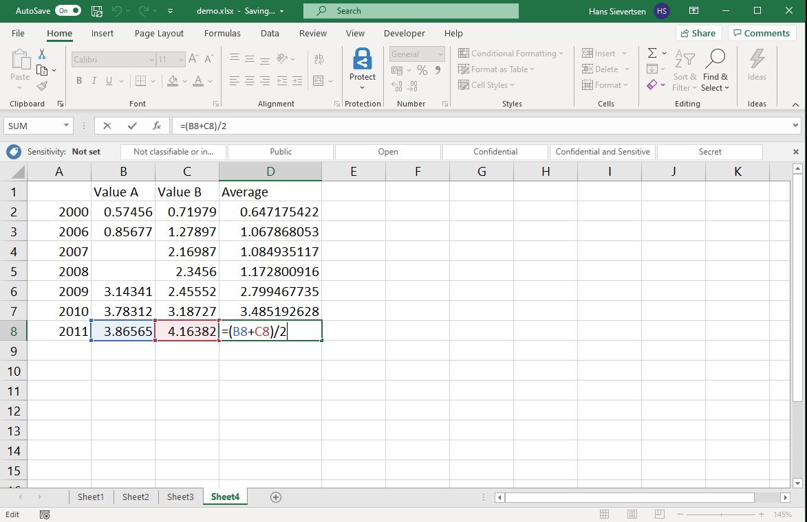
```

How did Microsoft Excel guess what you wanted to do? Microsoft Excel simply follows a systematic pattern. If you expand the formula in a direction, it updates all the cell references in the same direction. Expanding a formula downwards by one cell will make Microsoft Excel update all the row numbers to one row further down. 

What if we didn't want Microsoft Excel to do that? Consider the example below where we add the value 1 to all cells. We don' type the 1 manually in the formula because we want to able to change the value afterwards for all cells by just changing one cell. We therefore refer to cell H2 where we added the value 1. 

```{r,  include=TRUE, fig.align="center", fig.cap=c(" "), out.width="90%", fig.show='hold',echo=FALSE}
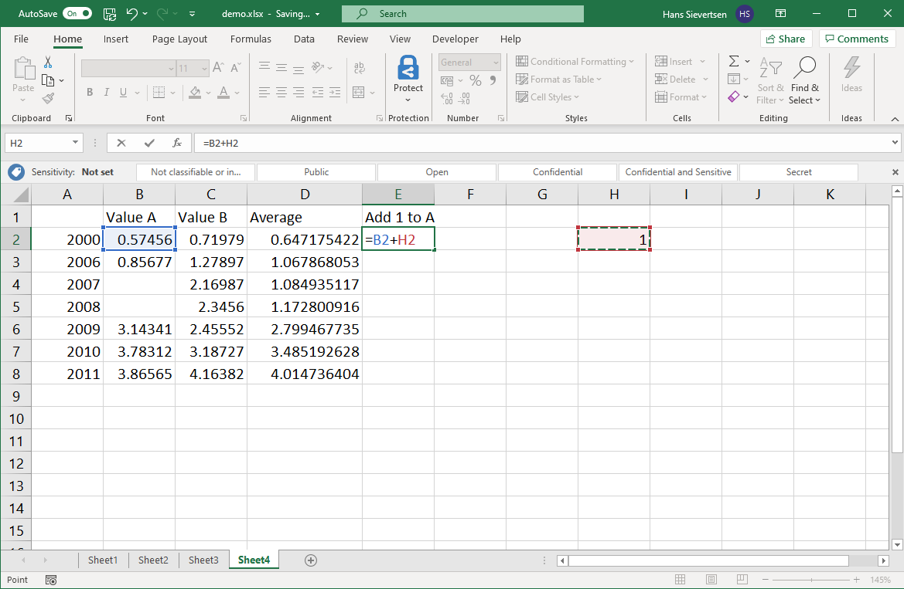
```

Now if we expand the formula down (just like above) Microsoft Excel will also update the reference cell H2 to a row further down. This will lead to an error in the formula! How can we avoid that?

```{r,  include=TRUE, fig.align="center", fig.cap=c(" "), out.width="90%", fig.show='hold',echo=FALSE}
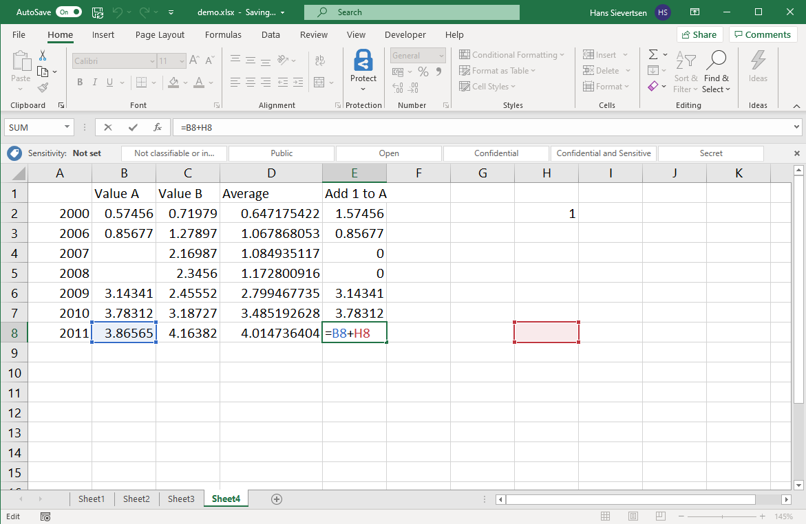
```


We can **lock** cell references to suppress the automatic reference updating by Microsoft Excel. We lock a cell using the $ symbol as in the example below. 

We use two $ symbols. One in front of the "H" which means "Never change the column, stick to the H column". One in front of the 2 which means "Never change the row, always stick to row 2!".

```{r,  include=TRUE, fig.align="center", fig.cap=c(" "), out.width="90%", fig.show='hold',echo=FALSE}
knitr::include_graphics("./graphics/cellreferencing/fig6.png")
```


If we now expand the formula downwards the reference to cell B8 is updated as desired and the reference to cell H2 stays fixed as desired!

```{r,  include=TRUE, fig.align="center", fig.cap=c(" "), out.width="90%", fig.show='hold',echo=FALSE}
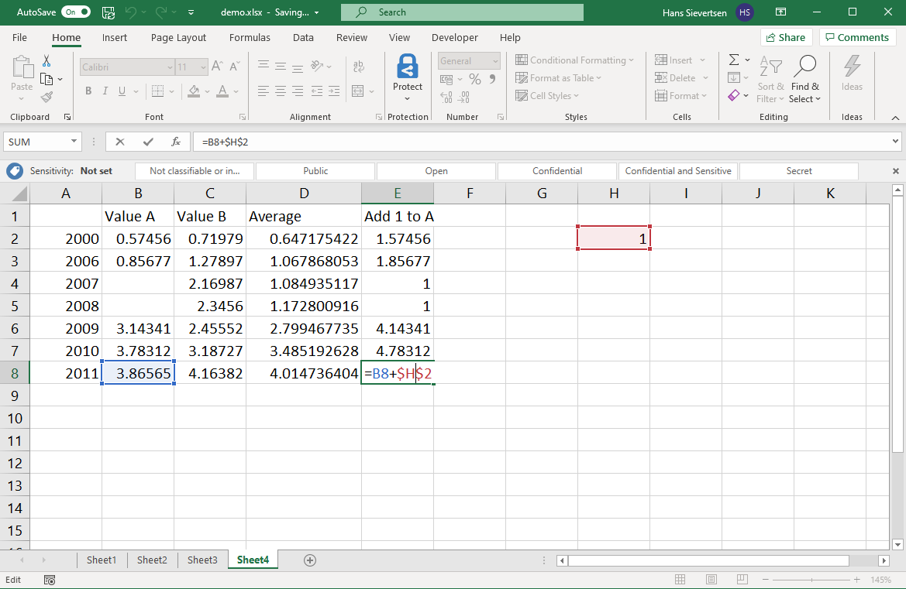
```

You don't have to include two dollar signs. If you only want to lock the column, only put it in front of the letter. If you only want to lock the row, only put it in front of the number. 


## Copy-pasting


Microsoft Excel have some special copy-pasting options. The animation below illustrates some of the these.

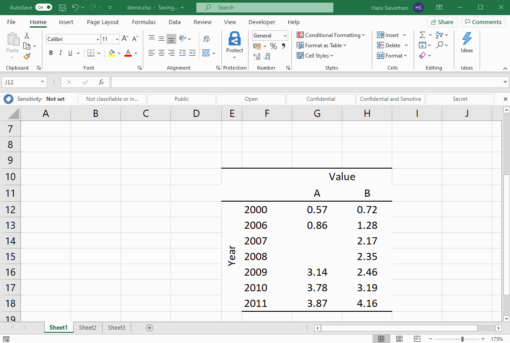


<!--chapter:end:02_ch2.Rmd-->

# Creating Charts in Microsoft Excel


## Our first line chart

Let's create our first chart in Microsoft Excel. We have a worksheet with two columns of data. Column A contains the variable Year and column B contains the variable Value. We want to create a chart where Year is shown on the horisontal axis and the variable Value on the vertical axis. 

```{r,  include=TRUE, fig.align="center", fig.cap=c(" "), out.width="90%", fig.show='hold',echo=FALSE}
knitr::include_graphics("./graphics/chart/fig1.png")
```


To insert a chart we select the **Insert** Tab. 

```{r,  include=TRUE, fig.align="center", fig.cap=c(" "), out.width="90%", fig.show='hold',echo=FALSE}
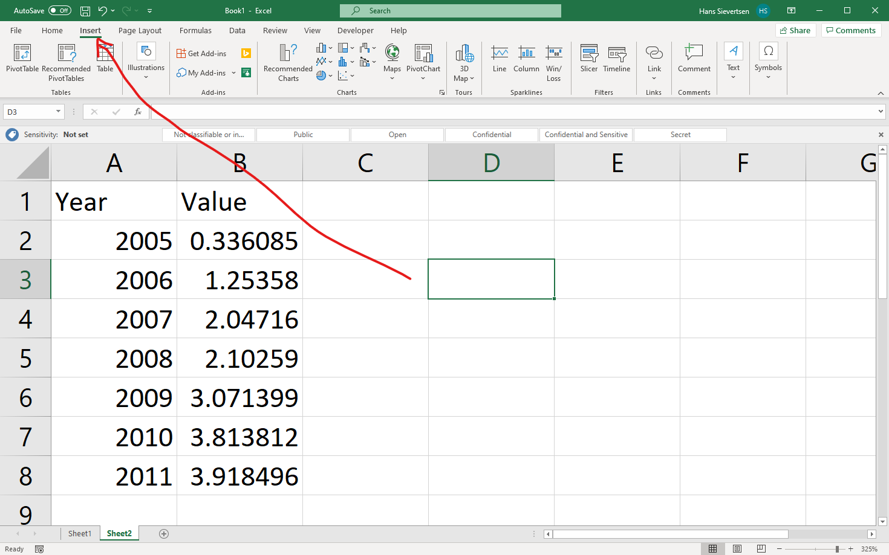
```


The **Insert** ribbon contains a section of charts. The icons reveal what type of chart they represent, but we can also hoover the mouse over the icon to see an explanation.


```{r,  include=TRUE, fig.align="center", fig.cap=c(" "), out.width="90%", fig.show='hold',echo=FALSE}
knitr::include_graphics("./graphics/chart/fig3.png")
```


Let's click on the icon that represents a line chart (see arrow below). 


```{r,  include=TRUE, fig.align="center", fig.cap=c(" "), out.width="90%", fig.show='hold',echo=FALSE}
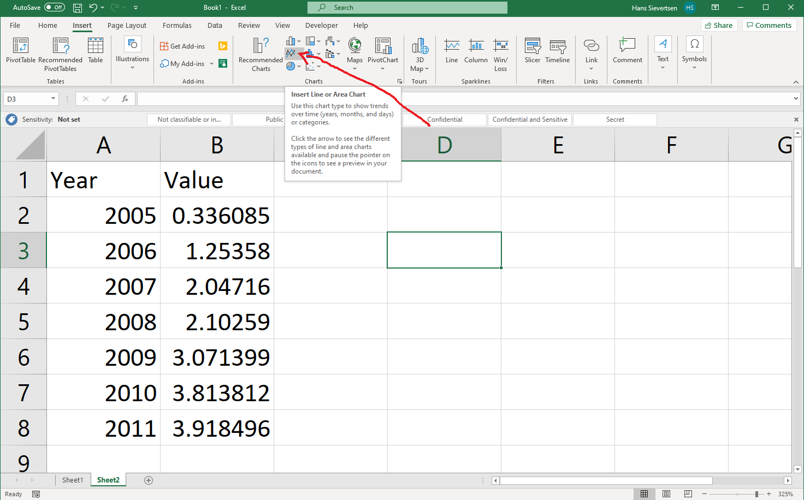
```


Clicking on the line chart icon opens a menu with different chart type options. 


```{r,  include=TRUE, fig.align="center", fig.cap=c(" "), out.width="90%", fig.show='hold',echo=FALSE}
knitr::include_graphics("./graphics/chart/fig5.png")
```

For now we'll just pick the one in the upper left corner.


```{r,  include=TRUE, fig.align="center", fig.cap=c(" "), out.width="90%", fig.show='hold',echo=FALSE}
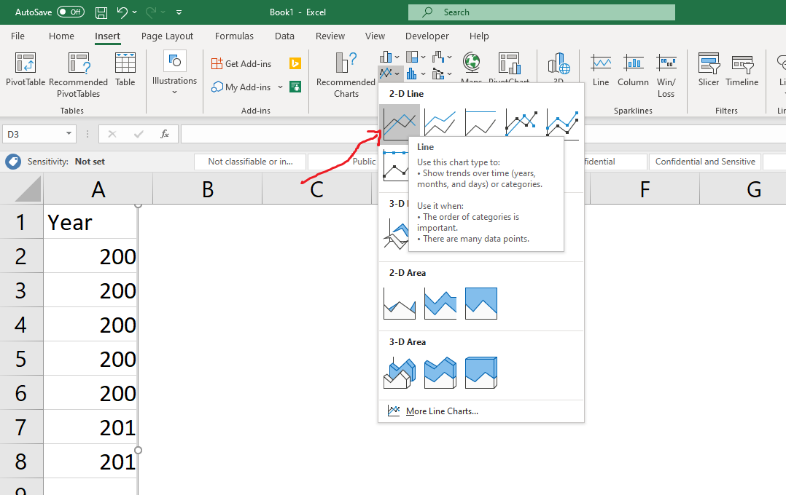
```


This creates a blank a canvas. Note if it doesn't look like that for you,, it might be because Microsoft Excel guessed what data to include. We cover that case later. Just read-on for now!

```{r,  include=TRUE, fig.align="center", fig.cap=c(" "), out.width="90%", fig.show='hold',echo=FALSE}
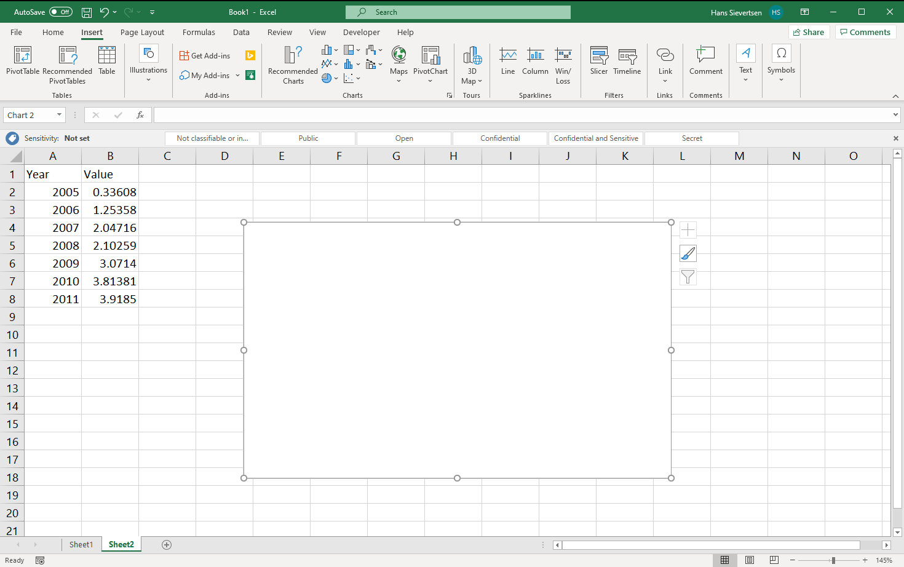
```


We first need to tell Microsoft Excel what data to use for the chart. Once we've selected the chart canvas (just click on it), we can select the "Chart Design" tab and select "Select Data" (see below). Alternatively, we can just right-click on the canvas and click "Select Data".

```{r,  include=TRUE, fig.align="center", fig.cap=c(" "), out.width="90%", fig.show='hold',echo=FALSE}
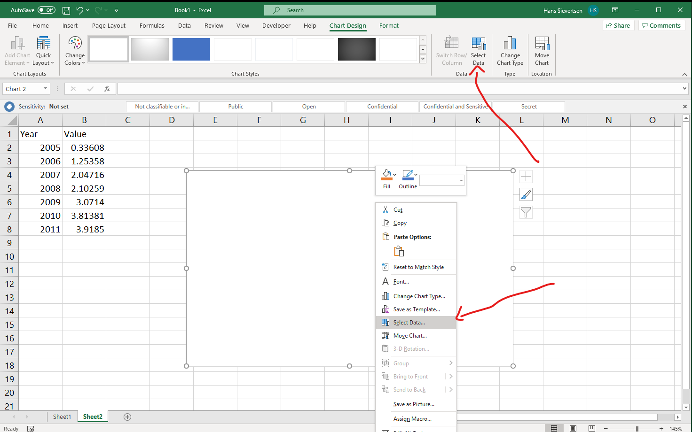
```


The select data looks like the menu below. In the top we can select the entire data range to be included. I generally recommend NOT to do that. Instead let's focus on the two panels below. Here we can select the data to show on the vertical axis (y-axis) in the left panel, and the variable to show on the horisontal axis (x-axis) on the right panel. 


```{r,  include=TRUE, fig.align="center", fig.cap=c(" "), out.width="90%", fig.show='hold',echo=FALSE}
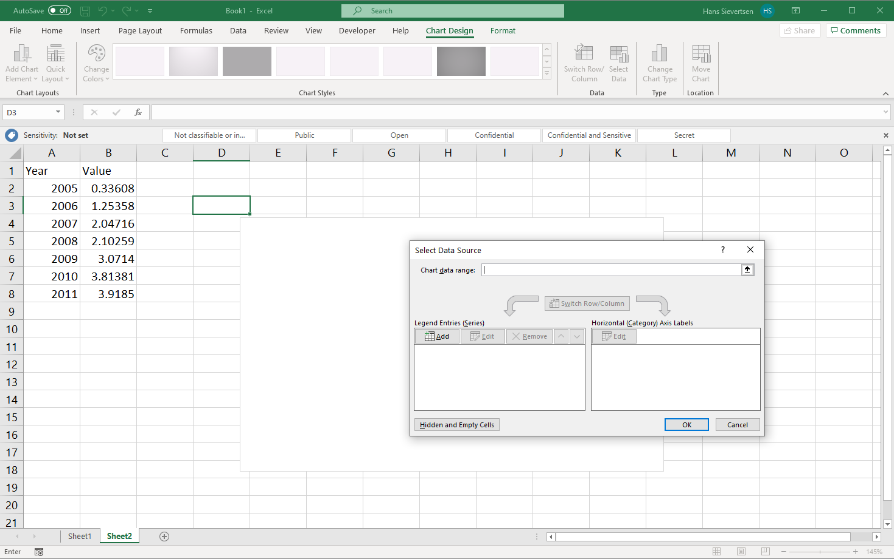
```

Let's first tell Microsoft Excel what data to use for the vertical axis. We click "Add" as shown below. 


```{r,  include=TRUE, fig.align="center", fig.cap=c(" "), out.width="90%", fig.show='hold',echo=FALSE}
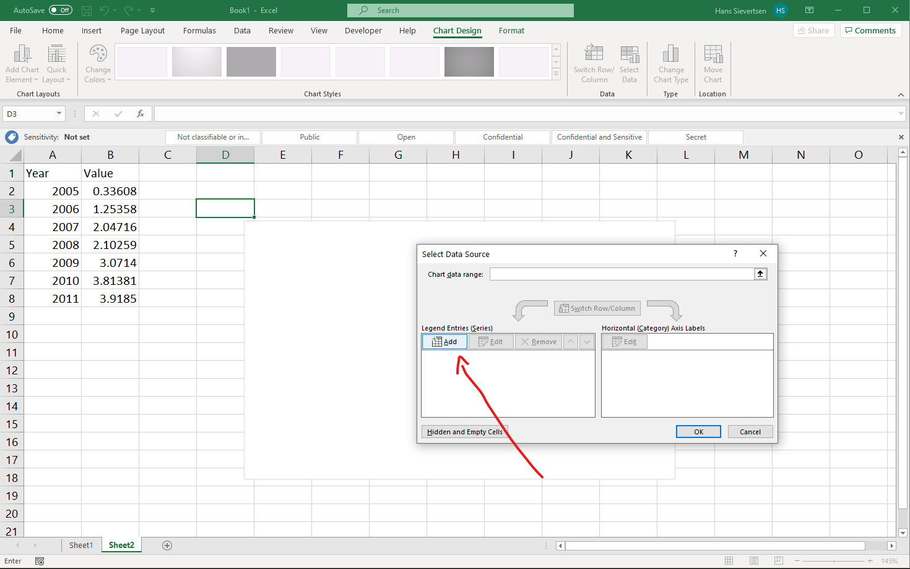
```

We should now see a menu like the one below. Here we can add a name for the series and the content of the series. 


```{r,  include=TRUE, fig.align="center", fig.cap=c(" "), out.width="90%", fig.show='hold',echo=FALSE}
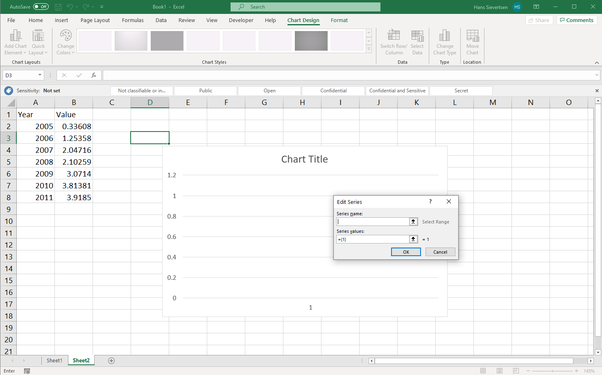
```


We can add the title of the series in "Series name"  manually by simply typing it, or...


```{r,  include=TRUE, fig.align="center", fig.cap=c(" "), out.width="90%", fig.show='hold',echo=FALSE}
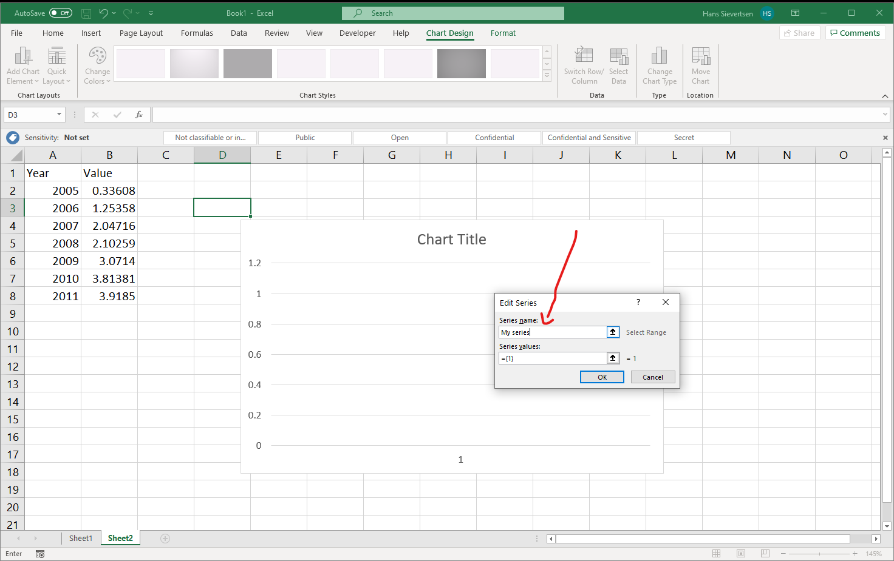
```

... we can click on the small icon with the arrow up as shown below.


```{r,  include=TRUE, fig.align="center", fig.cap=c(" "), out.width="90%", fig.show='hold',echo=FALSE}
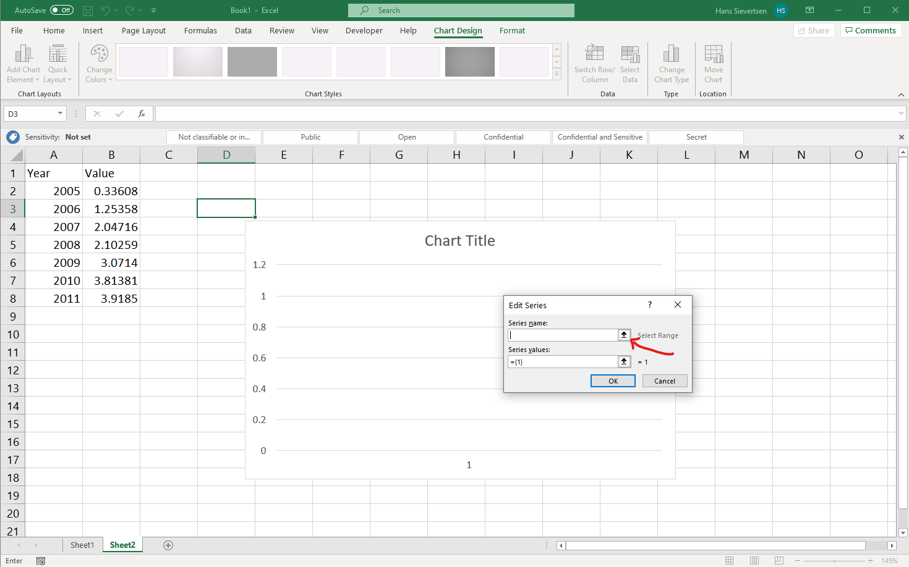
```


This opens yet another menu. We can now simply click on the cell that contains the title of the series or we can type the reference to the series like in the example below. The cell that is referenced should be marked with a dashed border. Click on the little icon indicated with the arrow below to confirm the selection. 


```{r,  include=TRUE, fig.align="center", fig.cap=c(" "), out.width="90%", fig.show='hold',echo=FALSE}
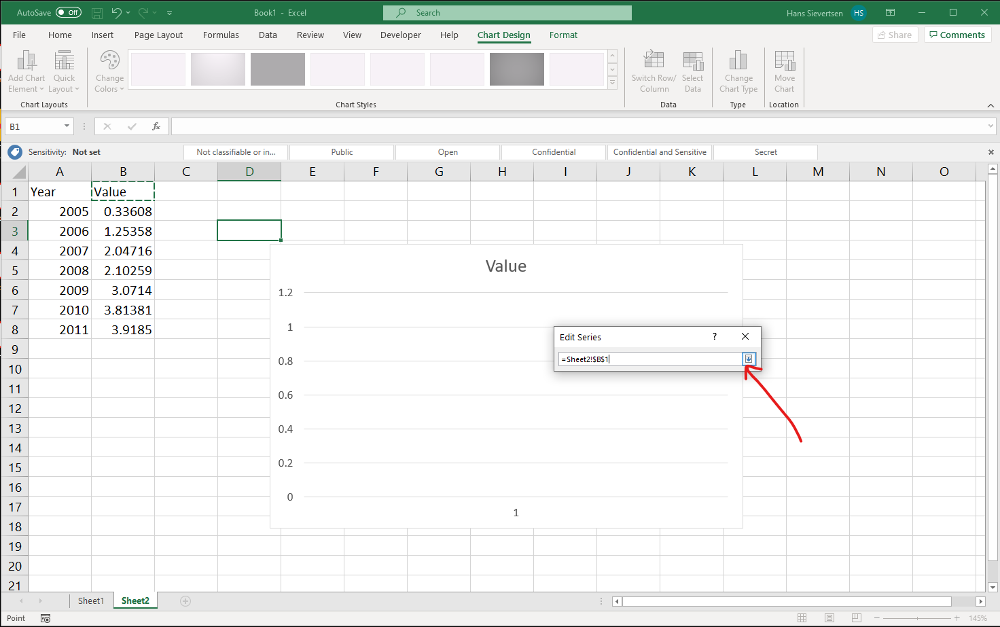
```


Note that it is very easy to mess up the reference to the right cell. For example as in the image below where I accidentially mixed-up a manual title entry with a reference to cell B1. Pay attention to what is written in the box!


```{r,  include=TRUE, fig.align="center", fig.cap=c(" "), out.width="90%", fig.show='hold',echo=FALSE}
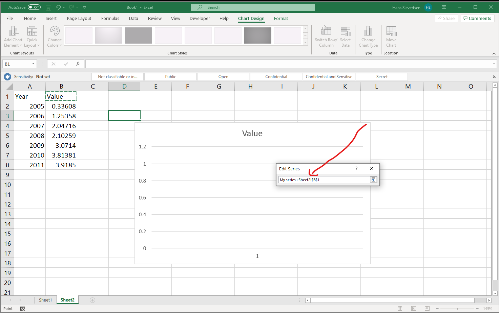
```

We are now back at the menu. Now click on the arrow up symbol for the "Series Values" section (just like we did for the "Series Name").


```{r,  include=TRUE, fig.align="center", fig.cap=c(" "), out.width="90%", fig.show='hold',echo=FALSE}
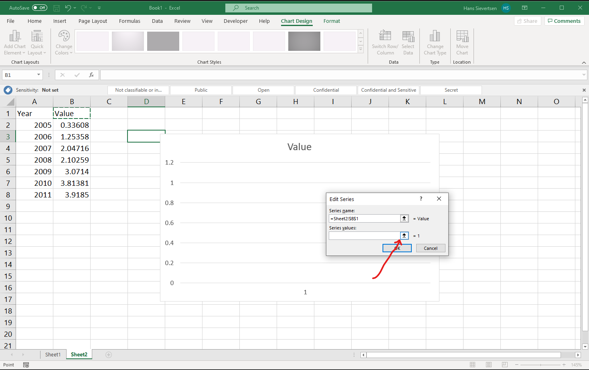
```


We now select all the cells that contain the values to show on the vertical axis and confirm our selection just like we did for the name. 

```{r,  include=TRUE, fig.align="center", fig.cap=c(" "), out.width="90%", fig.show='hold',echo=FALSE}
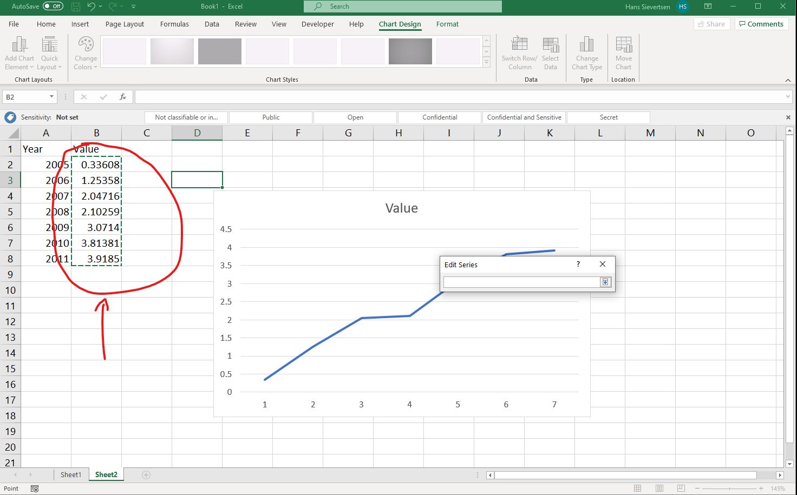
```


Back at the menu, we should already see our line. click "OK" to complete the series entry.


```{r,  include=TRUE, fig.align="center", fig.cap=c(" "), out.width="90%", fig.show='hold',echo=FALSE}
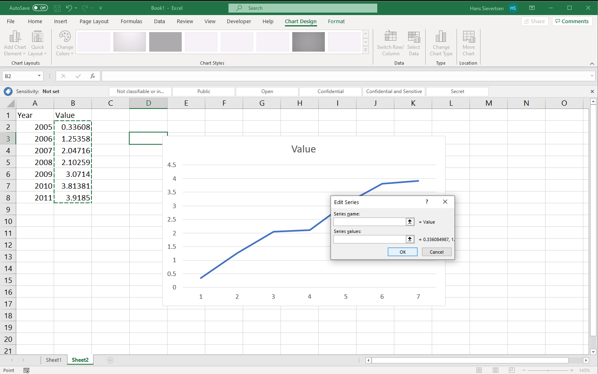
```


We might think we are done now, but wait! Look at the horisontal axis. It just shows values 1 to 7 and not the years from column A! We haven't told Microsoft Excel what valus to use on the horisotnal axis yet.

```{r,  include=TRUE, fig.align="center", fig.cap=c(" "), out.width="90%", fig.show='hold',echo=FALSE}
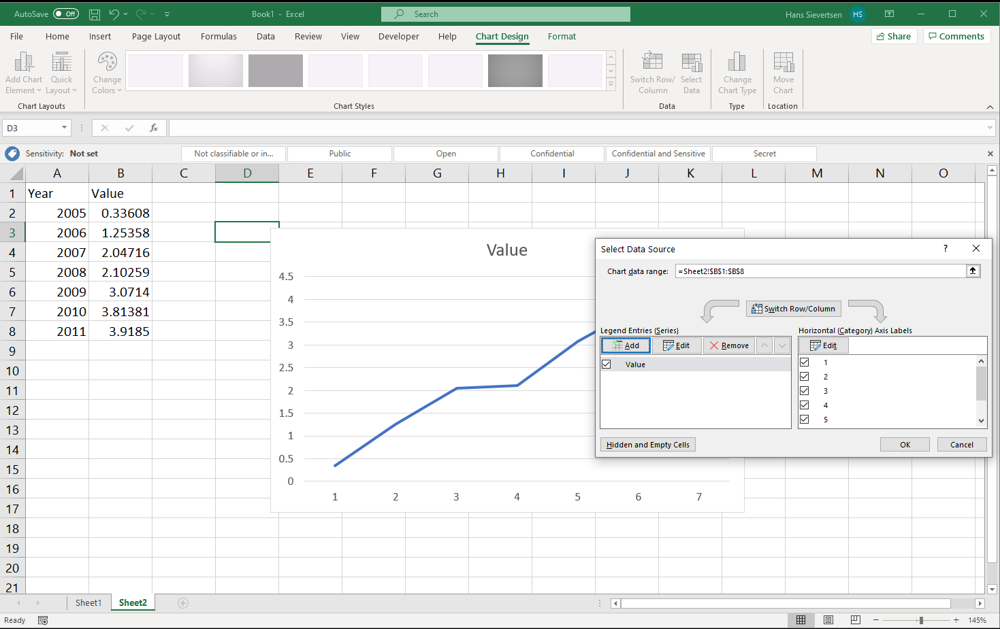
```


Click "Edit" in the right panel to select the series for the horisontal axis. 

```{r,  include=TRUE, fig.align="center", fig.cap=c(" "), out.width="90%", fig.show='hold',echo=FALSE}
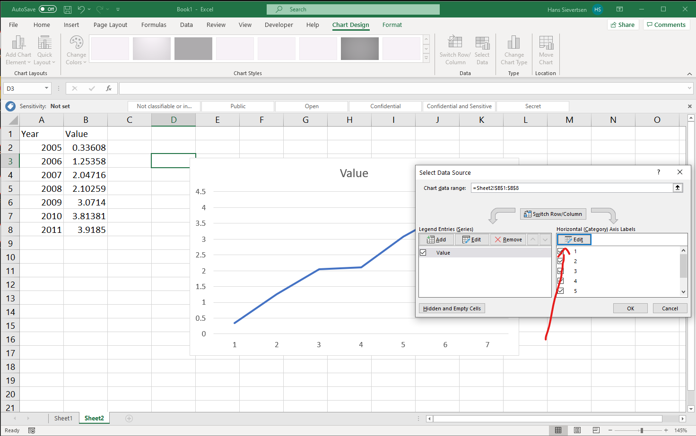
```


Follow the same procedure as for the data on the vertical axis and select the data for the horisontal axis and click OK. 

```{r,  include=TRUE, fig.align="center", fig.cap=c(" "), out.width="90%", fig.show='hold',echo=FALSE}
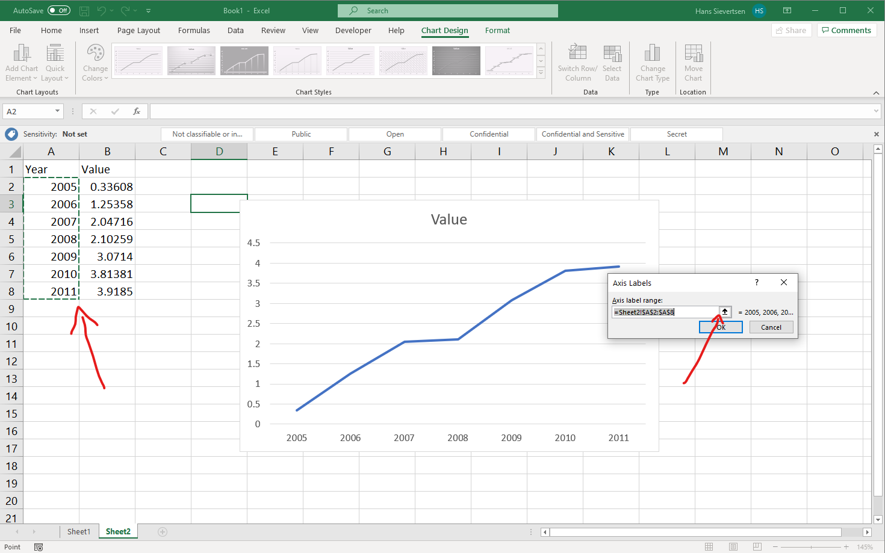
```


Back at the menu things already look good. Click "OK" to finish the "Select Data" procedure.


```{r,  include=TRUE, fig.align="center", fig.cap=c(" "), out.width="90%", fig.show='hold',echo=FALSE}
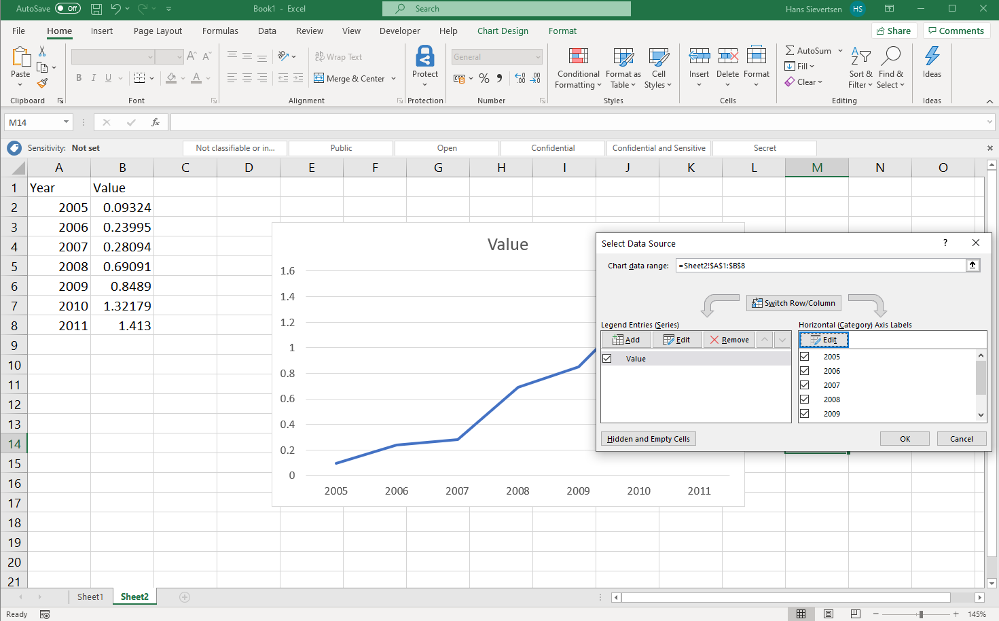
```


Looks good! Our first line chart!


```{r,  include=TRUE, fig.align="center", fig.cap=c(" "), out.width="90%", fig.show='hold',echo=FALSE}
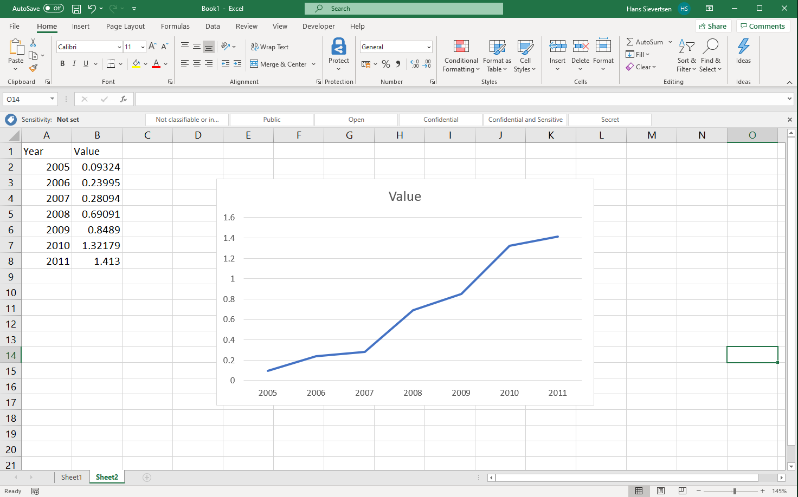
```


####   What if the canvas is not blank?   {-}


If we (accidently) selected some of the data before clicking on "Insert line chart" as in the example below...


```{r,  include=TRUE, fig.align="center", fig.cap=c(" "), out.width="90%", fig.show='hold',echo=FALSE}
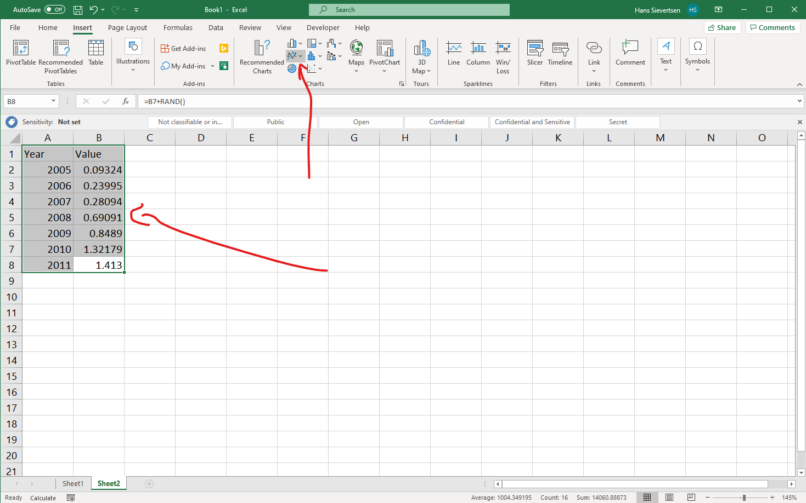
```


... it is very likely that Microsoft Excel produces something like the below. What is that? What happens is that Microsoft Excel make sa guess of what data you want to use where. Because it sees two columns with column headers it believes that you want to show both series on the vertical axis. So instead of showing Year on the horisontal axis it is shown on the vertical axis.


```{r,  include=TRUE, fig.align="center", fig.cap=c(" "), out.width="90%", fig.show='hold',echo=FALSE}
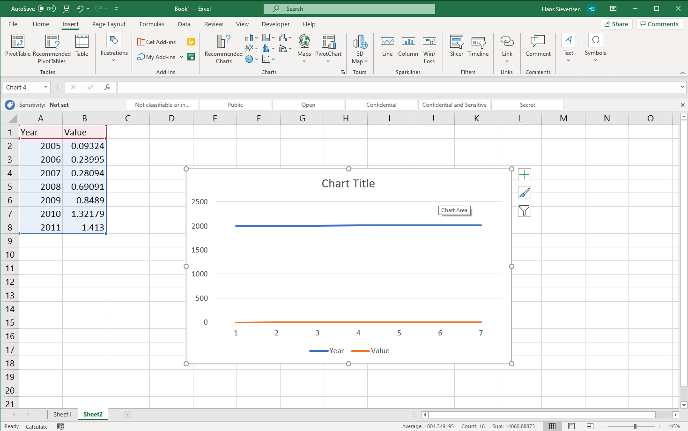
```


What can we do in that case? One solution is to select the chart area and press delete and start over. Another alternative is to go to the select data menu just like we did above. In the select data menu we highlight the row with "Year" in the left panel and click "Remove" to remove the Year series from the vertical axis. After that we can just follow the steps above and add the Year series to the horisontal axis using the right panel.

```{r,  include=TRUE, fig.align="center", fig.cap=c(" "), out.width="90%", fig.show='hold',echo=FALSE}
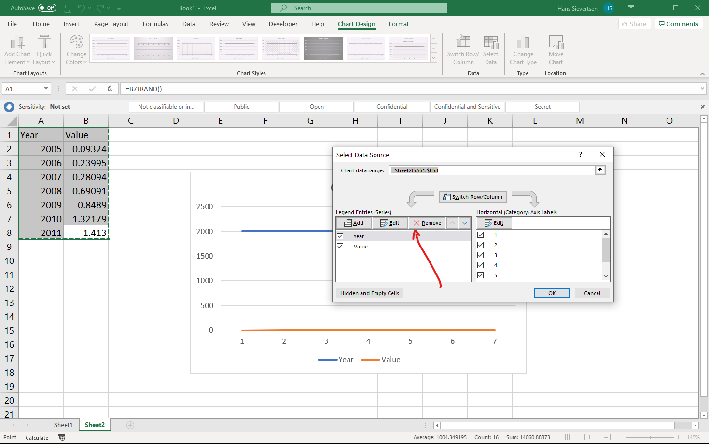
```


####  Getting Microsoft Excel to make the right guess {-}

How could we help Microsoft Excel to make the right guess? That is simple. Remove the header for the Year series. And follow the same steps as below. If the data structure is like below, we can do all we did above in one quick step by selecting all the data and clicking insert line chart. 

```{r,  include=TRUE, fig.align="center", fig.cap=c(" "), out.width="90%", fig.show='hold',echo=FALSE}
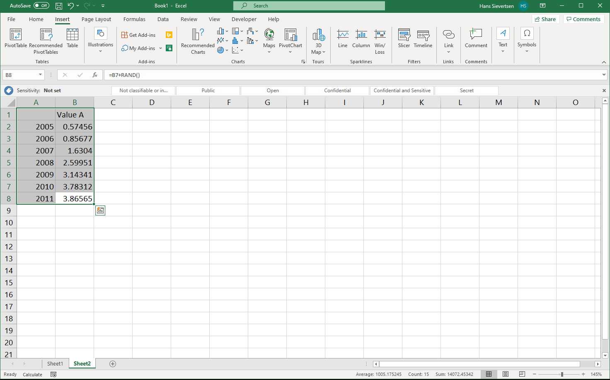
```


Voila! We have line chart with the right data series on the right axes. 

```{r,  include=TRUE, fig.align="center", fig.cap=c(" "), out.width="90%", fig.show='hold',echo=FALSE}
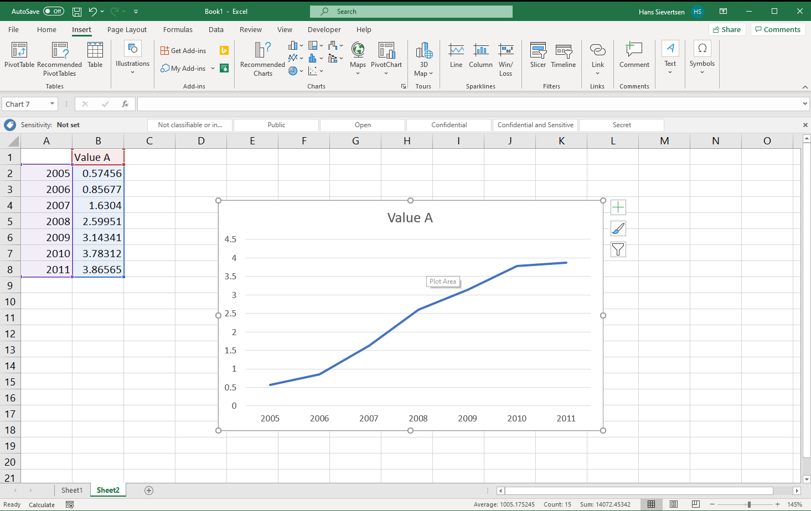
```


####   A bar chart {-}

To create a bar chart we follow the same steps as for the line chart, we just select the bar chart icon above the line chart icon (see below). The data selection procedure is just like for the line chart. 

```{r,  include=TRUE, fig.align="center", fig.cap=c(" "), out.width="90%", fig.show='hold',echo=FALSE}
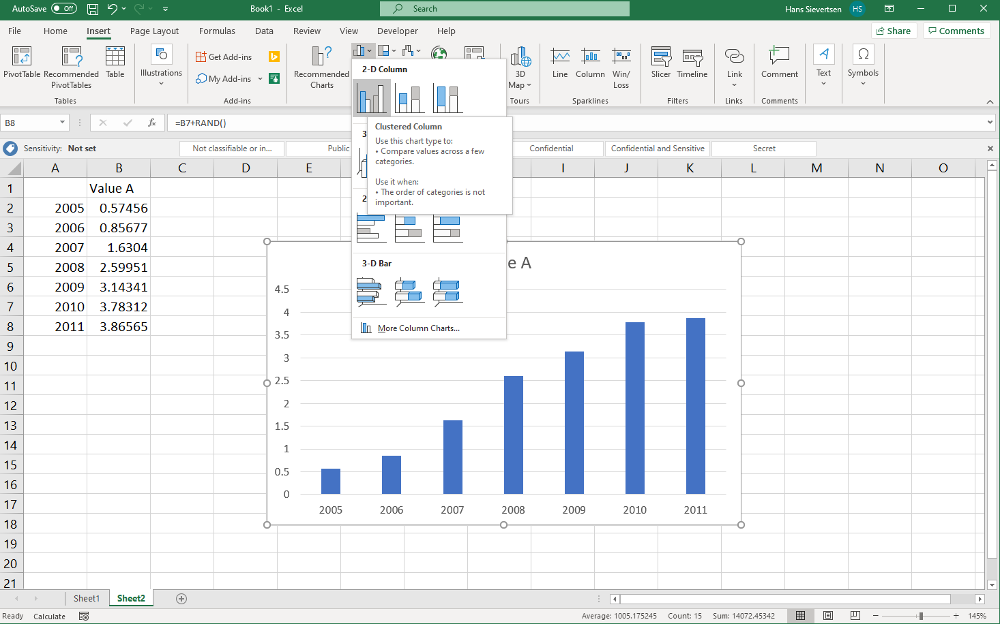
```


####   An area chart {-}

We can find area charts within the line chart menu as illustrated below. The data selection procedure is just like for the line chart. 

```{r,  include=TRUE, fig.align="center", fig.cap=c(" "), out.width="90%", fig.show='hold',echo=FALSE}
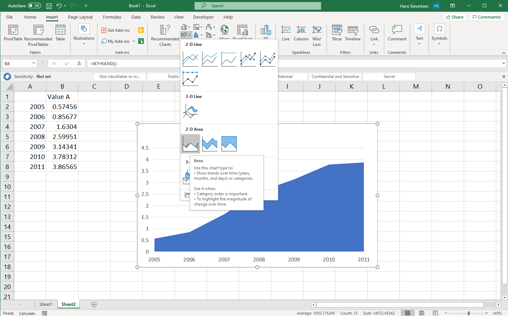
```


####   A stacked area chart {-}

A stacked area chart puts the series on top of each other. For the example below we have two series that we put on top of each other. The stacked area chart is just to the right of the line chart. The data selection procedure is just like for the line chart. 

```{r,  include=TRUE, fig.align="center", fig.cap=c(" "), out.width="90%", fig.show='hold',echo=FALSE}
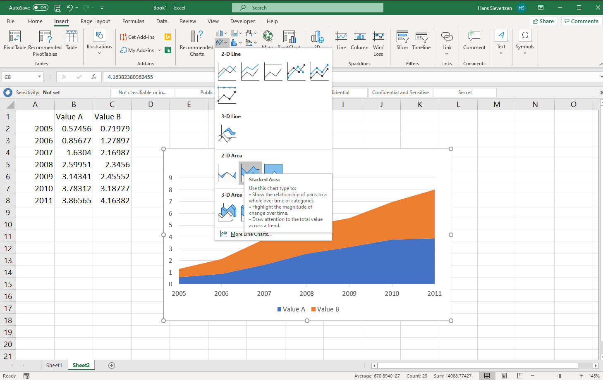
```


####   An unstacked area chart with two series {-}

If we do not stack our series and create an area chart with two series, one series might cover the other series. It is therefore important that the **ordering** of the series is as desired. We can change the order in the "Select data" menu by highlighting a series in the left panel (just click on it) and clicking on the small arrows (see below) to change the ordering.


```{r,  include=TRUE, fig.align="center", fig.cap=c(" "), out.width="90%", fig.show='hold',echo=FALSE}
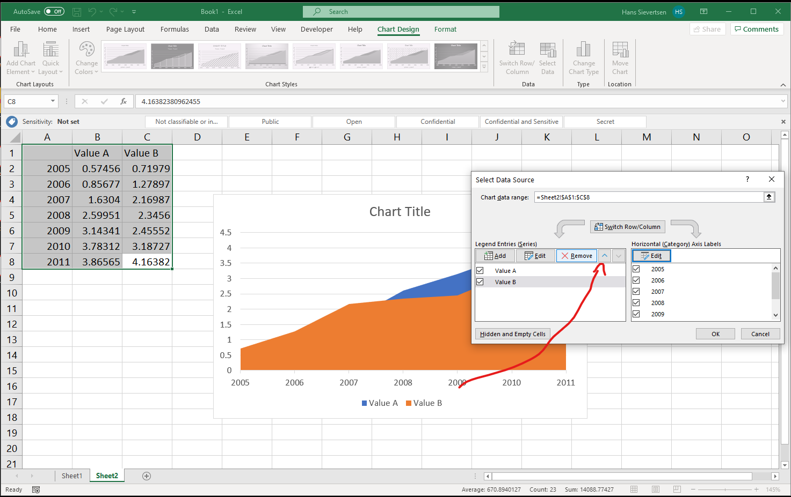
```


####   A scatter plot {-}

Scatter plots work slightly differently than line charts, bar charts, and area charts in Microsoft Excel. Let's try it. You will typically find the scatter plot icon in the lower row of the chart area in the ribbon, as shown below. 


```{r,  include=TRUE, fig.align="center", fig.cap=c(" "), out.width="90%", fig.show='hold',echo=FALSE}
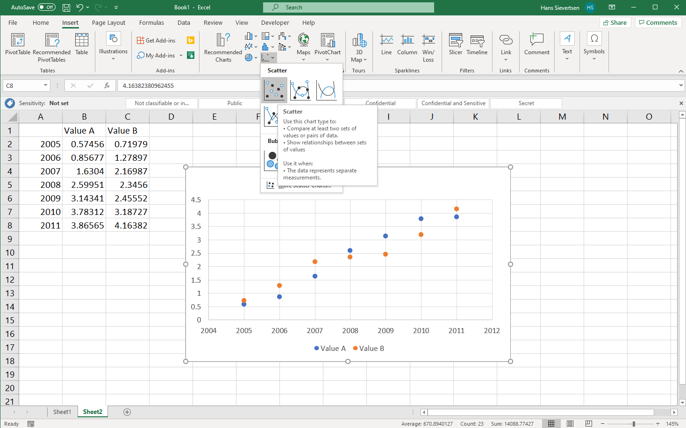
```


If we go to the "Select data" menu for the scatter plot we see that the right panel for the horisontal axis is "greyed out". We cannot modify that part. That is because each seres has their own series on the vertical and horisontal axis. 

```{r,  include=TRUE, fig.align="center", fig.cap=c(" "), out.width="90%", fig.show='hold',echo=FALSE}
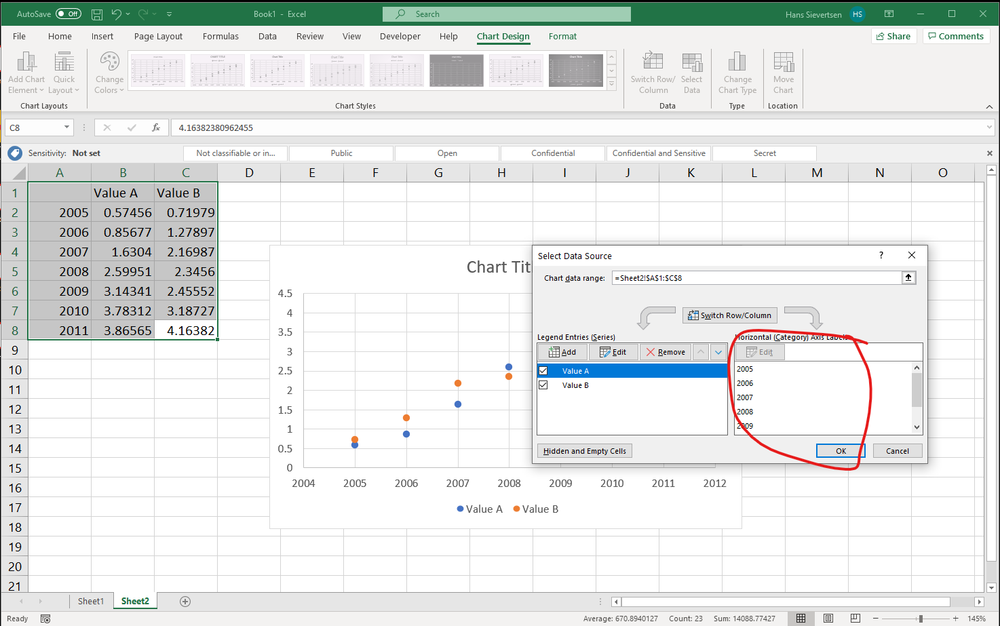
```

Let's select "Edit" in the left panel to  modify the data selection for one of the series. Recall that for the other charts we only changed the title of the series and the values on the vertical axis. However...


```{r,  include=TRUE, fig.align="center", fig.cap=c(" "), out.width="90%", fig.show='hold',echo=FALSE}
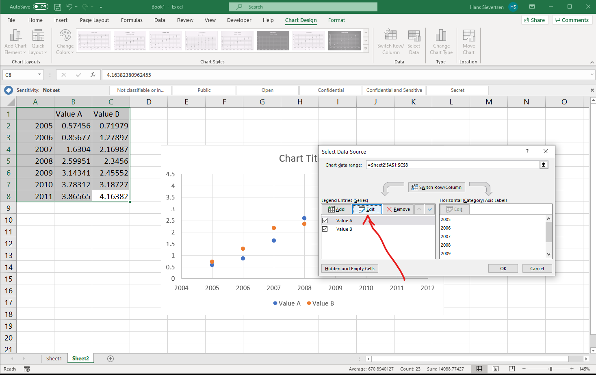
```


...in a Scatter plot, we specify both the values to use on the vertical and the horisontal axis for each series individual. We have one additional row in the select data menu, as shown below.

```{r,  include=TRUE, fig.align="center", fig.cap=c(" "), out.width="90%", fig.show='hold',echo=FALSE}
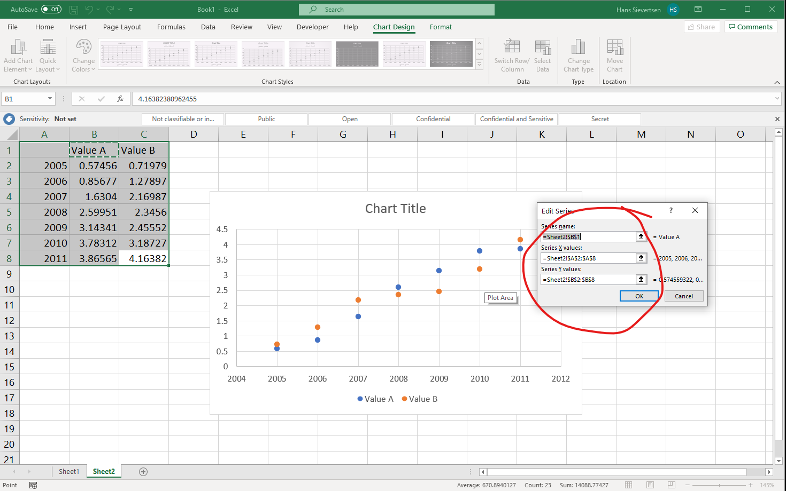
```

In many cases we don't need to worry about this difference, however, it gives us more flexibility, because we can select the series independently. 


## Polishing the chart


####   Missing data points {-}


Real-World data is often incomplete. Like in the example below, we don't observe any values for Value A in the years 2007 and 2008. This will lead to a gap in the line chart. This is typically fine and in line with what the data shows. However, in some cases we might want to make a guess of what these missing values could be. Our guess is that we can draw a straight line between the last observed value and the next observed value. This is called linear interpolation. 

```{r,  include=TRUE, fig.align="center", fig.cap=c(" "), out.width="90%", fig.show='hold',echo=FALSE}
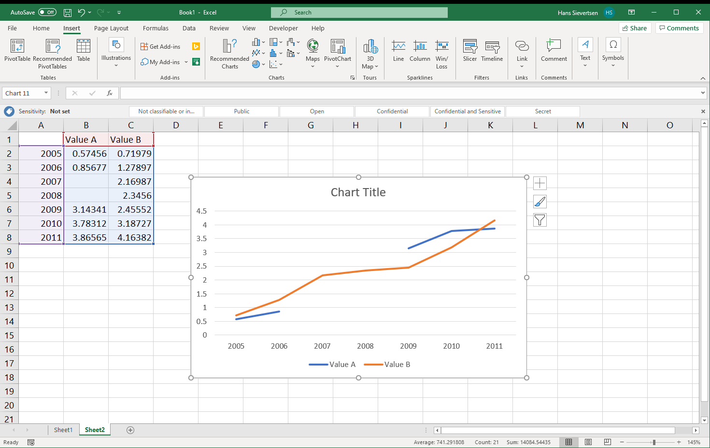
```


We can make Microsoft Excel draw a straight line between the last observed value and the next observed value by manually calculating what the values in the gaps are as in the example below.


```{r,  include=TRUE, fig.align="center", fig.cap=c(" "), out.width="90%", fig.show='hold',echo=FALSE}
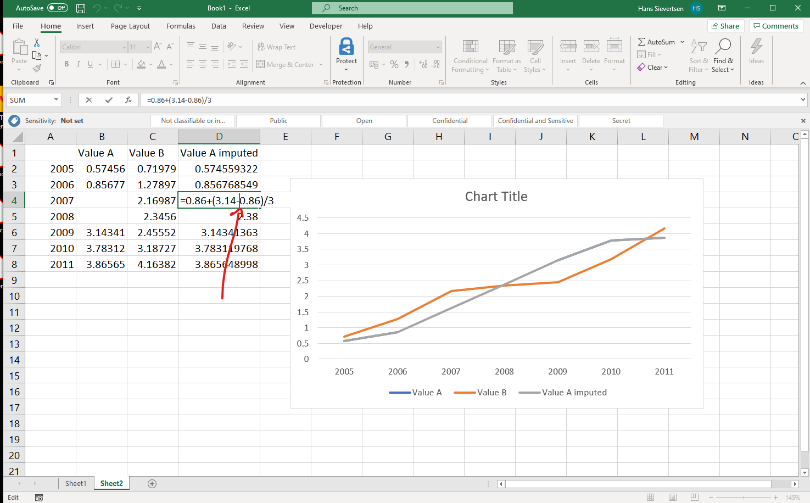
```


However, Microsoft Excel includes a function to do the linear interpolation and draw straight lines for us. To use this function simply go to the "Select data" menu and click on the "Hidden and Empty Cells" button in the lower left corner. 


```{r,  include=TRUE, fig.align="center", fig.cap=c(" "), out.width="90%", fig.show='hold',echo=FALSE}
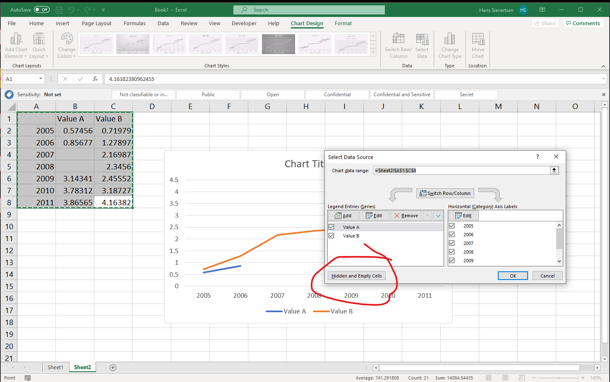
```


In the new menu, select "Connect data points with line", to connect values. 


```{r,  include=TRUE, fig.align="center", fig.cap=c(" "), out.width="90%", fig.show='hold',echo=FALSE}
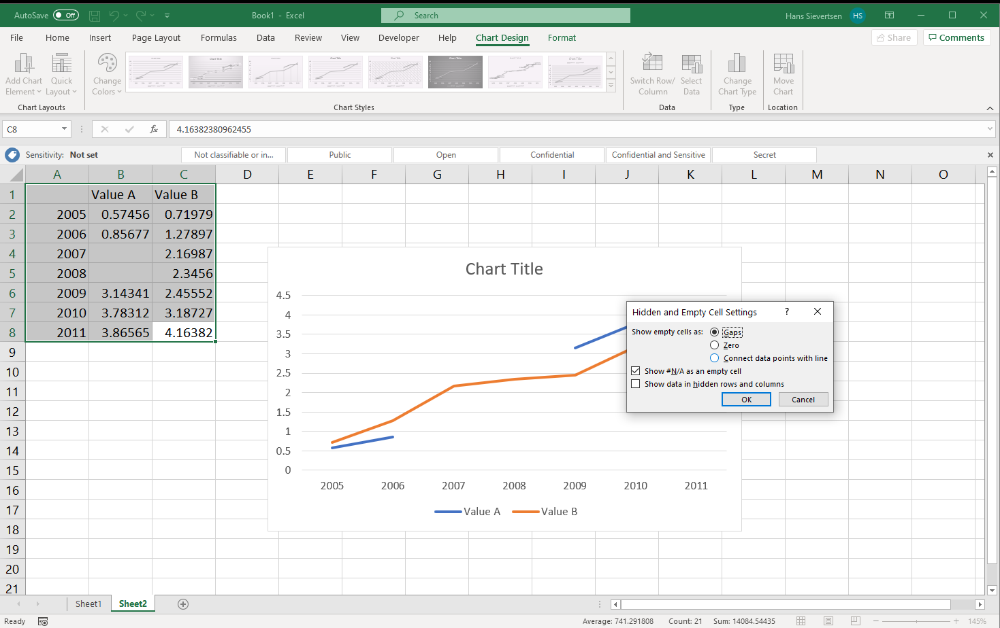
```


Voila! Microsoft Excel did all the work for us!


```{r,  include=TRUE, fig.align="center", fig.cap=c(" "), out.width="90%", fig.show='hold',echo=FALSE}
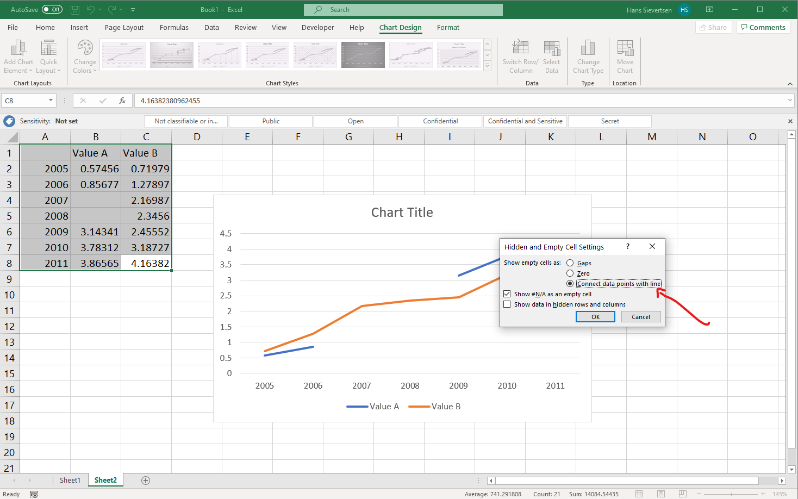
```


####   Numerical values on the horisontal axis {-}

You don't always make brilliant decisions. One example is my decision not to include Kevin de Bruyne in my Fantasy Premier League Team in the season 2019/20. Another example is Microsoft's decision to treat the horisontal axis in a line chart as categorical. I do not understand that because it is meaningless to connect values with a line that are categorical. But that is what they do!

What is the problem with treating the horisontal axis as categorical? The problem is that the numerical values are not given any importance by Microsoft Excel when generating the chart. Take a look at the chart below. The first value on the horisontal axis is 2000. The second value is 2006. The third value is 2007. The distance between 2000 and 2006 is the same as the distance from 2006 and 2007. That is misleading and not what we want. That is because Microsoft Excel ignores that 2000 is actually a number. It just treats it as   text. What can we do to solve this issue?


```{r,  include=TRUE, fig.align="center", fig.cap=c(" "), out.width="90%", fig.show='hold',echo=FALSE}
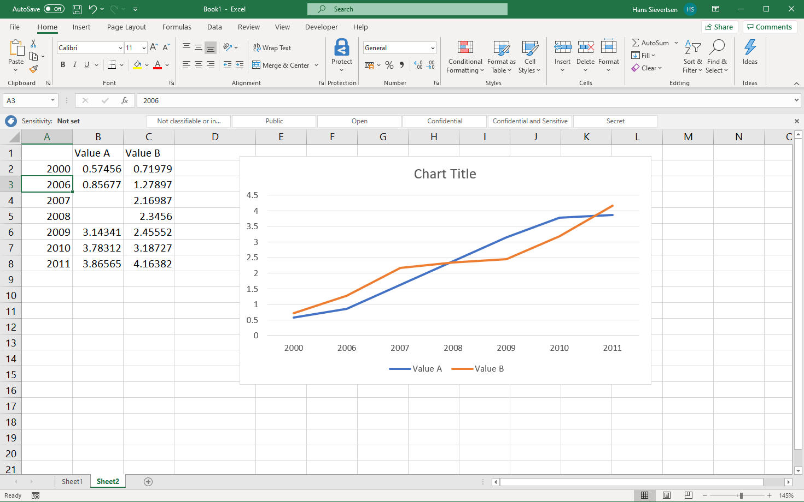
```

One solution is to manually add all the data points between 2000 and 2006 as in the example below (remember to connect lines across missing data points, as explained above).


```{r,  include=TRUE, fig.align="center", fig.cap=c(" "), out.width="90%", fig.show='hold',echo=FALSE}
knitr::include_graphics("./graphics/advchart/fig8.png")
```


However, manually adding empty dataseries is not the best use of our time. There is an alternative solution: Scatter plots! Scatter plots differ from line charts (and bar charts, area charts etc) in that the horisontal axis is treated as numerical by default. 

To change the chart type, click on "Change chart type" as shown below (you have to select your chart and select the Chart Design tab to see this option).  You can also right-click on the chart and select "Change chart type".

```{r,  include=TRUE, fig.align="center", fig.cap=c(" "), out.width="90%", fig.show='hold',echo=FALSE}
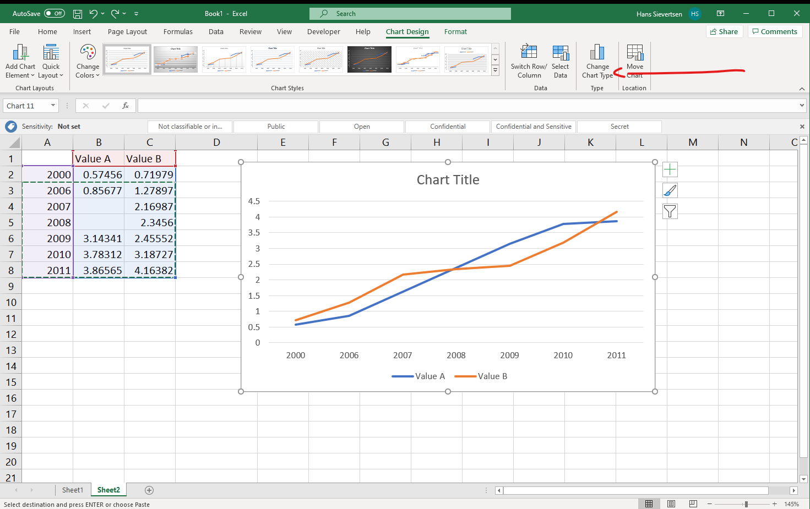
```


In the Change Chart Type menu select "X Y (Scatter)" and select the line chart chart as shown below. Don't ask me why Microsoft Excel includes a line chart in the Scatter menu. 

```{r,  include=TRUE, fig.align="center", fig.cap=c(" "), out.width="90%", fig.show='hold',echo=FALSE}
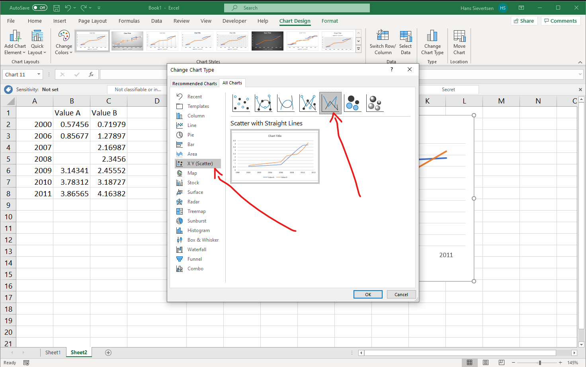
```

Voila! It works! The distance on the horisontal axis is now consistent with the values shown.

####   Formating axes  {-}


We can modify the axes scales and appearance. To change an axis, simply click on the axis (for example on one of the tick labels). If you've selected the "Format" tab, the ribbon will tell you what you've selected in the upper left corner (in the example below "Horizontal (Value) Axis"). We can then click "Format Selection" (or right-click on the axis and select "Format Axis").


```{r,  include=TRUE, fig.align="center", fig.cap=c(" "), out.width="90%", fig.show='hold',echo=FALSE}
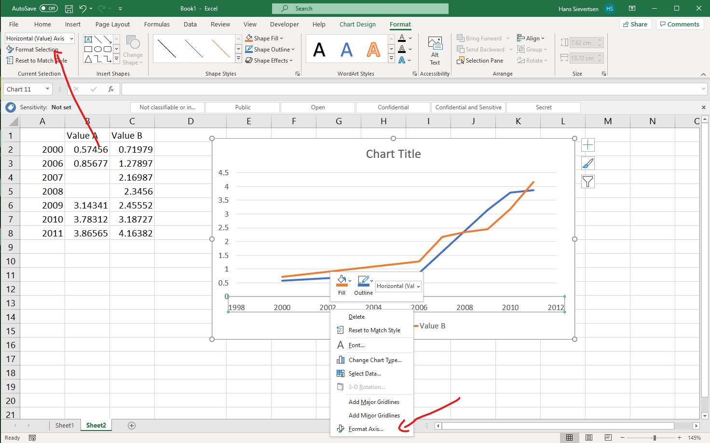
```


This opens a menu on the right as shown below. 


```{r,  include=TRUE, fig.align="center", fig.cap=c(" "), out.width="90%", fig.show='hold',echo=FALSE}
knitr::include_graphics("./graphics/advchart/fig16.png")
```

The menu consists of four categories (see below). The right-most category (the little bar chart symbol) allows us to change the scale and units on the axis. 

```{r,  include=TRUE, fig.align="center", fig.cap=c(" "), out.width="90%", fig.show='hold',echo=FALSE}
knitr::include_graphics("./graphics/advchart/fig17.png")
```


We can modify the beginning and end value of the axis (or click "Reset" to let Microsoft Excel determine it automatically).


```{r,  include=TRUE, fig.align="center", fig.cap=c(" "), out.width="90%", fig.show='hold',echo=FALSE}
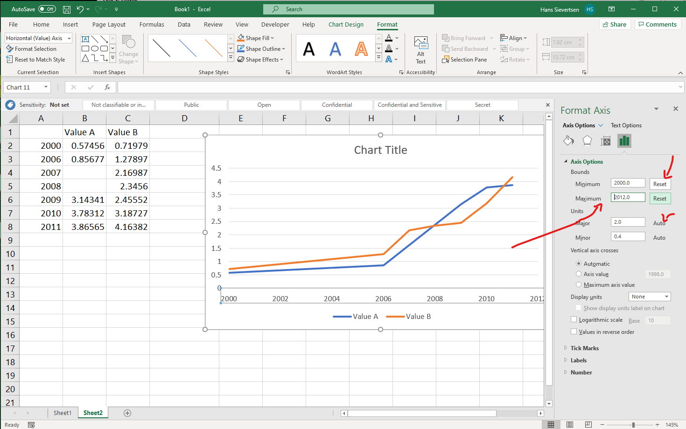
```


We can also change the appearance of the axis tick labels, by scrolling down to the "Number" section as shown below. In the example below we've told Excel to treat the labels on the vertical axis as numbers with two decimal places.


```{r,  include=TRUE, fig.align="center", fig.cap=c(" "), out.width="90%", fig.show='hold',echo=FALSE}
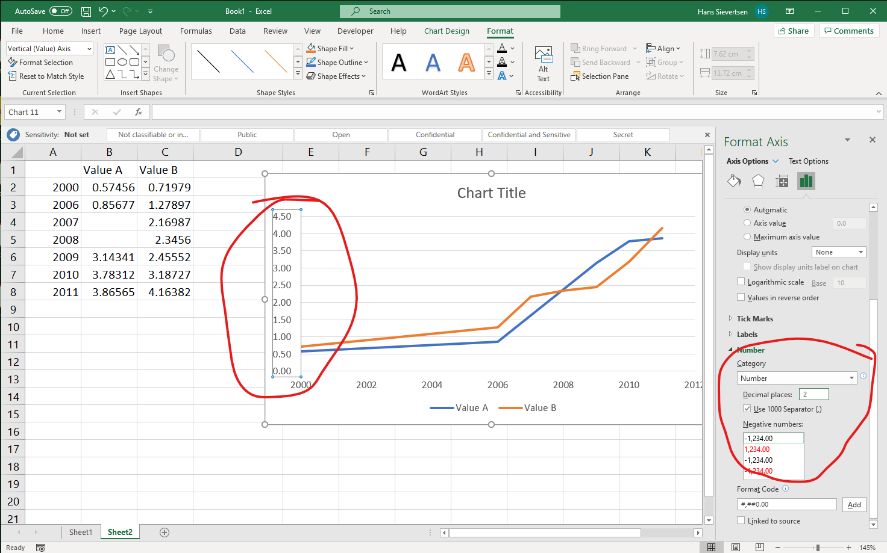
```

As shown in the example below, in the left-most menu we can change the colouring of the axis line, the line shape, the line thickness and other appearance aspects. 

```{r,  include=TRUE, fig.align="center", fig.cap=c(" "), out.width="90%", fig.show='hold',echo=FALSE}
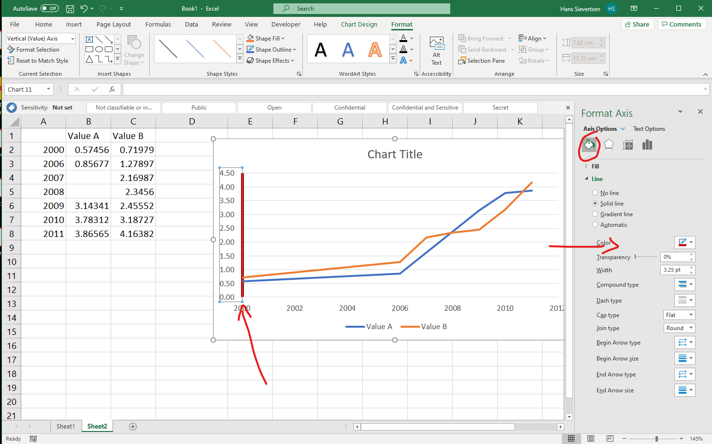
```


####   Formating other chart elements  {-}

We can modify almost all chart elements. We simply select the element we want to change and click "Format Selection" in the ribbon (or right-click and click Format...). In the example below we've selected the grid lines. We can then change the appearance of these grid lines in the menu on the right. 

```{r,  include=TRUE, fig.align="center", fig.cap=c(" "), out.width="90%", fig.show='hold',echo=FALSE}
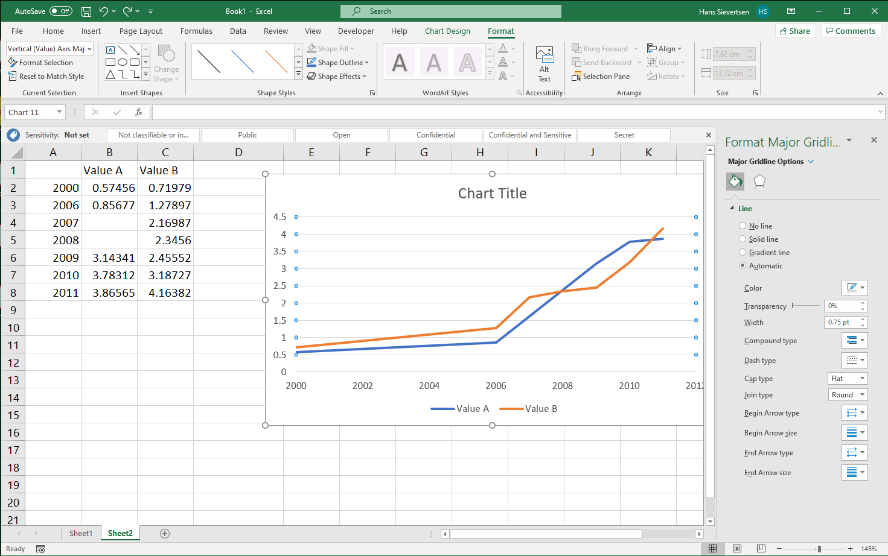
```


####   Adding chart elements  {-}

We can add chart elements in the Chart Design Tab by clicking Add Chart Element in the left-most part of the ribbon as shown below. we can also click on the big "+" symbol to the right of the chart. 


```{r,  include=TRUE, fig.align="center", fig.cap=c(" "), out.width="90%", fig.show='hold',echo=FALSE}
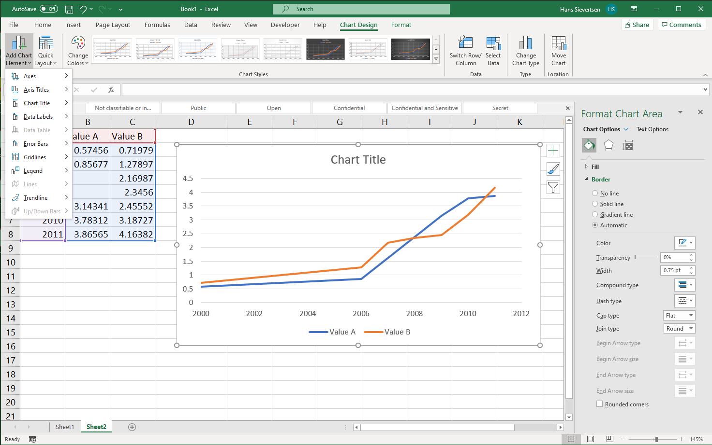
```


####   Moving chart elements  {-}

We can move chart elements by simply selecting and dragging them as shown for the legend below.


```{r,  include=TRUE, fig.align="center", fig.cap=c(" "), out.width="90%", fig.show='hold',echo=FALSE}
knitr::include_graphics("./graphics/advchart/fig23.png")
```


####   Inserting a text box {-}

We can insert a text box in our chart (and other shapes), for example to include a note about value imputation and data sources. Simply select the "Insert" tab and then select Illustrations and Shapes.  It is important that the chart canvas is selected when selecting this menu.


```{r,  include=TRUE, fig.align="center", fig.cap=c(" "), out.width="90%", fig.show='hold',echo=FALSE}
knitr::include_graphics("./graphics/advchart/fig24.png")
```


```{r,  include=TRUE, fig.align="center", fig.cap=c(" "), out.width="90%", fig.show='hold',echo=FALSE}
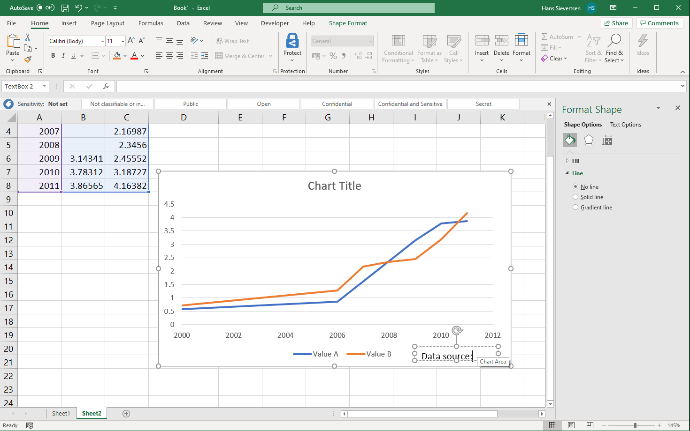
```


<!--chapter:end:03_ch3.Rmd-->

# Designing Tables in Microsoft Excel


##   Basic cell formatting 


Consider the table below. It shows the values for two series, "Value A" and "Value B" over years. Let's for now assume that we are happy with the structure of the table and we just want to improve the design. This includes

1. The colour and thickness of lines.

2. The alignment of values and labels.


```{r,  include=TRUE, fig.align="center", fig.cap=c(" "), out.width="90%", fig.show='hold',echo=FALSE}
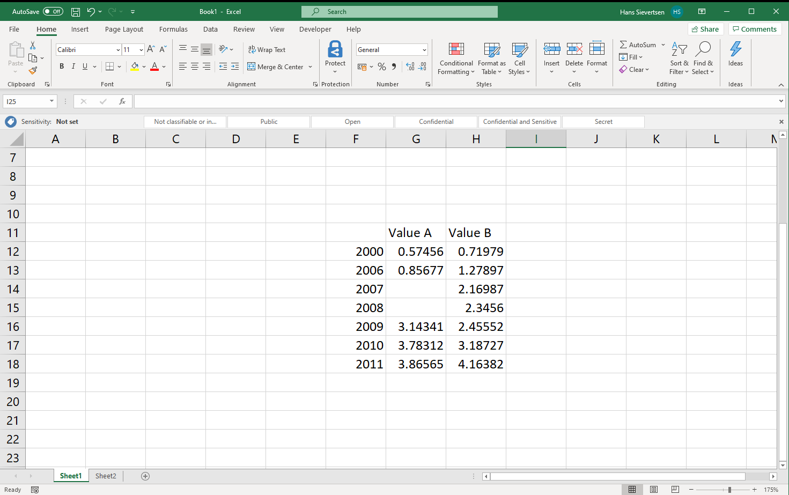
```


#### Modifying Borders {-}

We can add solid black orders to a selected cell by clicking on the "Borders" icon (see arrow below) in the "Home" tab ribbon. 


```{r,  include=TRUE, fig.align="center", fig.cap=c(" "), out.width="90%", fig.show='hold',echo=FALSE}
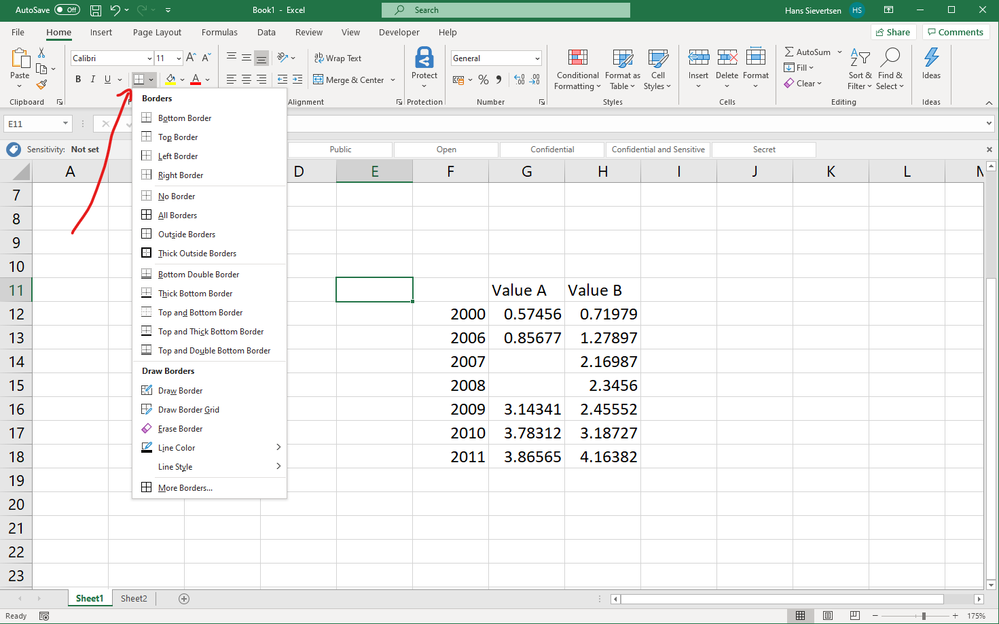
```


Below is an example where cell C12 is given a solid black line as a border on all sides.

```{r,  include=TRUE, fig.align="center", fig.cap=c(" "), out.width="90%", fig.show='hold',echo=FALSE}
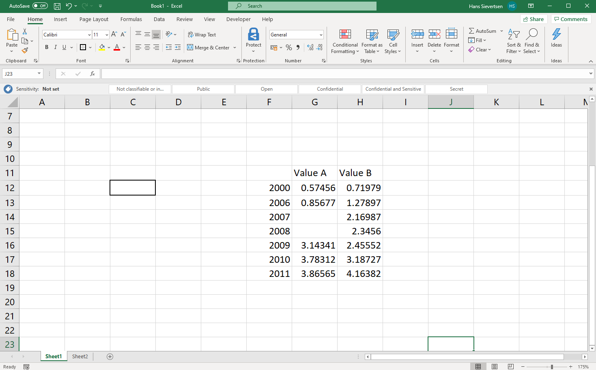
```


An alternative approach to modifying borders is to select a range of cells, right-click on the selected area, and select "Format Cells" as shown below. 


```{r,  include=TRUE, fig.align="center", fig.cap=c(" "), out.width="90%", fig.show='hold',echo=FALSE}
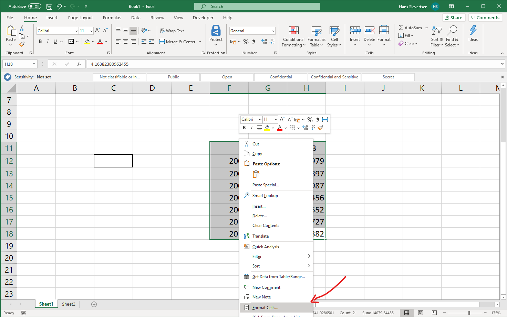
```

This opens a menu where we can change  aspects of the cells. 

```{r,  include=TRUE, fig.align="center", fig.cap=c(" "), out.width="90%", fig.show='hold',echo=FALSE}
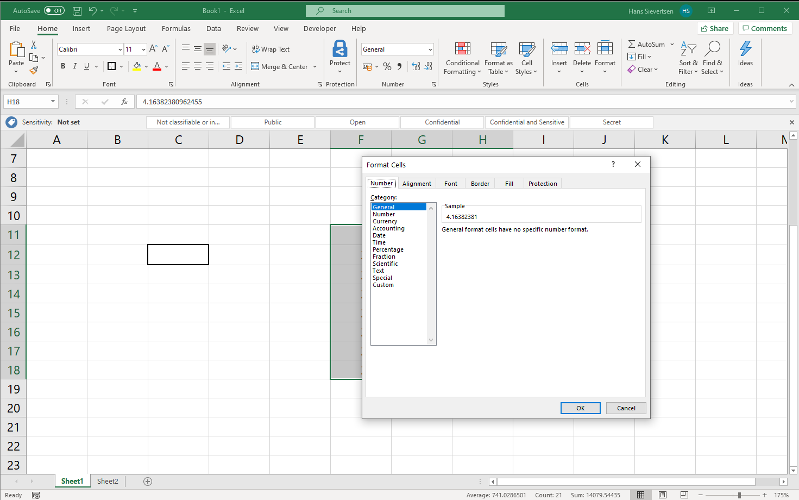
```

Let's jump to the Border tab. 

```{r,  include=TRUE, fig.align="center", fig.cap=c(" "), out.width="90%", fig.show='hold',echo=FALSE}
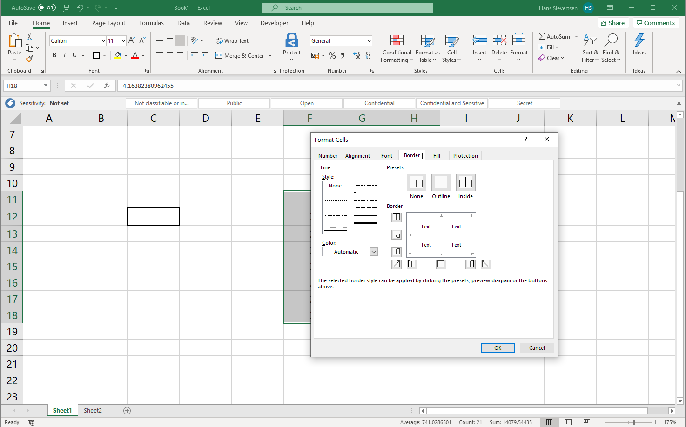
```


In the Color we select "White". 


```{r,  include=TRUE, fig.align="center", fig.cap=c(" "), out.width="90%", fig.show='hold',echo=FALSE}
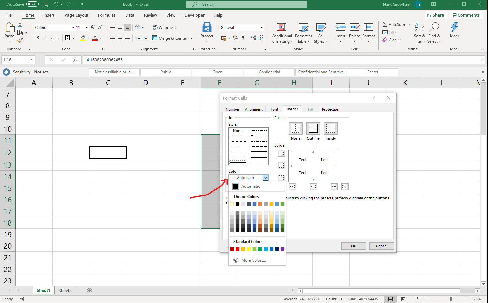
```


We then select all the borders we want to have the new setting (the white color). In this example we select both inside and outside. Click OK to to confirm our changes.

```{r,  include=TRUE, fig.align="center", fig.cap=c(" "), out.width="90%", fig.show='hold',echo=FALSE}
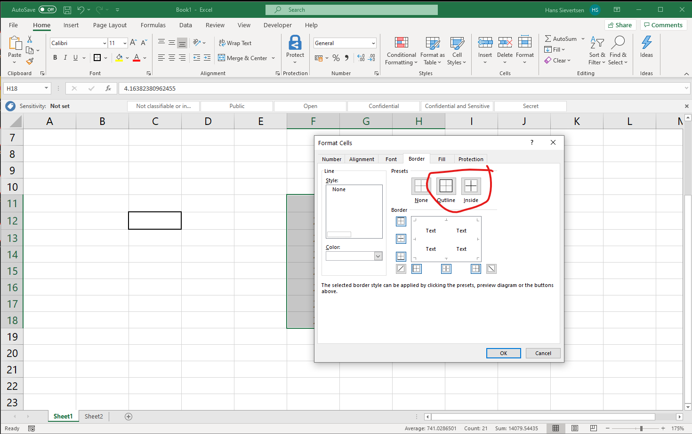
```


The image below shows the outcome of setting all borders in the selected area to white. The thin grey lines have disappeared! They are overwritten by the solid white lines.

```{r,  include=TRUE, fig.align="center", fig.cap=c(" "), out.width="90%", fig.show='hold',echo=FALSE}
knitr::include_graphics("./graphics/tabformat/fig9.png")
```

We can also change the borders manually by selecting the "Draw Border" menu as shown below. 

```{r,  include=TRUE, fig.align="center", fig.cap=c(" "), out.width="90%", fig.show='hold',echo=FALSE}
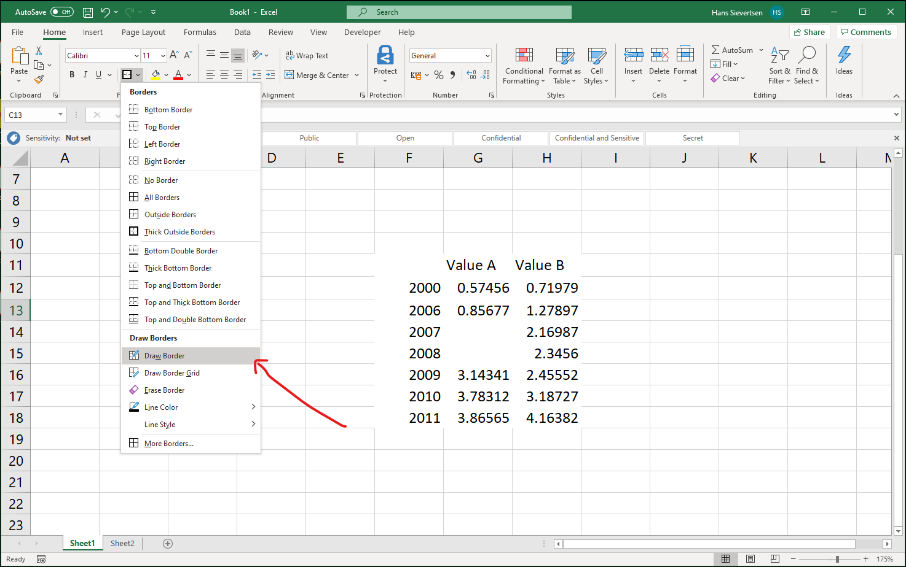
```

When drawing the border we can change the line type and color in the lower part of the menu. 

```{r,  include=TRUE, fig.align="center", fig.cap=c(" "), out.width="90%", fig.show='hold',echo=FALSE}
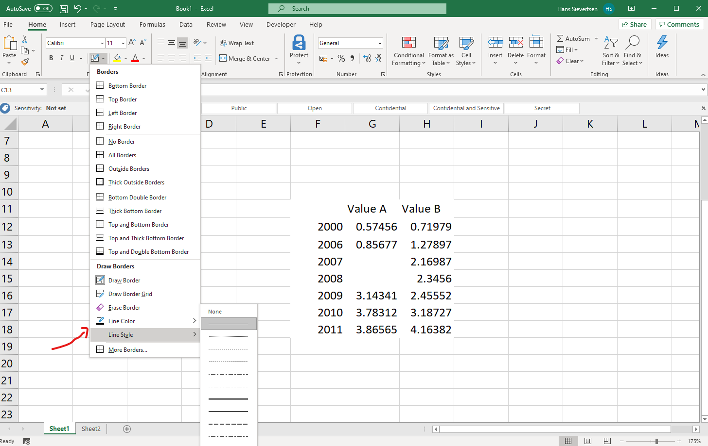
```


Let's return to our initial approach and let's select the data area again, but this time we exclude the top row in our selection.


```{r,  include=TRUE, fig.align="center", fig.cap=c(" "), out.width="90%", fig.show='hold',echo=FALSE}
knitr::include_graphics("./graphics/tabformat/fig12.png")
```


We return to the "Format Cells" and "Border" menu. But this time we select black, and only the upper and lower border.


```{r,  include=TRUE, fig.align="center", fig.cap=c(" "), out.width="90%", fig.show='hold',echo=FALSE}
knitr::include_graphics("./graphics/tabformat/fig13.png")
```


After we click OK the table looks like below. We've separated the data titles from the actual data using solid black lines. 


```{r,  include=TRUE, fig.align="center", fig.cap=c(" "), out.width="90%", fig.show='hold',echo=FALSE}
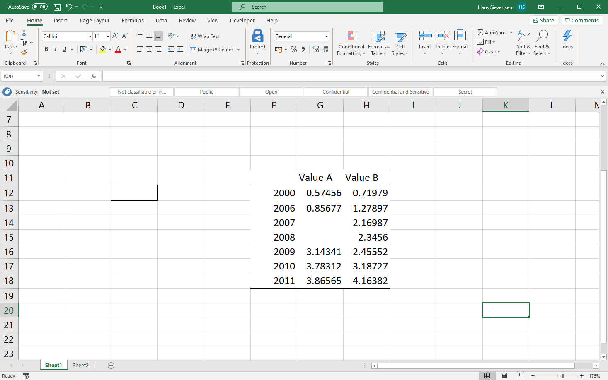
```


We now repeat the process on the area with the section including the titles to add a solid top border. 


```{r,  include=TRUE, fig.align="center", fig.cap=c(" "), out.width="90%", fig.show='hold',echo=FALSE}
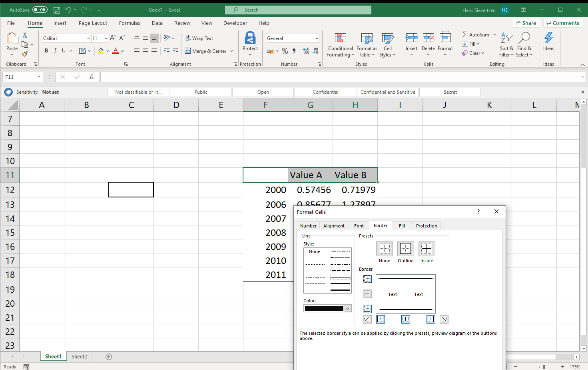
```


#### Value alignment and appearance {-}

Let's now adjust the apperance of the values in the table. We select just the cells that contain the values as shown below.


```{r,  include=TRUE, fig.align="center", fig.cap=c(" "), out.width="90%", fig.show='hold',echo=FALSE}
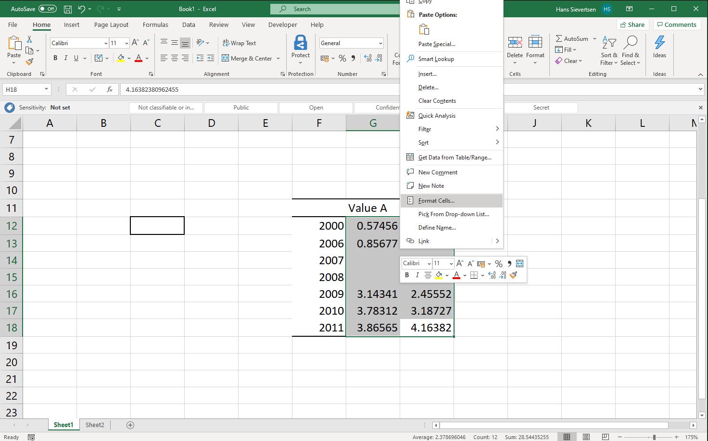
```


In the "Format Cells" menu we now focus on the "Number" tab. We set the "Category" to "Number". We set the number of decimal points to 2.


```{r,  include=TRUE, fig.align="center", fig.cap=c(" "), out.width="90%", fig.show='hold',echo=FALSE}
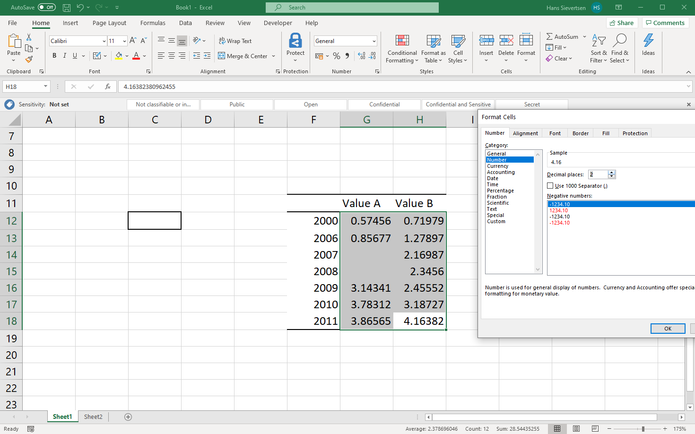
```


Great! All values are now shown with only two decimal points. This is much easier to read! (Note that there is also a shortcut for changing the number of decimal points directly in the ribbon).

```{r,  include=TRUE, fig.align="center", fig.cap=c(" "), out.width="90%", fig.show='hold',echo=FALSE}
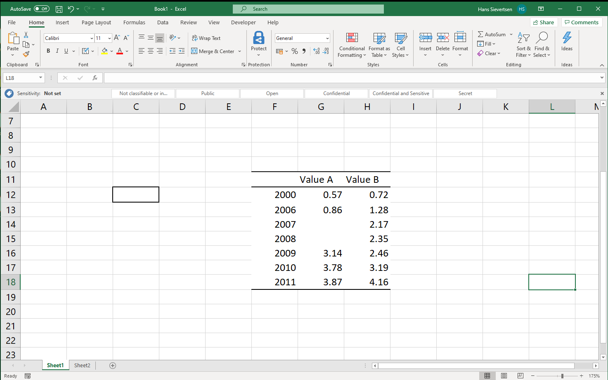
```


Next, we select the same cells again and change the alignment to center the values.


```{r,  include=TRUE, fig.align="center", fig.cap=c(" "), out.width="90%", fig.show='hold',echo=FALSE}
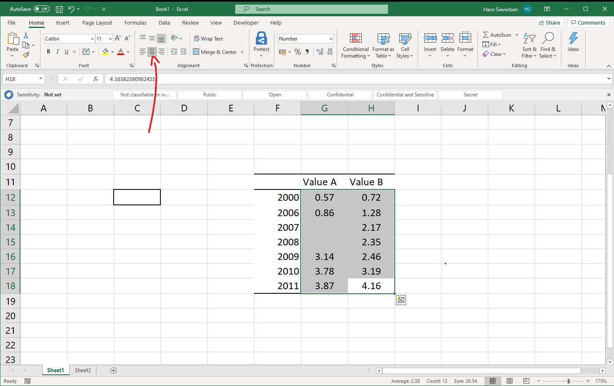
```


Finally, we left-align the year column. The table  looks quite good!

```{r,  include=TRUE, fig.align="center", fig.cap=c(" "), out.width="90%", fig.show='hold',echo=FALSE}
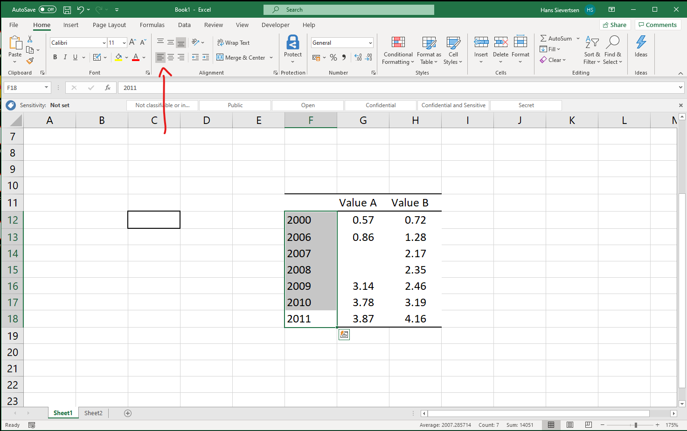
```


##   Merging and wrapping cells

#### Merging cells {-}

It is a bit inefficient that we repeat the word "Value" in the column headers of our table. Let us change that. First we add another general header to the columns by entering "Value" in cell G10:

```{r,  include=TRUE, fig.align="center", fig.cap=c(" "), out.width="90%", fig.show='hold',echo=FALSE}
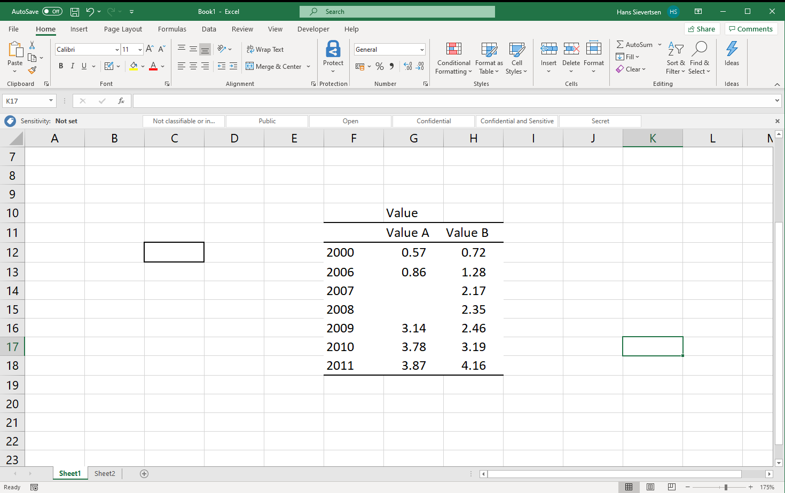
```


Next we select both cell G10 and cell H10. Having selected these two cells we click on "Merge & Center" as shown below. This merges the two cells and centers the title! 


```{r,  include=TRUE, fig.align="center", fig.cap=c(" "), out.width="90%", fig.show='hold',echo=FALSE}
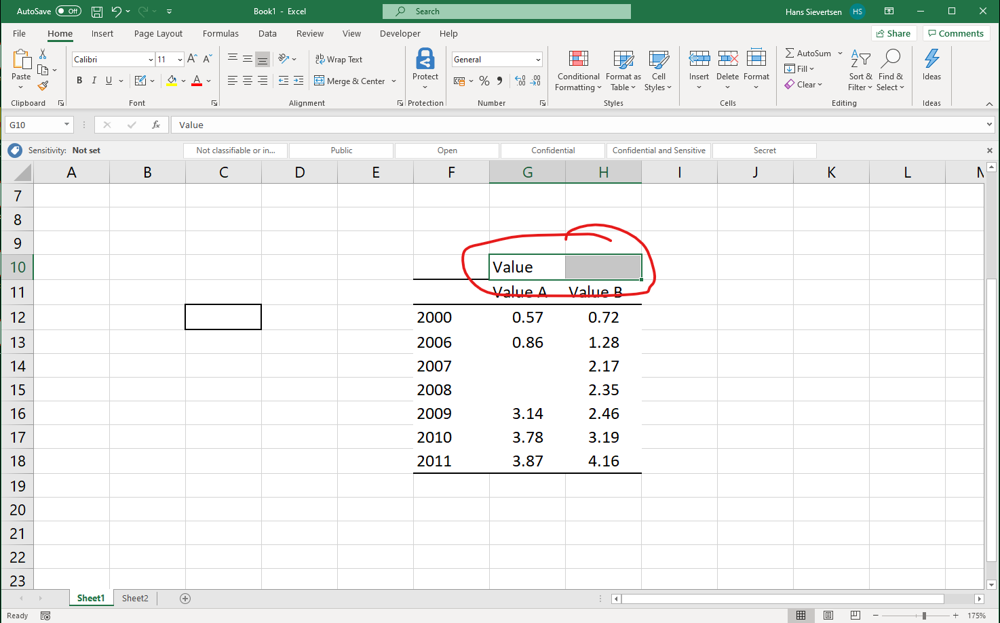
```


We repeat the process from above to modify the borders in the column title section.

```{r,  include=TRUE, fig.align="center", fig.cap=c(" "), out.width="90%", fig.show='hold',echo=FALSE}
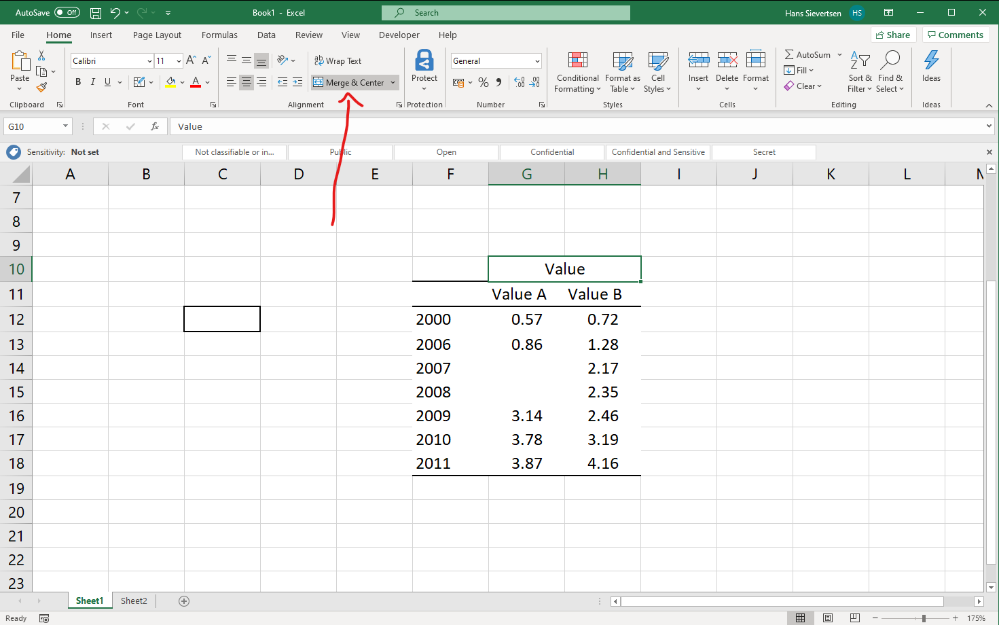
```


Finally, we remove the the "Value" from cells G11 and H12. We center align the text in these cells and voila. Our table looks like the one below. The advantage of merging the cells is that we can create titles that cover ceveral cells. 


```{r,  include=TRUE, fig.align="center", fig.cap=c(" "), out.width="90%", fig.show='hold',echo=FALSE}
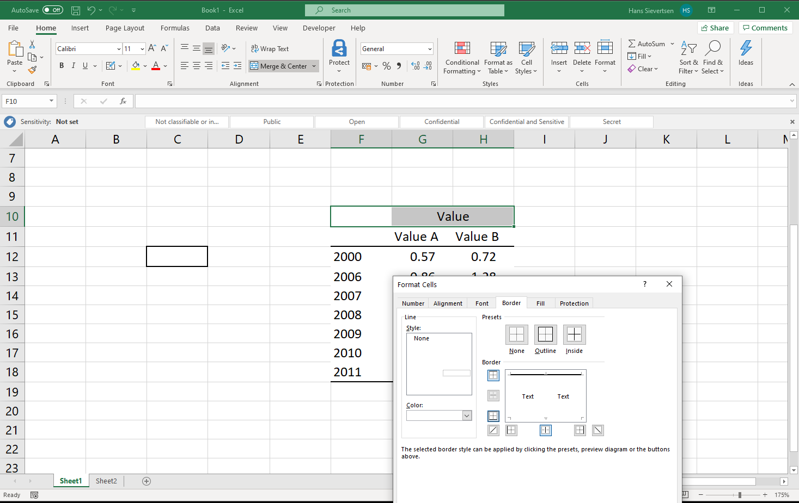
```


####   Text wrapping {-}

What if there is insufficient space to show all the column content as in the example below where cell F12 contains more content that we can see. 

```{r,  include=TRUE, fig.align="center", fig.cap=c(" "), out.width="90%", fig.show='hold',echo=FALSE}
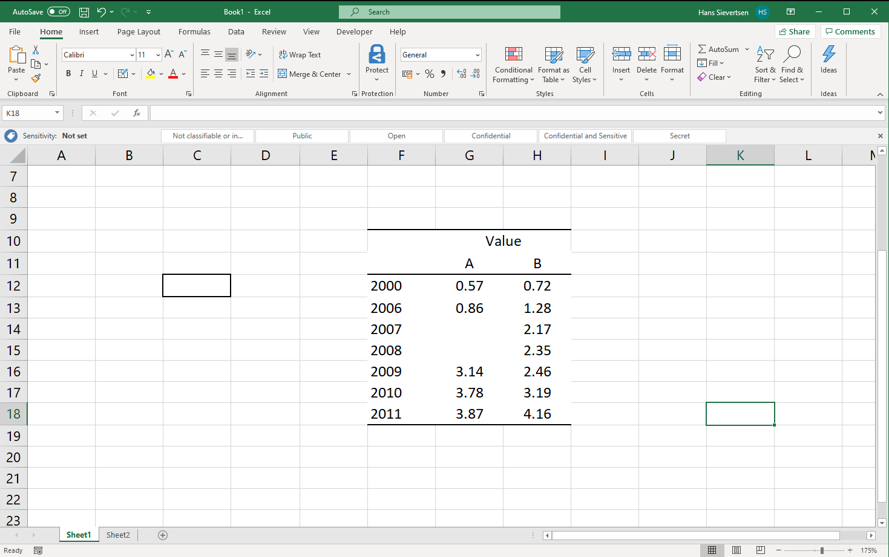
```


One solution is to make the cell wider. An alternative solution is to allow the text to **wrap** across rows. Simply select the cell and click "Wrap text". This can be done directly in the ribbon  (under Home Tab) or in the Format Cells menu, as shown below.


```{r,  include=TRUE, fig.align="center", fig.cap=c(" "), out.width="90%", fig.show='hold',echo=FALSE}
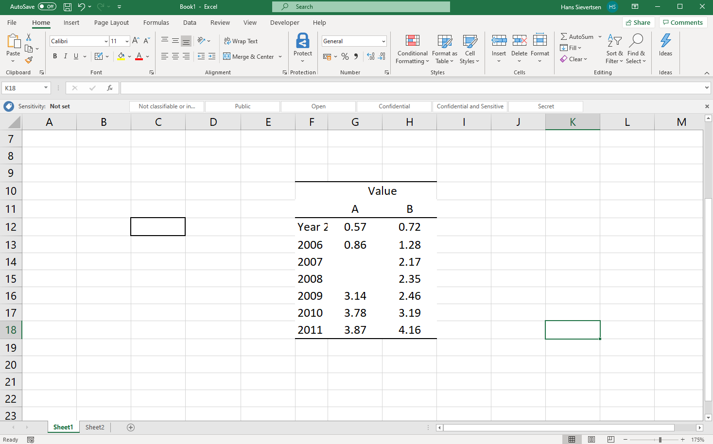
```

As a result, see below, the row 12 is now heigher than the other cells. 

```{r,  include=TRUE, fig.align="center", fig.cap=c(" "), out.width="90%", fig.show='hold',echo=FALSE}
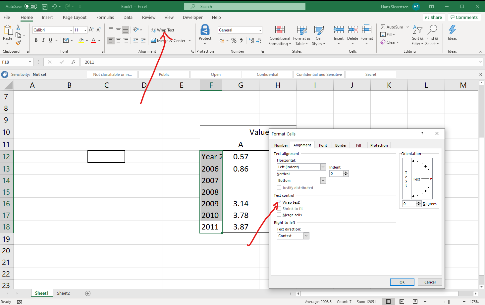
```


We can modify the vertical adjustment of text in a cell (either in the Format cells menu or) in the ribbon a shown below. 


```{r,  include=TRUE, fig.align="center", fig.cap=c(" "), out.width="90%", fig.show='hold',echo=FALSE}
knitr::include_graphics("./graphics/tabformat/fig29.png")
```


####   Text orientation {-}

We can also merge cells vertically as shown below.

```{r,  include=TRUE, fig.align="center", fig.cap=c(" "), out.width="90%", fig.show='hold',echo=FALSE}
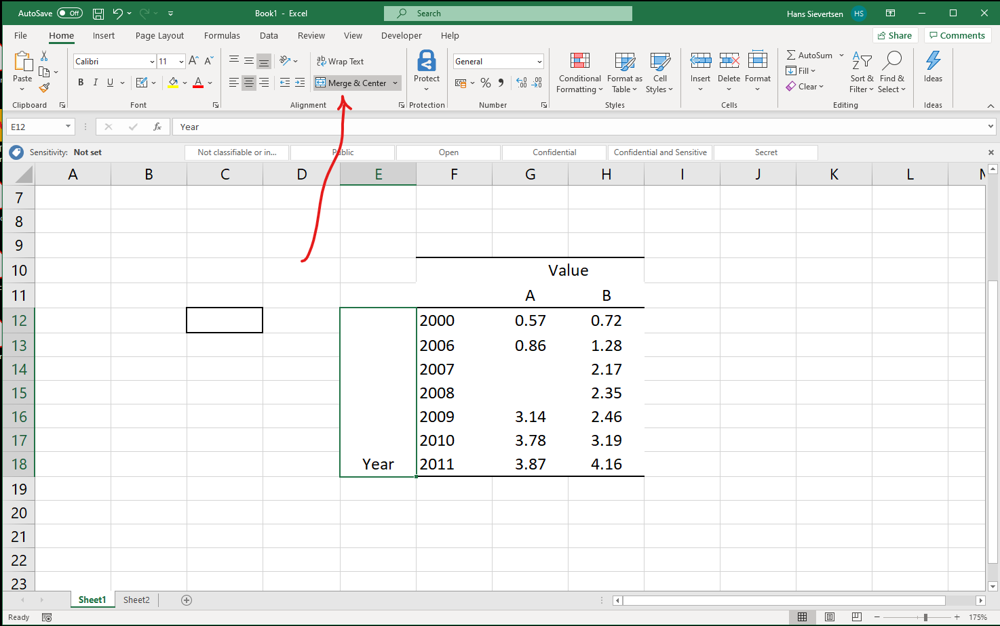
```


In a case like the example above, we might want to change the orientation of the text not be horisontal, but be rotated. Select the cells where want to to change the text orientation and click on the text-orientation icon in the ribbon (the Home Tab ribbon) as shown below. This option is also available in the Format Cells menu. 


```{r,  include=TRUE, fig.align="center", fig.cap=c(" "), out.width="90%", fig.show='hold',echo=FALSE}
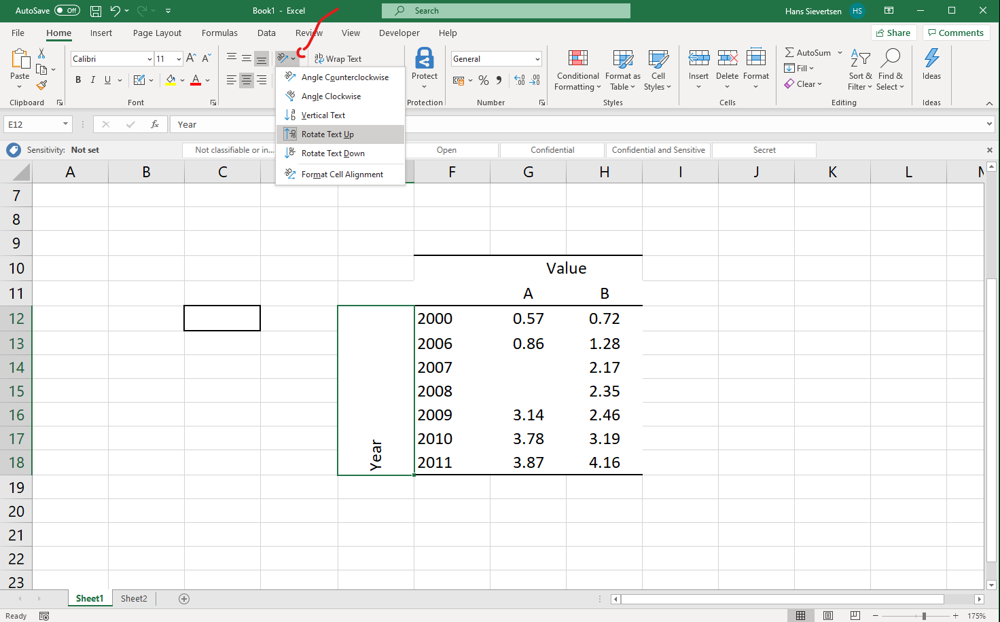
```


####   Cell (and row) width {-}

We can change the width of row by clicking on the line separating two columns and dragging the mouse in a direction as shown below. The same goes for rows!

```{r,  include=TRUE, fig.align="center", fig.cap=c(" "), out.width="90%", fig.show='hold',echo=FALSE}
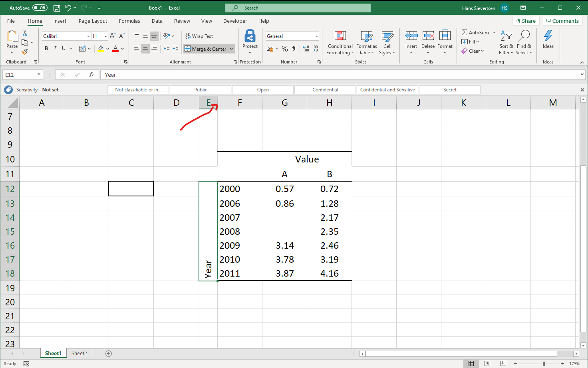
```


##   The format painter 

What if we've finished formatting cells, but we accidentally forgot to select cells to included. Do we have to repeat everything on these cells? No! We can use the formatting paint.  Here is how it works.

1. Select the cells that have the right format that we want to apply on other cells. 

2. Click on the "Format painter" icon in the Home Tab Ribbon as shown below.


```{r,  include=TRUE, fig.align="center", fig.cap=c(" "), out.width="90%", fig.show='hold',echo=FALSE}
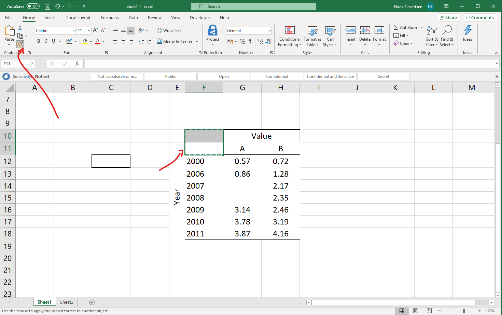
```


3. Select all the cells where you want to apply the format.


```{r,  include=TRUE, fig.align="center", fig.cap=c(" "), out.width="90%", fig.show='hold',echo=FALSE}
knitr::include_graphics("./graphics/tabformat/fig36.png")
```


Voila! 


```{r,  include=TRUE, fig.align="center", fig.cap=c(" "), out.width="90%", fig.show='hold',echo=FALSE}
knitr::include_graphics("./graphics/tabformat/fig37.png")
```


<!--chapter:end:04_ch4.Rmd-->

# Error Messages & Warnings


Understanding the error and warning messages  can help us avoid mistakes and save time. Here is a list of some of the most common issues. 


##   Leaving out adjacent cells 


Consider the example below. We enter a formula in cell D2 where we refer to the values in the cells B2 and C2. We expand the formula all the way to cell D8.

```{r,  include=TRUE, fig.align="center", fig.cap=c(" "), out.width="90%", fig.show='hold',echo=FALSE}
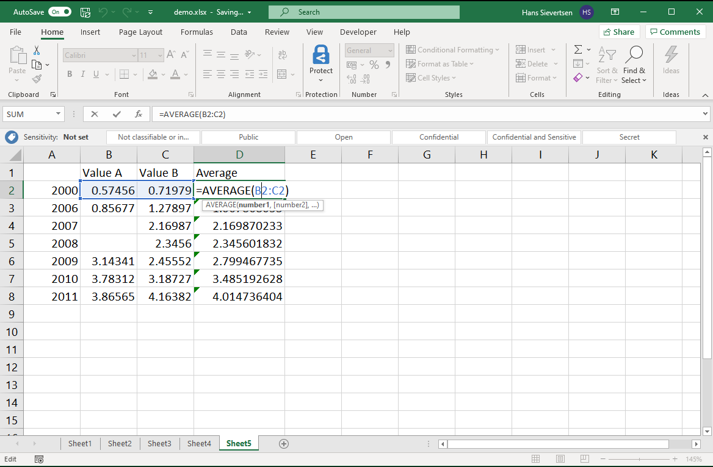
```

Note that all the cells with the new formula have a green triangle in the upper left corner. We can hover the mouse over this triangle to see the warning message as shown below.

```{r,  include=TRUE, fig.align="center", fig.cap=c(" "), out.width="90%", fig.show='hold',echo=FALSE}
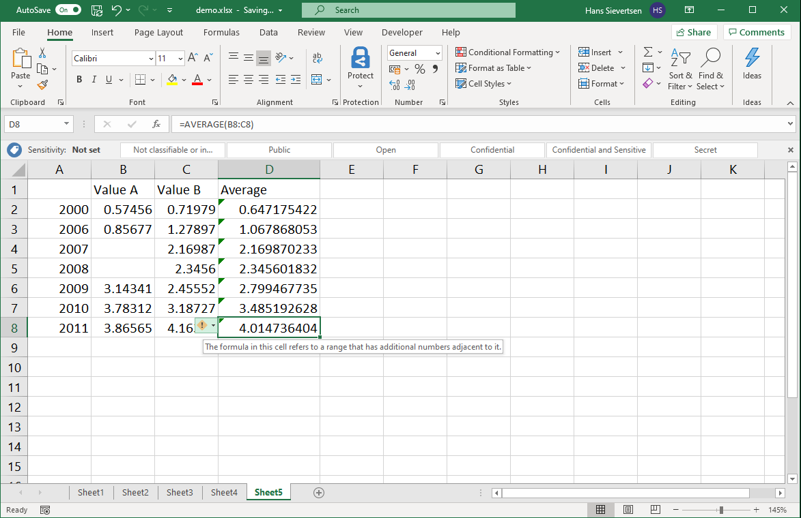
```

The warning is that we exclude adjacent cells. That is, because we we include the cells in columns B and C, Microsoft Excel thinks that maybe we also wanted to include column A. It therefore gives us the warning that we left out this columnn. We can click on the yellow warning symbol to see a menu with different options to sort out this issue (or ignore the issue), as shown below.

```{r,  include=TRUE, fig.align="center", fig.cap=c(" "), out.width="90%", fig.show='hold',echo=FALSE}
knitr::include_graphics("./graphics/errorwarn/fig3.png")
```


##   Inconsistent formulas 

Another useful Microsoft Excel warning is "Inconsistent formulas". This happens when the formula in one cell has  different structure than the formulas in the cells around it. Consider the example below. Again, we hover over the green triangle to read the warning meassage. 

```{r,  include=TRUE, fig.align="center", fig.cap=c(" "), out.width="90%", fig.show='hold',echo=FALSE}
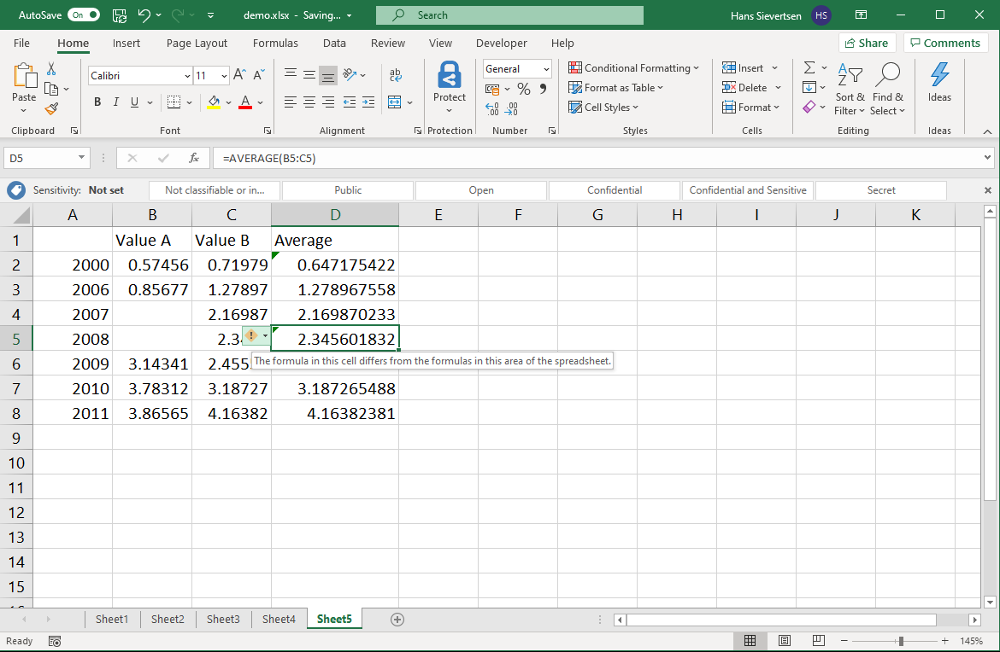
```

Let's investigate the content of cell D5. It is the average of cells B5 and C5. Fine.

```{r,  include=TRUE, fig.align="center", fig.cap=c(" "), out.width="90%", fig.show='hold',echo=FALSE}
knitr::include_graphics("./graphics/errorwarn/fig5.png")
```


Let's now investigate the content of the adjacent cell  D4. It is the average of cell  C4 only. Ohh! This differs in the structure from the formula in cell B5. Was this intentional?


```{r,  include=TRUE, fig.align="center", fig.cap=c(" "), out.width="90%", fig.show='hold',echo=FALSE}
knitr::include_graphics("./graphics/errorwarn/fig6.png")
```


##   \#\#\#

Sometimes you might see cell content looking like the cells in column A below. This looks like a bad error. Instead of showing numbers it just shows the  # symbol. 
```{r,  include=TRUE, fig.align="center", fig.cap=c(" "), out.width="90%", fig.show='hold',echo=FALSE}
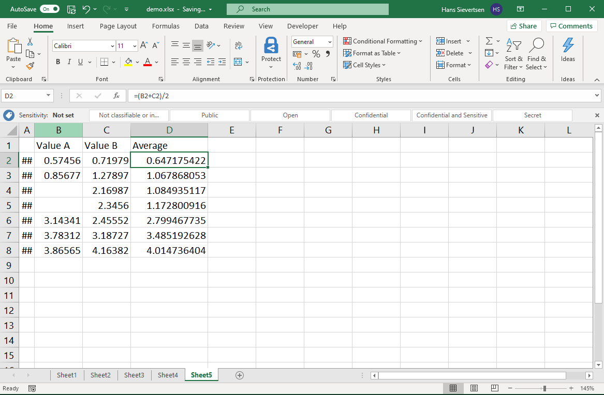
```


Don't worry! This just means that the column is too narrow to show the content. Click on the line separating this column from the next column and drag the line in a direction to increase the width of the column. You should now see the content of the cell.


```{r,  include=TRUE, fig.align="center", fig.cap=c(" "), out.width="90%", fig.show='hold',echo=FALSE}
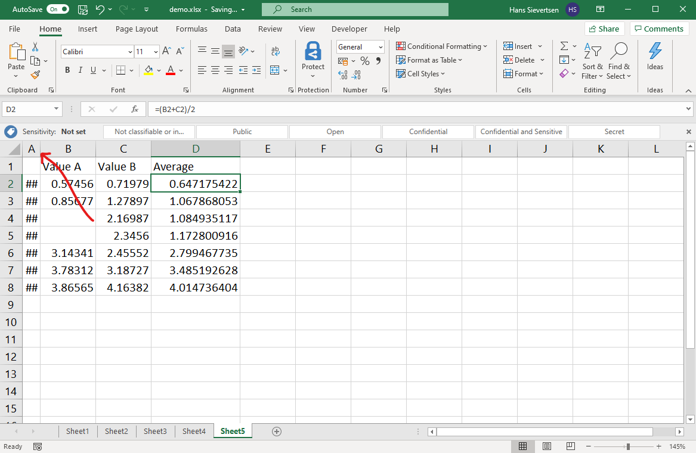
```


##   #REF! 

The #REF! message shown in cell D2 below appears if the cell refers to cells that don't exist (anymore). This often happens if you moved or deleted  cells, but forgot that other cells refer to these cells

```{r,  include=TRUE, fig.align="center", fig.cap=c(" "), out.width="90%", fig.show='hold',echo=FALSE}
knitr::include_graphics("./graphics/errorwarn/fig9.png")
```

After we delete column or row that contains a cell that another cell refers to, Microsoft Excel doesn't know what to do. So it simply replaces the old cell references with "#REF!" as shown below. The solution is to update the reference to the right cell.

```{r,  include=TRUE, fig.align="center", fig.cap=c(" "), out.width="90%", fig.show='hold',echo=FALSE}
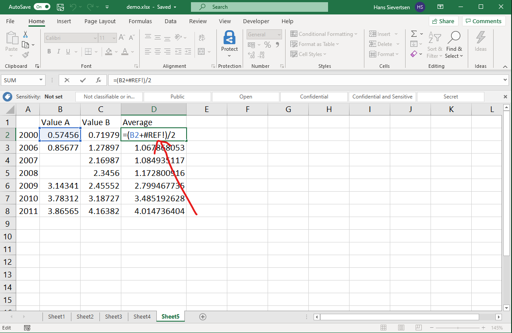
```


##   Circular formulas 

After we've entered a formula in a cell we might receive the following message. 

```{r,  include=TRUE, fig.align="center", fig.cap=c(" "), out.width="90%", fig.show='hold',echo=FALSE}
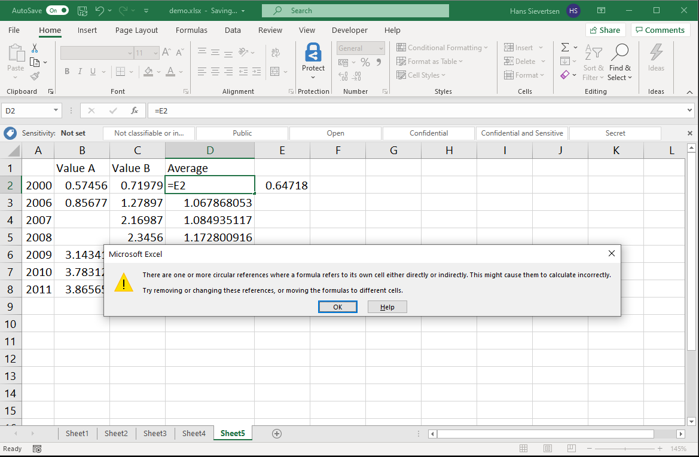
```

What does it mean? It means that we've entered formulas that run in circles. After we click "OK" it will look like below. It shows that cell D2 depends on the value of cell E2, but cell depends on the value of cell D2. And we can keep running in circles forever. That is not good. 


```{r,  include=TRUE, fig.align="center", fig.cap=c(" "), out.width="90%", fig.show='hold',echo=FALSE}
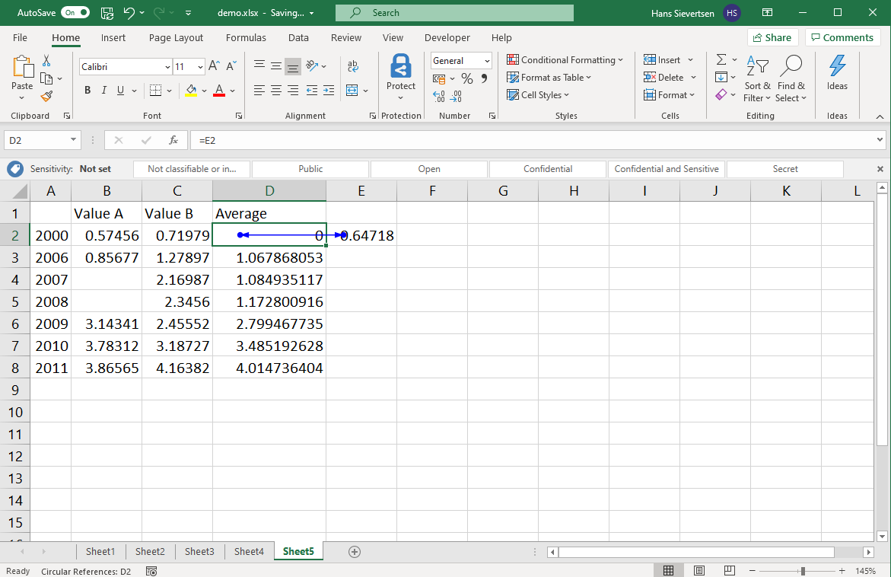
```


<!--chapter:end:05_ch5.Rmd-->

# Handling large datasets

## Filtering tables

We can use the filter function to filter the rows we are interested in. This is especially useful if our dataset contains many rows.

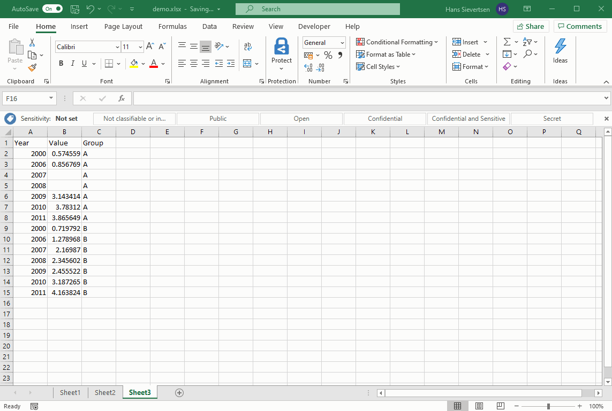

## Pivot tables

If our dataset follows the tidy data principles we can use the Pivot table function in Microsoft Excel to easily restructure the data and calculate aggregate statistics as shown below. 

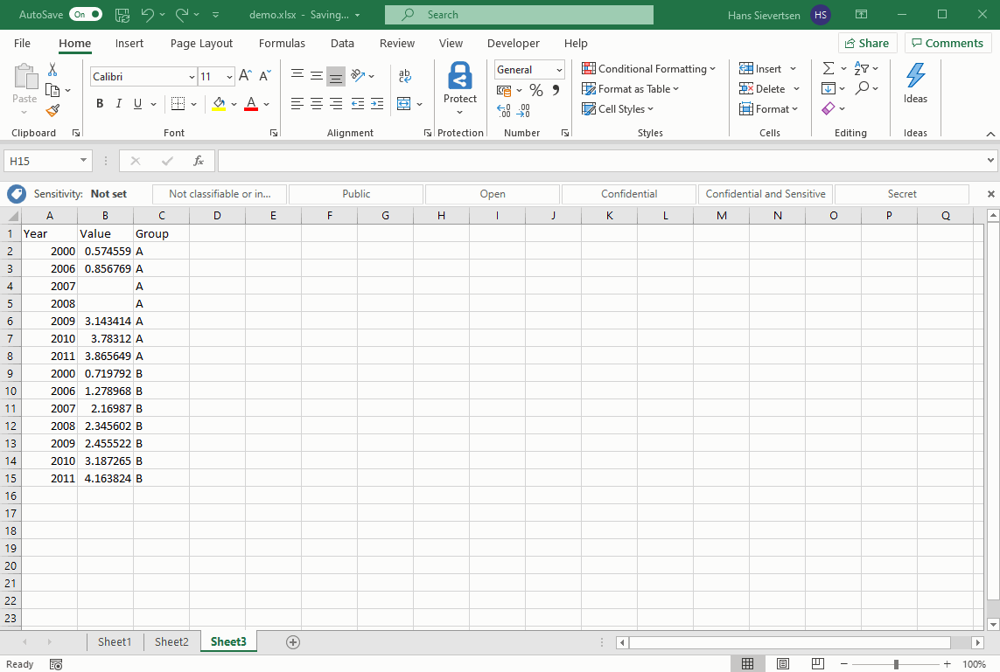

<!--chapter:end:06_ch6.Rmd-->

# Getting tables and charts into Word

## Inserting a chart in Microsoft Word


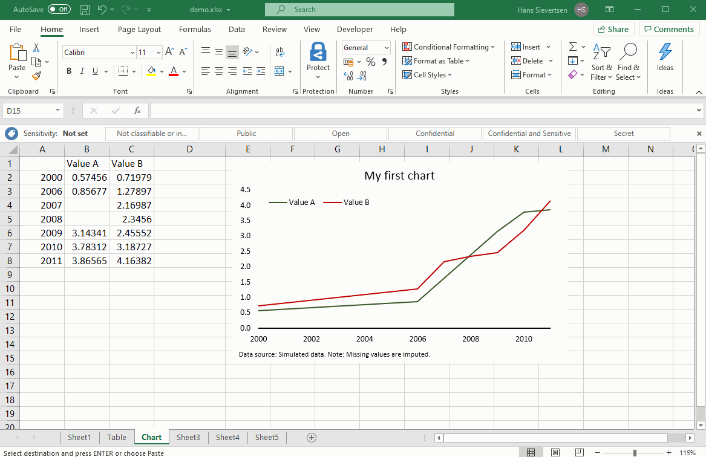

## Inserting a table in Microsoft Word


<!--chapter:end:07_ch7.Rmd-->

# Further resources

* Alexander, Michael, Richard Kusleika, and John Walkenbach. "Excel 2019 Bible". John Wiley & Sons, 2018. Available online through the University of Bristol students [here](https://bris.on.worldcat.org/external-search?queryString=excel%20bible&clusterResults=on&stickyFacetsChecked=on#/oclc/1054245932).


* [Microsoft Excel for Windows training](https://support.microsoft.com/en-ie/office/excel-for-windows-training-9bc05390-e94c-46af-a5b3-d7c22f6990bb)

* [Excel 2016 for Mac Help](https://support.microsoft.com/en-us/office/excel-2016-for-mac-help-2010f16b-aec0-4da7-b381-9cc1b9b47745?wt.mc_id=otc_excel)

<!--chapter:end:08_ch8.Rmd-->

